# Comprehensive Exploratory Data Analysis (EDA)

## 1. Overview
This document consolidates findings from the consolidated EDA script (`run_eda.py`), providing a complete view of the dataset, feature distributions, relationships, and ESG score composition.

## 2. Initial Findings: Distributions & Alignment

### A. Train vs Test Alignment
We compared the distributions of key features between the Train and Test sets.
- **Region Code**: Reasonably aligned.
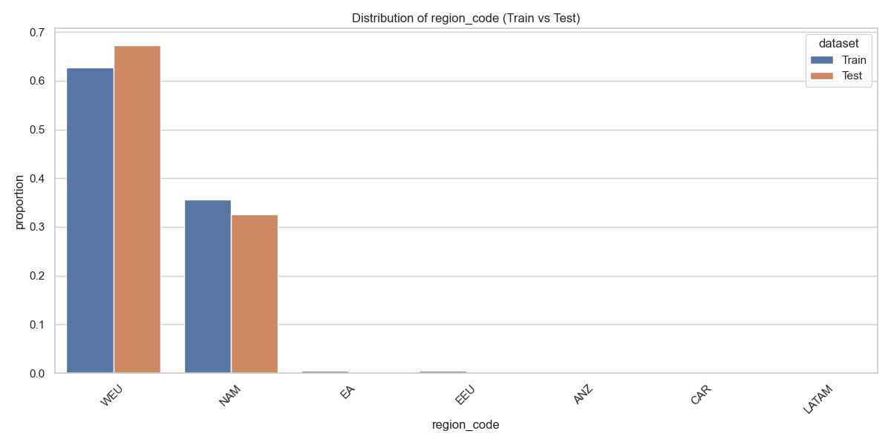

- **Country Code**: Major countries are represented in both.
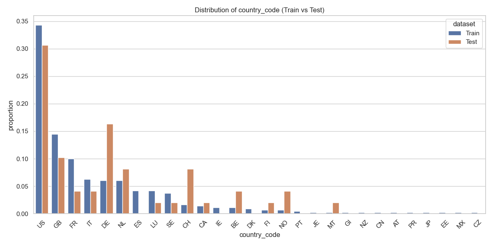

- **Revenue**: Log-transformed revenue shows very similar distribution, ensuring the test set covers the same scale of companies.

### B. Target Variable Distribution
- **Scope 1 & 2 Emissions**: Highly right-skewed. Log-transformation is essential.
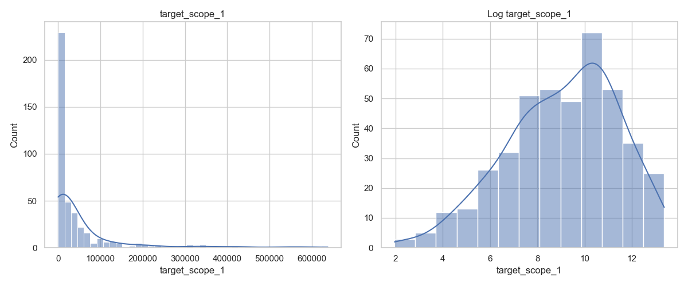
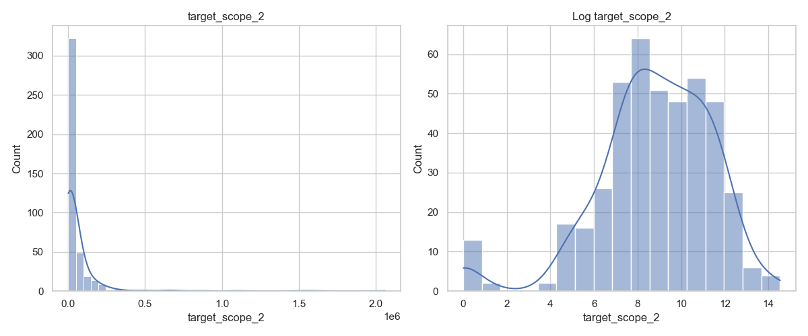

### C. Auxiliary Data Distributions
- **SDGs**: Most companies commit to a few SDGs.
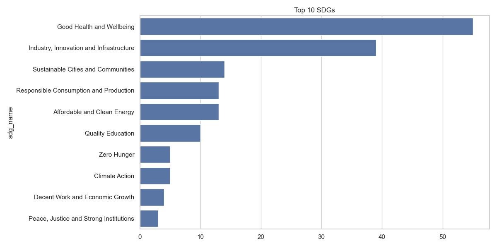
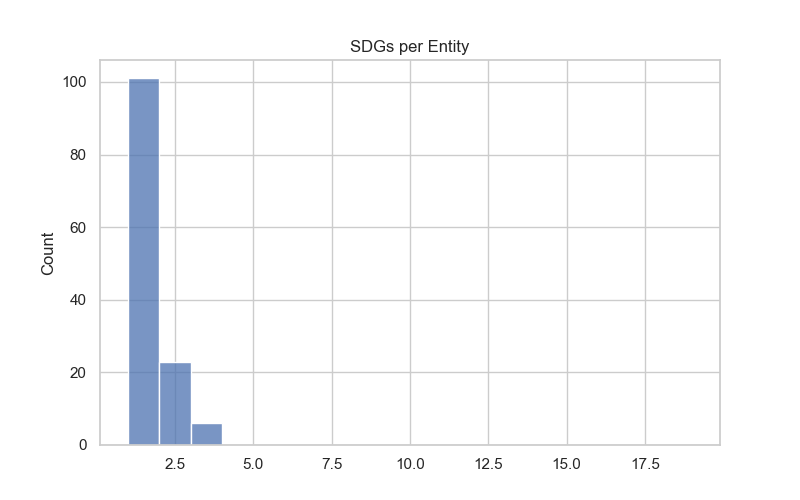

- **Sectors**: Manufacturing is dominant.
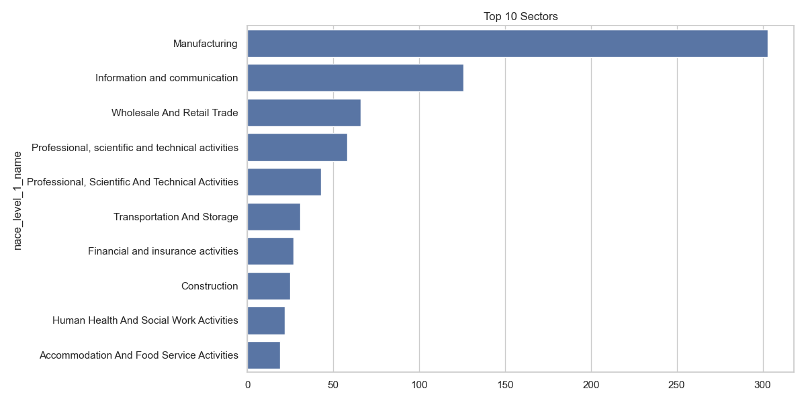

- **Environmental Activities**:
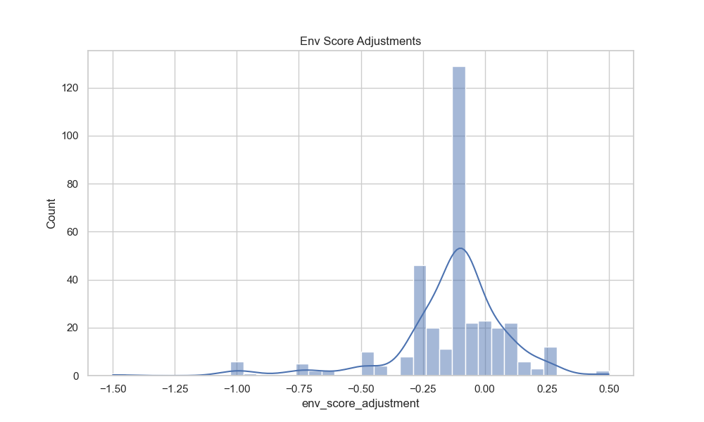

## 3. Extended Analysis: Correlations & Relationships

### A. Feature vs. Target Correlations
We analyzed the Spearman correlation between features and log-transformed targets.

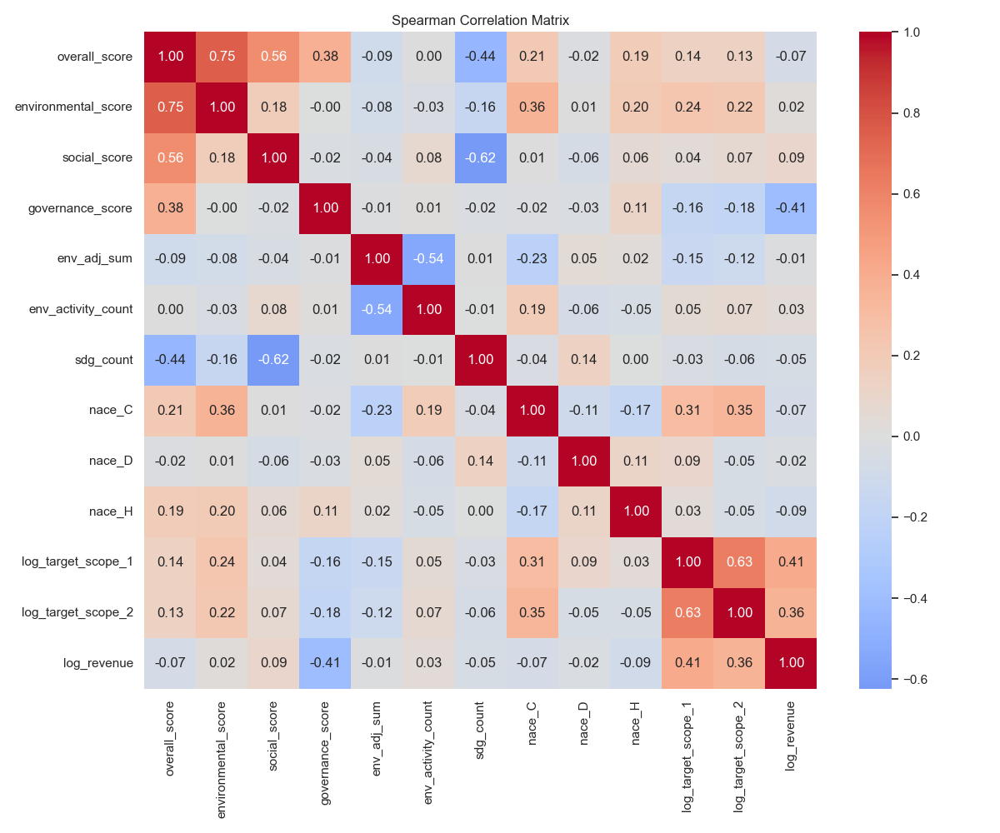

**Key Observations:**
- **Revenue**: Strongest positive correlation with emissions.
- **Sectors**: `nace_D` (Electricity) and `nace_C` (Manufacturing) show positive correlations.
- **ESG Scores**: `environmental_score` has a moderate correlation.

### B. ESG Score Relationships
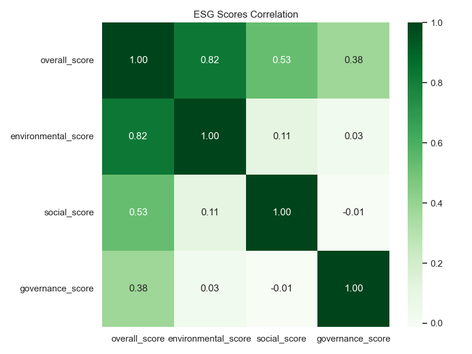
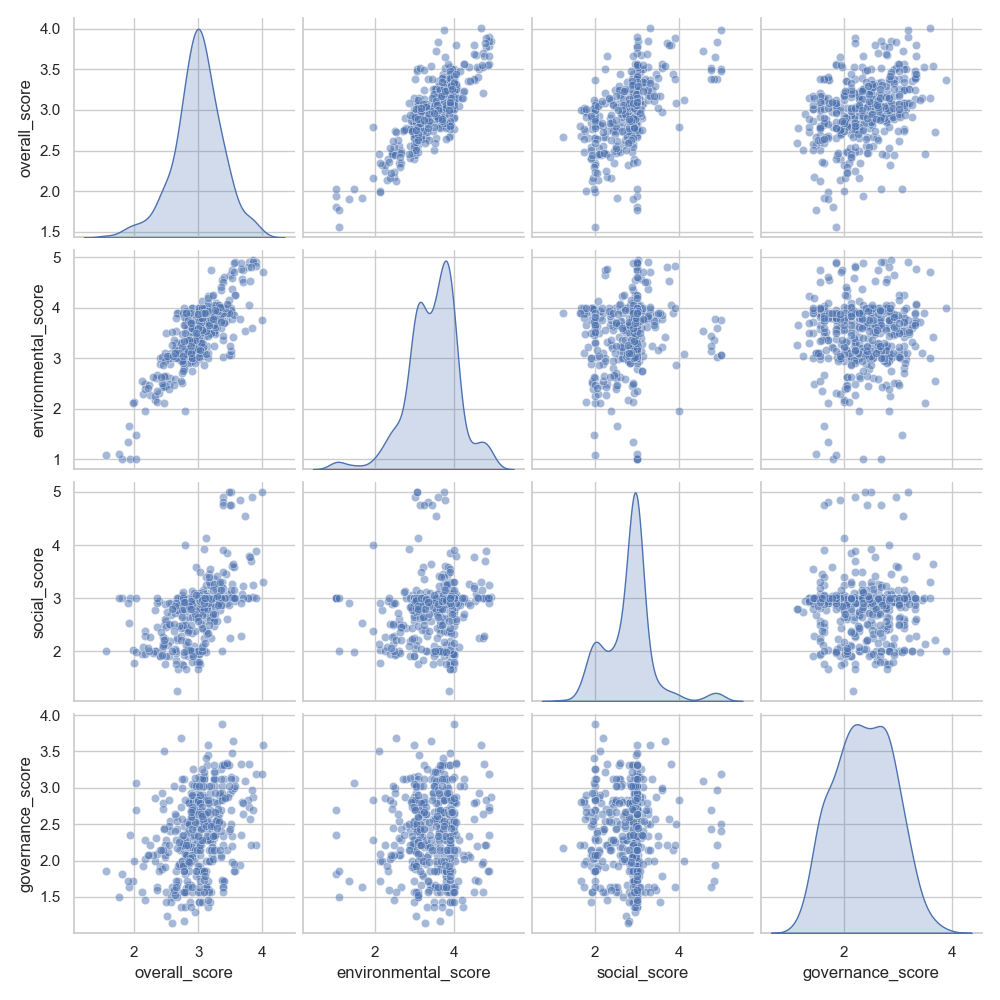

**Insights:**
- High collinearity between `overall_score` and its components.
- Positive correlation between E, S, and G scores.

## 4. ESG Score Composition Analysis
We investigated whether the `overall_score` is a linear combination of the individual component scores.

**Hypothesis**: $Overall = 0.45 \times E + 0.30 \times S + 0.25 \times G$ (based on documentation).

**Results**:
- **Max Difference**: 0.010750 (Very small, likely rounding differences).
- **Linear Regression Fit**:
    - $R^2$: **0.999996** (Almost perfect fit).
    - **Coefficients**:
        - Environmental: **0.4499** ($\approx 0.45$)
        - Social: **0.3000** ($\approx 0.30$)
        - Governance: **0.2499** ($\approx 0.25$)

**Conclusion**: The Overall Score is effectively the weighted sum of the component scores as described. The minor deviations are likely due to data rounding or floating-point precision.

## 5. Feature Engineering Proposal
Based on these findings, we propose:

1.  **Revenue**: Log-transform.
2.  **Sector**: Pivot `revenue_distribution_by_sector.csv` to create percentage features for each NACE Level 1 code.
3.  **Env Activities**: Aggregate to `sum` of score adjustments and `count` of activities.
4.  **SDGs**: Count the number of SDGs.
5.  **Targets**: Log-transform for training.
