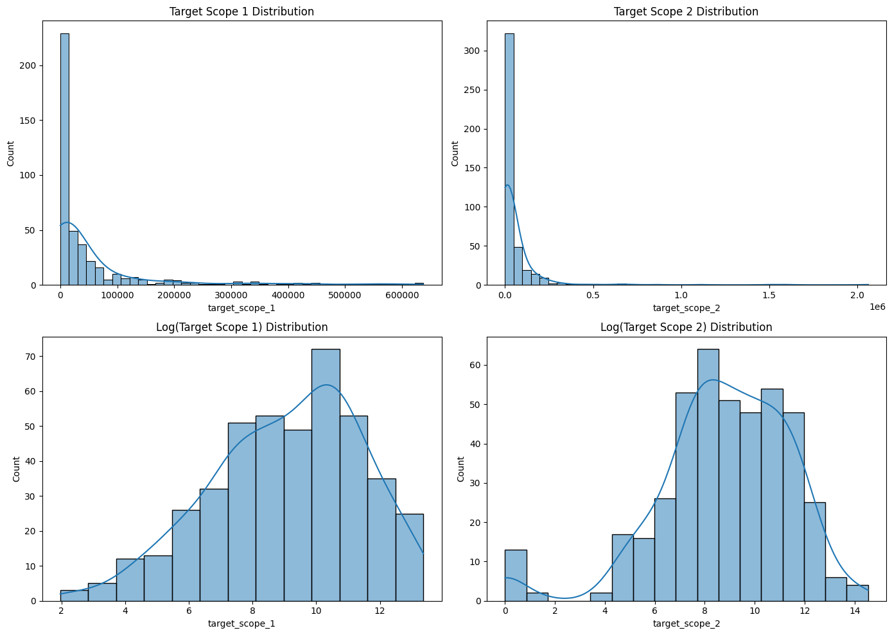
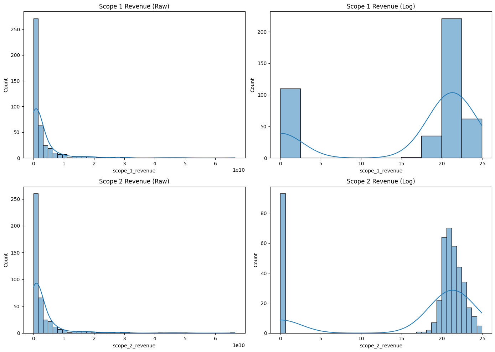
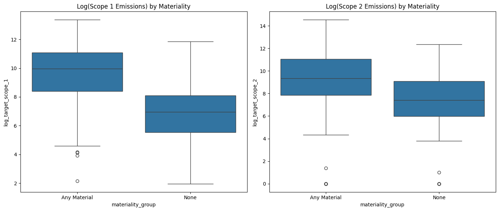

# 1. Problem Overview

#### Purpose

This analysis develops predictive models to estimate two company-level operational greenhouse gas emission targets consistent with the Greenhouse Gas Protocol. Accurate, auditable estimates enable downstream ESG reporting, portfolio-level exposure analysis, and risk assessment when disclosures are incomplete.

#### Definitions

- **Scope 1 — Direct emissions:** Emissions produced by sources owned or directly controlled by the reporting entity (e.g., combustion on site, company vehicle fleets, fugitive process emissions).
- **Scope 2 — Indirect emissions (purchased energy):** Emissions attributable to the generation of purchased electricity, heat or steam consumed by the company.

#### Why these targets are generally estimated

Many firms do not fully disclose emissions. Domain experts explain that financial institutions, corporates, and ESG analysts use modelled Scope 1 and Scope 2 values to fill these gaps for portfolio accounting, regulatory reporting, and basic risk assessment.

Both targets are measured in metric tons of CO₂-equivalent (tCO₂e). Even a modest improvement in model accuracy — for example, reducing mean absolute error by about 10,000 tCO₂e — corresponds to lowering valuation uncertainty by roughly 0.3–0.5 million USD when using conservative carbon-cost benchmarks commonly applied in financial risk models. Such improvements directly enhance the reliability of portfolio-level carbon exposure estimates and downstream decision-making.

#### Why both targets are modelled separately

- Scope 1 reflects operational intensity and asset ownership; drivers include production scale, fuel use and sector technology.
- Scope 2 depends heavily on electricity consumption patterns and grid carbon intensity, which vary by geography and operations.

Practical implication: Models should be trained separately for each target while sharing thoughtfully engineered features where appropriate (e.g., revenue, sector exposure, adjusted ESG signals).

# 2. Target Distribution and ML Objectives

## 2.1 Observed distribution

- Both Scope 1 and Scope 2 show pronounced right skew and heavy tails. A handful of large industrial firms contribute a disproportionately large share of total emissions.
- Applying a log1p transform stabilizes variance and reduces skewness, producing distributions that are more amenable to standard supervised learners.

#### Implications for modelling:

- Consider log-based metrics for stability.
- Maintain separate models for Scope 1 and Scope 2 but use shared pre-processing conventions where appropriate (e.g., clipping and documented transforms).

```python
import pandas as pd
import matplotlib.pyplot as plt
import seaborn as sns
import numpy as np

# Load data
df = pd.read_csv('data/train.csv')

# Plot distributions
fig, axes = plt.subplots(2, 2, figsize=(14, 10))

# Scope 1
sns.histplot(df['target_scope_1'], kde=True, ax=axes[0, 0])
axes[0, 0].set_title('Target Scope 1 Distribution')

# Scope 2
sns.histplot(df['target_scope_2'], kde=True, ax=axes[0, 1])
axes[0, 1].set_title('Target Scope 2 Distribution')

# Log Scope 1
sns.histplot(np.log1p(df['target_scope_1']), kde=True, ax=axes[1, 0])
axes[1, 0].set_title('Log(Target Scope 1) Distribution')

# Log Scope 2
sns.histplot(np.log1p(df['target_scope_2']), kde=True, ax=axes[1, 1])
axes[1, 1].set_title('Log(Target Scope 2) Distribution')

plt.tight_layout()
plt.show()

```



## 2.2 Why Median-Focused Prediction

#### Rationale:

- Extreme emission values are frequently driven by asset-level characteristics (e.g., power plants, refineries) that are not observable in the provided dataset; attempting to fit those outliers closely will likely overfit.
- Stakeholders typically use aggregated or median estimates at portfolio or sector levels — therefore stability of central estimates is more valuable than perfect tail accuracy.
- RMSE is sensitive to a small number of extreme errors; MAE and log-MAE are more robust and align with multiplicative emission behavior.

## 2.3 Objective and Evaluation Metrics

Based on the distributional characteristics and practical use cases:

- **Primary objective:** Mean Absolute Error (MAE)
- **Secondary metrics:** Log-MAE, Log-RMSE

These design choices reduce sensitivity to heavy-tail noise, prioritize reliable central estimates, and align with the needs of typical users of emissions forecasts.

# 3. Feature Engineering — Overview

This section summarizes feature families, the rationale behind each group, and recommended transformations. The goal is to produce robust, interpretable predictors for Scope 1 and Scope 2 while avoiding implicit data leakage. A detailed feature evaluation is provided in the following section.

#### Feature families

1. Scale (Operational Size)

- Motivation: Revenue is a proxy for production scale and energy use.
- Candidate features: `revenue`, `log_revenue`, sector-partitioned absolute revenues, NACE revenue shares.
- Strategy: Provide both raw and log-transformed variants; derive scope-specific absolute revenues.

2. Geography

- Motivation: Under the Greenhouse Gas Protocol, both Scope 1 and Scope 2 vary significantly by country due to fuel mixes, industrial structure, and grid emission factors.
- Candidate features: `country_code` (categorical), region groups (collapse rare categories), country emission-factor lookups where available.
- Strategy: Use stable encodings (group rare categories, regularized target encoding for high-cardinality country codes).

3. Behavioural & Sustainability Signals

- Motivation: ESG scores, environmental activity adjustments and SDG commitments proxy for mitigation efforts and process maturity.
- Candidate features: adjusted `environmental_score`, `social_score`, `governance_score`, aggregated `env_score_adjustment`, SDG presence indicators.
- Strategy: Use adjusted environmental score rather than composite overall score to avoid multicollinearity; clip and standardize consistently across splits.

# 4. Scale of Business

## 4.1 Hypothesis 1

**Hypothesis:** Business scale, proxied by revenue, is one of the strongest predictors of operational emissions. Applying a log transformation to revenue significantly improves predictability.

### Evidence

- Both revenue and emissions are heavily right-skewed; applying log transformations produces more stable, bell-shaped distributions.
- Correlation analysis indicates a strong positive relationship between `log(revenue)` and `log(total emissions)` (correlation = 0.4291).

### Interpretation and Practical Takeaways

- Include `log_revenue` as a baseline feature; it stabilizes variance and improves performance for linear models.
- Scale is informative but not sufficient. Combining size features with sector exposure and geography provides better discrimination across firms.

```python
# Hypothesis 1: Revenue vs Emissions

# 1. Plot Revenue Distribution (Raw vs Log)
fig, axes = plt.subplots(1, 2, figsize=(14, 5))

sns.histplot(df['revenue'], kde=True, ax=axes[0])
axes[0].set_title('Revenue Distribution (Raw)')

sns.histplot(np.log1p(df['revenue']), kde=True, ax=axes[1])
axes[1].set_title('Revenue Distribution (Log)')

plt.tight_layout()
plt.show()

# 2. Calculate Log Correlations
df['log_revenue'] = np.log1p(df['revenue'])
df['log_total_emissions'] = np.log1p(df['target_scope_1'] + df['target_scope_2'])

correlation = df['log_revenue'].corr(df['log_total_emissions'])
print(f"Correlation between Log(Revenue) and Log(Total Emissions): {correlation:.4f}")

```


    Correlation between Log(Revenue) and Log(Total Emissions): 0.4291

## 4.2 Hypothesis 2

**Hypothesis:** Sector-partitioned revenues provide additional, target-specific predictive power for Scope 1 and Scope 2.

### Procedure Summary

1. Map NACE sectors to scope-exposure categories (Scope 1, Scope 2, both, or neither) using conservative domain rules informed by expert guidance.
2. Compute absolute revenue per sector by multiplying total revenue by each sector’s revenue share.
3. Aggregate sector-level revenues into `scope_1_revenue` and `scope_2_revenue` buckets.
4. Generate log-transformed features and binary exposure flags:
   - `log_scope_1_revenue`, `log_scope_2_revenue`
   - `scope1_revenue_present`, `scope2_revenue_present`

### Evidence and Rationale

- Sectors with direct process emissions (manufacturing, mining, heavy industry) show stronger associations with Scope 1.
- Service, ICT, and office-based sectors correlate more with electricity use and thus Scope 2.
- Correlation analyses within non-zero subsets indicate that scope-partitioned revenues carry incremental predictive value beyond total revenue.
- Candle plots confirm that firms with no material sector revenue exhibit distinctively low emissions profiles.

### Interpretation and Practical Takeaways

- Include `log_scope_1_revenue` and `log_scope_2_revenue` as core features.
- Add binary materiality flags (`scope1_revenue_present`, `scope2_revenue_present`) to capture exposure even when revenue magnitudes are small.
- All subsequent analyses condition on company size by controlling for revenue before examining additional relationships.

```python
# Hypothesis 2: Sector Analysis

# Load sector data and classification
sector_df = pd.read_csv('data/revenue_distribution_by_sector.csv')
classification_df = pd.read_csv('data/sector_emission_scope_classification.csv')

# Merge classification
sector_df = pd.merge(sector_df, classification_df, on='nace_level_2_name', how='left')

# Fill missing classifications (if any) with False/True default (Scope 2 is universal)
sector_df['affects_scope_1'] = sector_df['affects_scope_1'].fillna(False)
sector_df['affects_scope_2'] = sector_df['affects_scope_2'].fillna(True)

# Create summary table
sector_summary = sector_df.groupby(['nace_level_1_code', 'nace_level_1_name', 'nace_level_2_name'])[['affects_scope_1', 'affects_scope_2']].first().reset_index()
sector_summary['company_count'] = sector_df.groupby(['nace_level_1_code', 'nace_level_1_name', 'nace_level_2_name']).size().values

# Display table
from IPython.display import display
display(sector_summary)

# Calculate Scope 1 / Scope 2 Revenue
merged_df = pd.merge(sector_df, df[['entity_id', 'revenue']], on='entity_id', how='inner')

# Calculate weighted revenue for each scope
# Note: A sector can contribute to BOTH Scope 1 and Scope 2
merged_df['scope_1_revenue_part'] = merged_df['revenue'] * merged_df['revenue_pct'] * merged_df['affects_scope_1'].astype(int)
merged_df['scope_2_revenue_part'] = merged_df['revenue'] * merged_df['revenue_pct'] * merged_df['affects_scope_2'].astype(int)

# Aggregate by entity
entity_revenue_split = merged_df.groupby('entity_id')[['scope_1_revenue_part', 'scope_2_revenue_part']].sum().reset_index()
entity_revenue_split.rename(columns={'scope_1_revenue_part': 'scope_1_revenue', 'scope_2_revenue_part': 'scope_2_revenue'}, inplace=True)

final_df = pd.merge(df, entity_revenue_split, on='entity_id', how='left').fillna(0)

# 1. Plot Scope 1 / Scope 2 Revenue Distributions
fig, axes = plt.subplots(2, 2, figsize=(14, 10))

sns.histplot(final_df['scope_1_revenue'], kde=True, ax=axes[0, 0])
axes[0, 0].set_title('Scope 1 Revenue (Raw)')

sns.histplot(np.log1p(final_df['scope_1_revenue']), kde=True, ax=axes[0, 1])
axes[0, 1].set_title('Scope 1 Revenue (Log)')

sns.histplot(final_df['scope_2_revenue'], kde=True, ax=axes[1, 0])
axes[1, 0].set_title('Scope 2 Revenue (Raw)')

sns.histplot(np.log1p(final_df['scope_2_revenue']), kde=True, ax=axes[1, 1])
axes[1, 1].set_title('Scope 2 Revenue (Log)')

plt.tight_layout()
plt.show()

# 2. Calculate Log Correlations (Filtered for non-zero revenue)
final_df['log_scope_1_revenue'] = np.log1p(final_df['scope_1_revenue'])
final_df['log_scope_2_revenue'] = np.log1p(final_df['scope_2_revenue'])
final_df['log_target_scope_1'] = np.log1p(final_df['target_scope_1'])
final_df['log_target_scope_2'] = np.log1p(final_df['target_scope_2'])

# Filter for non-zero scope 1 revenue
df_s1 = final_df[final_df['scope_1_revenue'] > 0]
corr_s1 = df_s1['log_scope_1_revenue'].corr(df_s1['log_target_scope_1'])

# Filter for non-zero scope 2 revenue
df_s2 = final_df[final_df['scope_2_revenue'] > 0]
corr_s2 = df_s2['log_scope_2_revenue'].corr(df_s2['log_target_scope_2'])

print(f"Correlation (Filtered > 0): Log(Scope 1 Revenue) vs Log(Scope 1 Emissions): {corr_s1:.4f}")
print(f"Correlation (Filtered > 0): Log(Scope 2 Revenue) vs Log(Scope 2 Emissions): {corr_s2:.4f}")

# 3. Report Company Counts
has_s1 = (final_df['scope_1_revenue'] > 0).sum()
has_s2 = (final_df['scope_2_revenue'] > 0).sum()
has_both = ((final_df['scope_1_revenue'] > 0) & (final_df['scope_2_revenue'] > 0)).sum()
has_neither = ((final_df['scope_1_revenue'] == 0) & (final_df['scope_2_revenue'] == 0)).sum()

print(f"Companies with Scope 1 Revenue: {has_s1}")
print(f"Companies with Scope 2 Revenue: {has_s2}")
print(f"Companies with Both: {has_both}")
print(f"Companies with NO material sector revenue (Both False): {has_neither}")

# 4. Box Plots for Materiality Groups
final_df['materiality_group'] = 'Any Material'
final_df.loc[(final_df['scope_1_revenue'] == 0) & (final_df['scope_2_revenue'] == 0), 'materiality_group'] = 'None'

fig, axes = plt.subplots(1, 2, figsize=(14, 6))

sns.boxplot(x='materiality_group', y='log_target_scope_1', data=final_df, ax=axes[0])
axes[0].set_title('Log(Scope 1 Emissions) by Materiality')

sns.boxplot(x='materiality_group', y='log_target_scope_2', data=final_df, ax=axes[1])
axes[1].set_title('Log(Scope 2 Emissions) by Materiality')

plt.tight_layout()
plt.show()

```

<div>
<style scoped>
    .dataframe tbody tr th:only-of-type {
        vertical-align: middle;
    }

    .dataframe tbody tr th {
        vertical-align: top;
    }

    .dataframe thead th {
        text-align: right;
    }

</style>
<table border="1" class="dataframe">
  <thead>
    <tr style="text-align: right;">
      <th></th>
      <th>nace_level_1_code</th>
      <th>nace_level_1_name</th>
      <th>nace_level_2_name</th>
      <th>affects_scope_1</th>
      <th>affects_scope_2</th>
      <th>company_count</th>
    </tr>
  </thead>
  <tbody>
    <tr>
      <th>0</th>
      <td>A</td>
      <td>Agriculture, Forestry And Fishing</td>
      <td>Crop and animal production, hunting and relate...</td>
      <td>True</td>
      <td>True</td>
      <td>7</td>
    </tr>
    <tr>
      <th>1</th>
      <td>A</td>
      <td>Agriculture, Forestry And Fishing</td>
      <td>Forestry and logging</td>
      <td>True</td>
      <td>True</td>
      <td>1</td>
    </tr>
    <tr>
      <th>2</th>
      <td>B</td>
      <td>Mining And Quarrying</td>
      <td>Extraction of crude petroleum and natural gas</td>
      <td>True</td>
      <td>True</td>
      <td>3</td>
    </tr>
    <tr>
      <th>3</th>
      <td>B</td>
      <td>Mining And Quarrying</td>
      <td>Mining of metal ores</td>
      <td>True</td>
      <td>True</td>
      <td>1</td>
    </tr>
    <tr>
      <th>4</th>
      <td>B</td>
      <td>Mining And Quarrying</td>
      <td>Mining support service activities</td>
      <td>True</td>
      <td>True</td>
      <td>1</td>
    </tr>
    <tr>
      <th>...</th>
      <td>...</td>
      <td>...</td>
      <td>...</td>
      <td>...</td>
      <td>...</td>
      <td>...</td>
    </tr>
    <tr>
      <th>74</th>
      <td>R</td>
      <td>Human Health And Social Work Activities</td>
      <td>Gambling and betting activities</td>
      <td>False</td>
      <td>True</td>
      <td>13</td>
    </tr>
    <tr>
      <th>75</th>
      <td>R</td>
      <td>Human Health And Social Work Activities</td>
      <td>Sports activities and amusement and recreation...</td>
      <td>True</td>
      <td>True</td>
      <td>8</td>
    </tr>
    <tr>
      <th>76</th>
      <td>S</td>
      <td>Arts, Sports And Recreation</td>
      <td>Other personal service activities</td>
      <td>False</td>
      <td>True</td>
      <td>1</td>
    </tr>
    <tr>
      <th>77</th>
      <td>S</td>
      <td>Arts, Sports And Recreation</td>
      <td>Repair and maintenance of computers, personal ...</td>
      <td>False</td>
      <td>False</td>
      <td>1</td>
    </tr>
    <tr>
      <th>78</th>
      <td>T</td>
      <td>Other Service Activities</td>
      <td>Activities of households as employers of domes...</td>
      <td>False</td>
      <td>True</td>
      <td>1</td>
    </tr>
  </tbody>
</table>
<p>79 rows × 6 columns</p>
</div>



    Correlation (Filtered > 0): Log(Scope 1 Revenue) vs Log(Scope 1 Emissions): 0.4437
    Correlation (Filtered > 0): Log(Scope 2 Revenue) vs Log(Scope 2 Emissions): 0.3034
    Companies with Scope 1 Revenue: 319
    Companies with Scope 2 Revenue: 336
    Companies with Both: 319
    Companies with NO material sector revenue (Both False): 93



## 5. Geography

### 5.1 Hypothesis 3

**Hypothesis:** For companies with comparable scale and sector exposure, country-level factors explain residual differences in emissions. This effect is expected to be stronger for Scope 2 than for Scope 1.

### Motivation

Domain knowledge suggests that, under the Greenhouse Gas Protocol, both Scope 1 and Scope 2 vary meaningfully by country due to differences in fuel mixes, industrial structure, and grid emission factors. Geography therefore serves as a reasonable proxy for country-level determinants. We sought to validate this using the available data, even though high-quality country emission-factor tables were not included in the provided dataset.

### Analytical Approach

- Condition on company size by stratifying firms into revenue quantiles and comparing country distributions within each bin.
- Apply Welch’s t-tests to evaluate mean differences and report multiplicative ratios in log space when informative.

### Expected Outcomes

- **Scope 1:** Only modest country-level differences, likely on the order of single-digit percent effects.
- **Scope 2:** Larger variations driven by grid mix, potentially resulting in substantial multiplicative differences.

### Findings and Conclusions

**Country features**

- As a standalone feature, country shows limited signal due to high variance and small sample sizes in many categories.
- However, based on the definitions of Scope 1 and Scope 2, country-level factors should logically matter.
- The lack of strong detection is likely due to insufficient data rather than absence of effect; some countries with larger sample sizes do show statistically significant differences.
- Given the domain rationale and partial empirical support, country information is likely to improve performance in tree-based models (e.g., CatBoost).

**Region features**

- Aside from WEU and NAM, all other regions contain fewer than ten companies.
- Regions provide much coarser information than country codes and show weaker differentiation.

**Final Decision**

- **Use country as a categorical feature.**
- **Exclude region features** due to sparsity and lower informational value.

```python
# Hypothesis 3: Country Analysis

import numpy as np
import pandas as pd
from scipy import stats

def analyze_country_factors(df, scope_col, revenue_col, country_col='country_code',
                            n_quantiles=10, use_log_target=False):
    """
    use_log_target=False → 기존 raw target 분석
    use_log_target=True  → log1p(target) 기반 안정화된 factor 분석
    """

    df = df.copy()

    # Create log target column if needed
    if use_log_target:
        scope_col_used = f"log_{scope_col}"
        df[scope_col_used] = np.log1p(df[scope_col])
        print(f"\n=== Log-Transformed Analysis for {scope_col} vs {revenue_col} ===")
    else:
        scope_col_used = scope_col
        print(f"\n=== Analysis for {scope_col} vs {revenue_col} ===")

    # Step A: Filter and Quantiles
    df_valid = df[df[revenue_col] > 0].copy()
    df_valid['log_revenue'] = np.log1p(df_valid[revenue_col])

    # Quantile binning
    try:
        df_valid['quantile'] = pd.qcut(df_valid['log_revenue'], n_quantiles, labels=False)
    except ValueError:
        print("Warning: Not enough unique revenue values for quantiles. Using rank-based binning.")
        df_valid['quantile'] = pd.qcut(df_valid['log_revenue'].rank(method='first'), n_quantiles, labels=False)

    # Step B-D: Per group analysis
    for q in range(n_quantiles):
        group_df = df_valid[df_valid['quantile'] == q]
        if group_df.empty:
            continue

        country_counts = group_df[country_col].value_counts()
        if country_counts.empty:
            continue

        baseline_country = country_counts.idxmax()
        baseline_data = group_df[group_df[country_col] == baseline_country][scope_col_used]

        # Stats
        b_min = baseline_data.min()
        b_max = baseline_data.max()
        b_mean = baseline_data.mean()
        b_std = baseline_data.std()
        b_median = baseline_data.median()

        print(f"\n[Group {q} (Quantile {q+1}/{n_quantiles})]")
        print(f"- Baseline country: {baseline_country} (n={len(baseline_data)})")
        print(f"- Baseline stats: min={b_min:.4f}, max={b_max:.4f}, mean={b_mean:.4f}, std={b_std:.4f}, median={b_median:.4f}")

        results = []

        for country in country_counts.index:
            if country == baseline_country:
                continue

            c_data = group_df[group_df[country_col] == country][scope_col_used]
            if len(c_data) < 2:
                continue

            c_mean = c_data.mean()
            c_std = c_data.std()

            # Ratio changes if using log or raw
            if use_log_target:
                # In log space: exp(mean difference) gives multiplicative factor
                mean_ratio = np.exp(c_mean - b_mean)
            else:
                mean_ratio = c_mean / b_mean if b_mean != 0 else np.nan

            # Welch test
            t_stat, p_val = stats.ttest_ind(c_data, baseline_data, equal_var=False)
            is_sig = "Yes" if p_val < 0.05 else "No"

            results.append({
                'Country': country,
                'n': len(c_data),
                'Mean': c_mean,
                'Std': c_std,
                'Ratio': mean_ratio,
                'p-value': p_val,
                'Sig?': is_sig
            })

        if results:
            print(pd.DataFrame(results).to_string(index=False, float_format=lambda x: "{:.4f}".format(x)))
        else:
            print("No other countries with sufficient data for comparison.")


# Run Analysis for Scope 1
# Note: Using 'scope_1_revenue' calculated in previous step
analyze_country_factors(final_df, 'target_scope_1', 'scope_1_revenue')

# Run Analysis for Scope 2
# Note: Using 'scope_2_revenue' calculated in previous step
analyze_country_factors(final_df, 'target_scope_2', 'scope_2_revenue')

# Run Analysis for Log Scope 1
analyze_country_factors(final_df, 'target_scope_1', 'scope_1_revenue', use_log_target=True)

# Run Analysis for Log Scope 2
analyze_country_factors(final_df, 'target_scope_2', 'scope_2_revenue', use_log_target=True)


```

    === Analysis for target_scope_1 vs scope_1_revenue ===

    [Group 0 (Quantile 1/10)]
    - Baseline country: US (n=8)
    - Baseline stats: min=183.0000, max=146713.0000, mean=19508.0875, std=51442.1905, median=381.0000
    Country  n      Mean        Std  Ratio  p-value Sig?
         GB  5 1865.3400  2461.4722 0.0956   0.3649   No
         NL  4 7115.2500  9369.0699 0.3647   0.5282   No
         IT  4 6889.3600  5566.1649 0.3532   0.5139   No
         ES  3 7285.8067 11946.2002 0.3735   0.5462   No
         DE  2 4009.5000  3329.7658 0.2055   0.4252   No
         LU  2 3016.0000   333.7544 0.1546   0.3947   No

    [Group 1 (Quantile 2/10)]
    - Baseline country: FR (n=6)
    - Baseline stats: min=1290.6800, max=138437.0000, mean=28640.2200, std=54059.6302, median=7115.5000
    Country  n       Mean         Std  Ratio  p-value Sig?
         US  6 65752.8333  52035.7681 2.2958   0.2536   No
         LU  3  2707.8467   2599.5724 0.0945   0.2934   No
         GB  3 10158.3600  11075.7505 0.3547   0.4530   No
         IT  3 63735.3333 107530.1996 2.2254   0.6376   No
         NL  3 50903.0000  79725.1157 1.7773   0.6926   No
         FI  2 19450.5000  22838.8419 0.6791   0.7509   No
         ES  2 21608.0000  12498.8195 0.7545   0.7774   No

    [Group 2 (Quantile 3/10)]
    - Baseline country: IT (n=5)
    - Baseline stats: min=7.6000, max=416298.0000, mean=100691.2000, std=177554.1150, median=36110.0000
    Country  n       Mean        Std  Ratio  p-value Sig?
         US  5 21840.2000 27385.4738 0.2169   0.3796   No
         GB  4 36193.5000 29481.3630 0.3595   0.4665   No
         FR  4 11782.2500 11998.1740 0.1170   0.3261   No
         NL  2 38603.5000 53554.1463 0.3834   0.5119   No
         DE  2 43405.5000  7514.4238 0.4311   0.5111   No
         LU  2  9746.5000  7727.9700 0.0968   0.3164   No

    [Group 3 (Quantile 4/10)]
    - Baseline country: US (n=10)
    - Baseline stats: min=281.0000, max=559769.0000, mean=103572.2120, std=192188.2213, median=20778.5000
    Country  n        Mean         Std  Ratio  p-value Sig?
         NL  5  13280.6000  14688.8722 0.1282   0.1730   No
         ES  4   6020.6325   4959.3127 0.0581   0.1431   No
         FR  3   5388.3333   7626.7018 0.0520   0.1412   No
         GB  2  89434.5000 118503.3184 0.8635   0.9026   No
         DE  2   4303.5000   3964.7477 0.0416   0.1370   No
         LU  2 126731.0000 125652.8750 1.2236   0.8487   No

    [Group 4 (Quantile 5/10)]
    - Baseline country: US (n=13)
    - Baseline stats: min=425.0000, max=442406.0000, mean=125040.7692, std=140158.1223, median=70379.0000
    Country  n        Mean         Std  Ratio  p-value Sig?
         FR  5  35425.7620  19714.2949 0.2833   0.0423  Yes
         DE  4 147576.5000 286715.2672 1.1802   0.8878   No
         GB  4  39751.3100  50701.0360 0.3179   0.0872   No
         ES  2   9097.0000   1739.4827 0.0728   0.0114  Yes

    [Group 5 (Quantile 6/10)]
    - Baseline country: US (n=13)
    - Baseline stats: min=375.0000, max=568478.0000, mean=100694.0623, std=165833.6326, median=55237.0000
    Country  n        Mean         Std  Ratio  p-value Sig?
         GB  5  26041.4000  17774.7502 0.2586   0.1343   No
         FR  5  28760.6000  32088.5315 0.2856   0.1576   No
         DE  2 181389.0000 230873.1925 1.8014   0.7081   No

    [Group 6 (Quantile 7/10)]
    - Baseline country: US (n=8)
    - Baseline stats: min=14499.0000, max=512369.0000, mean=137465.3750, std=164558.4842, median=87593.5000
    Country  n        Mean         Std  Ratio  p-value Sig?
         GB  7 105957.7143 143379.4884 0.7708   0.6983   No
         NL  4  46792.6750  57925.6697 0.3404   0.1946   No
         FR  3  19116.0000  20373.6648 0.1391   0.0835   No
         IT  2  24004.7550  18774.0315 0.1746   0.0957   No
         DE  2  25084.5000   7290.9780 0.1825   0.0951   No
         DK  2   4592.0000   2713.8758 0.0334   0.0563   No

    [Group 7 (Quantile 8/10)]
    - Baseline country: US (n=16)
    - Baseline stats: min=2659.0000, max=441976.0000, mean=93879.0652, std=116238.4573, median=61684.0220
    Country  n        Mean         Std  Ratio  p-value Sig?
         GB  4  33329.8975  27851.5346 0.3550   0.0766   No
         FR  3  82846.3333  39015.6739 0.8825   0.7701   No
         SE  2  24118.5000  33971.5311 0.2569   0.1201   No
         NL  2 316700.0000 397818.2751 3.3735   0.5729   No
         CH  2 322602.5000 445480.8077 3.4364   0.5998   No

    [Group 8 (Quantile 9/10)]
    - Baseline country: US (n=20)
    - Baseline stats: min=1919.0000, max=631252.0000, mean=84506.7310, std=139604.7377, median=39615.5000
    Country  n        Mean         Std  Ratio  p-value Sig?
         GB  2  55785.5000  55828.2017 0.6601   0.6139   No
         FR  2  23206.0000  31952.7412 0.2746   0.1551   No
         CA  2 283305.0000 354980.3321 3.3525   0.5727   No

    [Group 9 (Quantile 10/10)]
    - Baseline country: US (n=12)
    - Baseline stats: min=1712.0000, max=517000.0000, mean=191803.7500, std=190835.9745, median=94052.0000
    Country  n        Mean         Std  Ratio  p-value Sig?
         SE  6  21708.6667  21025.6174 0.1132   0.0105  Yes
         GB  4 199143.2500 123054.7911 1.0383   0.9313   No
         FR  2  89257.5000  23677.4706 0.4654   0.1002   No
         DE  2 125100.0000 146936.7891 0.6522   0.6388   No
         CA  2 167309.0000  54185.5926 0.8723   0.7262   No

    === Analysis for target_scope_2 vs scope_2_revenue ===

    [Group 0 (Quantile 1/10)]
    - Baseline country: US (n=7)
    - Baseline stats: min=1166.0000, max=33991.0000, mean=12547.6843, std=13289.0347, median=7644.0000
    Country  n       Mean        Std  Ratio  p-value Sig?
         GB  5  1193.3000  1347.5355 0.0951   0.0647   No
         IT  5  5031.3740  5044.1427 0.4010   0.2086   No
         NL  4  9182.2500 12535.6234 0.7318   0.6883   No
         ES  4 15437.1950 14491.0509 1.2303   0.7544   No
         DE  2  4007.0000  3181.9805 0.3193   0.1649   No
         LU  2 26532.0000 22418.1134 2.1145   0.5342   No

    [Group 1 (Quantile 2/10)]
    - Baseline country: US (n=7)
    - Baseline stats: min=3600.0000, max=1597469.0000, mean=250392.2171, std=594439.9425, median=17366.5200
    Country  n       Mean        Std  Ratio  p-value Sig?
         FR  6  3560.1267  3929.9521 0.0142   0.3141   No
         LU  4  2336.0275  2482.9259 0.0093   0.3119   No
         NL  4 30872.0000 58131.6986 0.1233   0.3688   No
         GB  2  6619.2550  8822.9178 0.0264   0.3197   No
         IT  2  7795.0000 10047.9874 0.0311   0.3219   No
         NO  2  2849.6000   779.7974 0.0114   0.3128   No
         FI  2  8015.5000  3655.0350 0.0320   0.3222   No

    [Group 2 (Quantile 3/10)]
    - Baseline country: IT (n=5)
    - Baseline stats: min=1840.6000, max=85145.0000, mean=30749.0000, std=33929.3607, median=29729.0000
    Country  n       Mean        Std  Ratio  p-value Sig?
         GB  4 10954.2500 16573.1638 0.3562   0.2957   No
         FR  4  6869.2500  9442.5148 0.2234   0.1962   No
         US  4 39659.0000 33860.9828 1.2898   0.7075   No
         NL  4 49680.5000 33184.6051 1.6157   0.4291   No
         ES  2  2648.0100  3744.8517 0.0861   0.1382   No
         DE  2 19441.0000 22893.2891 0.6322   0.6459   No

    [Group 3 (Quantile 4/10)]
    - Baseline country: US (n=11)
    - Baseline stats: min=1082.0000, max=310903.0000, mean=67347.9891, std=96799.9531, median=33697.0000
    Country  n       Mean        Std  Ratio  p-value Sig?
         GB  4 16105.7500 27623.2277 0.2391   0.1368   No
         FR  4 10099.1700 13661.9631 0.1500   0.0825   No
         ES  3 14506.6033 12500.5110 0.2154   0.1064   No
         NL  3 38007.3333 61358.4285 0.5643   0.5500   No
         LU  3 39635.0000 26562.5525 0.5885   0.4173   No
         IT  2  9903.7500 14006.0176 0.1471   0.0893   No
         DE  2  8742.0000 10490.6362 0.1298   0.0779   No

    [Group 4 (Quantile 5/10)]
    - Baseline country: US (n=15)
    - Baseline stats: min=448.0000, max=2061608.0000, mean=195513.3660, std=519008.1758, median=63336.0000
    Country  n       Mean        Std  Ratio  p-value Sig?
         GB  5 24937.2840 48746.9047 0.1275   0.2286   No
         FR  5 49661.0000 86375.1182 0.2540   0.3112   No
         DE  4 46327.0000 82610.2321 0.2370   0.3031   No
         ES  2 30824.5000 40836.1237 0.1577   0.2484   No

    [Group 5 (Quantile 6/10)]
    - Baseline country: US (n=10)
    - Baseline stats: min=3064.0000, max=243753.0000, mean=71215.3000, std=78090.7142, median=48790.0000
    Country  n       Mean        Std  Ratio  p-value Sig?
         GB  6 34043.1667 52533.5602 0.4780   0.2753   No
         FR  5 50439.8000 87747.4062 0.7083   0.6671   No
         IT  2  4893.0000  3890.5015 0.0687   0.0252  Yes
         NL  2  3205.0000   926.3099 0.0450   0.0223  Yes
         ES  2 11370.5000 11928.1843 0.1597   0.0448  Yes
         DE  2 64987.5000 87312.8382 0.9125   0.9374   No

    [Group 6 (Quantile 7/10)]
    - Baseline country: US (n=10)
    - Baseline stats: min=780.0000, max=109701.0000, mean=55283.5000, std=43103.8567, median=62451.5000
    Country  n       Mean        Std  Ratio  p-value Sig?
         GB  7 12510.0000 22371.0052 0.2263   0.0183  Yes
         NL  3 29394.7667 35537.7461 0.5317   0.3528   No
         FR  3 16928.0000 12970.3828 0.3062   0.0317  Yes
         IT  2  5008.0750  4658.5255 0.0906   0.0051  Yes
         DK  2  3881.0000  1151.1698 0.0702   0.0044  Yes

    [Group 7 (Quantile 8/10)]
    - Baseline country: US (n=14)
    - Baseline stats: min=0.0000, max=302607.0000, mean=95215.2751, std=98653.6494, median=63177.0000
    Country  n        Mean         Std  Ratio  p-value Sig?
         GB  6  50713.5083  64695.4792 0.5326   0.2523   No
         FR  5  34716.8000  61791.3086 0.3646   0.1400   No
         SE  2   2062.0000   1630.5882 0.0217   0.0037  Yes
         NL  2 320940.0000 451218.9792 3.3707   0.6077   No
         DE  2  16029.3000  19550.5126 0.1683   0.0227  Yes
         CH  2 254331.0000 351900.1749 2.6711   0.6375   No

    [Group 8 (Quantile 9/10)]
    - Baseline country: US (n=22)
    - Baseline stats: min=1597.0000, max=862769.0000, mean=101483.0614, std=179463.6935, median=57512.0000
    Country  n        Mean         Std  Ratio  p-value Sig?
         GB  2   3151.5000   1994.7482 0.0311   0.0179  Yes
         CA  2 374688.5000 482673.2102 3.6921   0.5695   No

    [Group 9 (Quantile 10/10)]
    - Baseline country: US (n=14)
    - Baseline stats: min=0.0000, max=1105788.0000, mean=179176.6429, std=293992.0166, median=86971.5000
    Country  n        Mean         Std  Ratio  p-value Sig?
         SE  6   6292.3333  13483.3386 0.0351   0.0467  Yes
         GB  4 237078.2500  56640.8766 1.3232   0.4984   No
         FR  2 147612.0000 191467.5458 0.8238   0.8609   No
         DE  2 339450.0000 437769.8082 1.8945   0.6958   No
         CA  2  56887.5000  13048.2414 0.3175   0.1456   No

    === Log-Transformed Analysis for target_scope_1 vs scope_1_revenue ===

    [Group 0 (Quantile 1/10)]
    - Baseline country: US (n=8)
    - Baseline stats: min=5.2149, max=11.8962, mean=6.9908, std=2.3218, median=5.9436
    Country  n   Mean    Std  Ratio  p-value Sig?
         GB  5 6.5278 1.7977 0.6294   0.6952   No
         NL  4 8.2927 1.1674 3.6762   0.2254   No
         IT  4 8.3931 1.3115 4.0645   0.2127   No
         ES  3 6.8226 3.0281 0.8451   0.9362   No
         DE  2 8.0854 0.9521 2.9878   0.3526   No
         LU  2 8.0089 0.1109 2.7680   0.2561   No

    [Group 1 (Quantile 2/10)]
    - Baseline country: FR (n=6)
    - Baseline stats: min=7.1637, max=11.8382, mean=8.9749, std=1.7006, median=8.8701
    Country  n    Mean    Std  Ratio  p-value Sig?
         US  6 10.6497 1.2348 5.3378   0.0822   No
         LU  3  7.5696 1.0169 0.2453   0.1697   No
         GB  3  8.8299 1.0587 0.8650   0.8803   No
         IT  3  8.9767 2.7492 1.0018   0.9992   No
         NL  3  9.4275 2.2627 1.5725   0.7785   No
         FI  2  9.2912 1.6814 1.3721   0.8422   No
         ES  2  9.8893 0.6143 2.4955   0.3107   No

    [Group 2 (Quantile 3/10)]
    - Baseline country: IT (n=5)
    - Baseline stats: min=2.1518, max=12.9392, mean=8.9485, std=4.1244, median=10.4944
    Country  n    Mean    Std  Ratio  p-value Sig?
         US  5  9.0877 1.6003 1.1493   0.9466   No
         GB  4 10.1337 1.0857 3.2713   0.5664   No
         FR  4  8.9301 1.1143 0.9818   0.9928   No
         NL  2  8.9230 3.2834 0.9748   0.9938   No
         DE  2 10.6708 0.1740 5.5975   0.4038   No
         LU  2  8.9961 0.8962 1.0488   0.9815   No

    [Group 3 (Quantile 4/10)]
    - Baseline country: US (n=10)
    - Baseline stats: min=5.6419, max=13.2353, mean=9.6423, std=2.3773, median=9.8948
    Country  n    Mean    Std  Ratio  p-value Sig?
         NL  5  8.8586 1.3467 0.4567   0.4310   No
         ES  4  8.1285 1.5483 0.2201   0.1952   No
         FR  3  7.7747 1.5551 0.1545   0.1692   No
         GB  2 10.3501 2.4215 2.0295   0.7540   No
         DE  2  8.0914 1.0996 0.2121   0.2365   No
         LU  2 11.4117 1.2296 5.8672   0.2252   No

    [Group 4 (Quantile 5/10)]
    - Baseline country: US (n=13)
    - Baseline stats: min=6.0544, max=13.0000, mean=10.6378, std=2.0676, median=11.1617
    Country  n    Mean    Std  Ratio  p-value Sig?
         FR  5 10.3431 0.5911 0.7448   0.6472   No
         DE  4  8.8595 3.4944 0.1689   0.3928   No
         GB  4  9.9111 1.3704 0.4835   0.4404   No
         ES  2  9.1066 0.1924 0.2163   0.0222  Yes

    [Group 5 (Quantile 6/10)]
    - Baseline country: US (n=13)
    - Baseline stats: min=5.9296, max=13.2507, mean=9.9399, std=2.3086, median=10.9194
    Country  n    Mean    Std  Ratio  p-value Sig?
         GB  5 10.0283 0.5442 1.0925   0.8990   No
         FR  5  9.7370 1.2447 0.8164   0.8146   No
         DE  2 11.2780 2.0821 3.8119   0.5220   No

    [Group 6 (Quantile 7/10)]
    - Baseline country: US (n=8)
    - Baseline stats: min=9.5819, max=13.1468, mean=11.2297, std=1.2118, median=11.3260
    Country  n    Mean    Std  Ratio  p-value Sig?
         GB  7 10.8494 1.2898 0.6836   0.5683   No
         NL  4  9.8815 1.6687 0.2597   0.2143   No
         FR  3  9.2405 1.5640 0.1368   0.1419   No
         IT  2  9.9035 0.8806 0.2655   0.2152   No
         DE  2 10.1085 0.2948 0.3259   0.0477  Yes
         DK  2  8.3364 0.6294 0.0554   0.0148  Yes

    [Group 7 (Quantile 8/10)]
    - Baseline country: US (n=16)
    - Baseline stats: min=7.8861, max=12.9990, mean=10.7958, std=1.3274, median=11.0292
    Country  n    Mean    Std  Ratio  p-value Sig?
         GB  4  9.6965 1.8725 0.3331   0.3337   No
         FR  3 11.2235 0.5918 1.5337   0.4001   No
         SE  2  7.6834 4.3819 0.0445   0.4974   No
         NL  2 11.8879 1.9989 2.9805   0.5788   No
         CH  2 11.1508 3.1321 1.4261   0.8991   No

    [Group 8 (Quantile 9/10)]
    - Baseline country: US (n=20)
    - Baseline stats: min=7.5601, max=13.3555, mean=10.5122, std=1.3786, median=10.5870
    Country  n    Mean    Std  Ratio  p-value Sig?
         GB  2 10.5820 1.2479 1.0722   0.9506   No
         FR  2  8.5752 3.0502 0.1441   0.5326   No
         CA  2 11.7857 1.9841 3.5733   0.5272   No

    [Group 9 (Quantile 10/10)]
    - Baseline country: US (n=12)
    - Baseline stats: min=7.4460, max=13.1558, mean=11.2597, std=1.7851, median=11.3758
    Country  n    Mean    Std  Ratio  p-value Sig?
         SE  6  9.3586 1.4330 0.1494   0.0307  Yes
         GB  4 11.9763 0.8807 2.0474   0.3128   No
         FR  2 11.3814 0.2684 1.1294   0.8284   No
         DE  2 11.1516 1.6827 0.8976   0.9439   No
         CA  2 12.0007 0.3297 2.0980   0.2170   No

    === Log-Transformed Analysis for target_scope_2 vs scope_2_revenue ===

    [Group 0 (Quantile 1/10)]
    - Baseline country: US (n=7)
    - Baseline stats: min=7.0622, max=10.4339, mean=8.8577, std=1.2483, median=8.9418
    Country  n   Mean    Std  Ratio  p-value Sig?
         GB  5 5.4972 3.2385 0.0347   0.0801   No
         IT  5 7.6952 1.7193 0.3127   0.2389   No
         NL  4 7.8821 2.2244 0.3770   0.4635   No
         ES  4 8.6808 2.2998 0.8379   0.8937   No
         DE  2 8.1068 0.8978 0.4719   0.4314   No
         LU  2 9.9654 0.9746 3.0274   0.3116   No

    [Group 1 (Quantile 2/10)]
    - Baseline country: US (n=7)
    - Baseline stats: min=8.1890, max=14.2839, mean=10.3884, std=1.9688, median=9.7624
    Country  n   Mean    Std  Ratio  p-value Sig?
         FR  6 7.1316 1.9867 0.0385   0.0134  Yes
         LU  4 6.7861 1.9067 0.0273   0.0222  Yes
         NL  4 8.3673 2.3217 0.1325   0.1974   No
         GB  2 7.7030 2.4874 0.0682   0.3428   No
         IT  2 8.0737 2.1716 0.0988   0.3425   No
         NO  2 7.9362 0.2770 0.0861   0.0164  Yes
         FI  2 8.9344 0.4728 0.2336   0.1181   No

    [Group 2 (Quantile 3/10)]
    - Baseline country: IT (n=5)
    - Baseline stats: min=7.5184, max=11.3521, mean=9.4925, std=1.7057, median=10.2999
    Country  n    Mean    Std  Ratio  p-value Sig?
         GB  4  6.7762 4.6324 0.0661   0.3332   No
         FR  4  8.2156 1.1914 0.2789   0.2290   No
         US  4 10.1964 1.0889 2.0216   0.4779   No
         NL  4 10.5880 0.8364 2.9906   0.2544   No
         ES  2  4.2874 6.0634 0.0055   0.4342   No
         DE  2  9.2843 1.6923 0.8120   0.8974   No

    [Group 3 (Quantile 4/10)]
    - Baseline country: US (n=11)
    - Baseline stats: min=6.9875, max=12.6472, mean=9.9105, std=1.9144, median=10.4252
    Country  n    Mean    Std  Ratio  p-value Sig?
         GB  4  7.7299 2.6386 0.1130   0.2010   No
         FR  4  8.3301 1.7544 0.2059   0.1844   No
         ES  3  8.1562 3.1685 0.1730   0.4424   No
         NL  3  8.9647 2.3782 0.3884   0.5742   No
         LU  3 10.3101 1.0469 1.4912   0.6488   No
         IT  2  4.9469 6.9960 0.0070   0.4975   No
         DE  2  8.4398 1.7686 0.2297   0.4303   No

    [Group 4 (Quantile 5/10)]
    - Baseline country: US (n=15)
    - Baseline stats: min=6.1070, max=14.5390, mean=10.2182, std=2.4502, median=11.0562
    Country  n   Mean    Std  Ratio  p-value Sig?
         GB  5 8.1126 2.4898 0.1218   0.1454   No
         FR  5 9.4539 1.9446 0.4657   0.4960   No
         DE  4 7.8248 4.5359 0.0913   0.3748   No
         ES  2 9.2863 2.4194 0.3938   0.6830   No

    [Group 5 (Quantile 6/10)]
    - Baseline country: US (n=10)
    - Baseline stats: min=8.0278, max=12.4039, mean=10.3181, std=1.5977, median=10.6831
    Country  n   Mean    Std  Ratio  p-value Sig?
         GB  6 7.6774 4.1942 0.0713   0.1905   No
         FR  5 9.3921 1.9418 0.3961   0.3881   No
         IT  2 8.3059 0.8993 0.1337   0.1045   No
         NL  2 8.0515 0.2931 0.1037   0.0021  Yes
         ES  2 8.9394 1.3496 0.2519   0.3541   No
         DE  2 9.9180 2.5906 0.6702   0.8641   No

    [Group 6 (Quantile 7/10)]
    - Baseline country: US (n=10)
    - Baseline stats: min=6.6606, max=11.6055, mean=10.1730, std=1.7424, median=11.0278
    Country  n   Mean    Std  Ratio  p-value Sig?
         GB  7 8.4052 1.4890 0.1707   0.0411  Yes
         NL  3 9.4457 1.8683 0.4832   0.5889   No
         FR  3 9.4995 0.8876 0.5099   0.3998   No
         IT  2 8.2358 1.1153 0.1441   0.1723   No
         DK  2 8.2416 0.3010 0.1449   0.0085  Yes

    [Group 7 (Quantile 8/10)]
    - Baseline country: US (n=14)
    - Baseline stats: min=0.0000, max=12.6202, mean=10.1812, std=3.1642, median=11.0514
    Country  n    Mean    Std  Ratio  p-value Sig?
         GB  6  9.5063 2.4447 0.5092   0.6151   No
         FR  5  9.3096 1.5657 0.4183   0.4400   No
         SE  2  7.4447 0.8927 0.0648   0.0395  Yes
         NL  2 10.4544 4.1222 1.3141   0.9411   No
         DE  2  9.0015 1.8421 0.3074   0.5270   No
         CH  2 10.8707 3.1933 1.9927   0.8138   No

    [Group 8 (Quantile 9/10)]
    - Baseline country: US (n=22)
    - Baseline stats: min=7.3765, max=13.6679, mean=10.7122, std=1.3709, median=10.9585
    Country  n    Mean    Std  Ratio  p-value Sig?
         GB  2  7.9443 0.6809 0.0628   0.0450  Yes
         CA  2 11.9487 2.1676 3.4436   0.5659   No

    [Group 9 (Quantile 10/10)]
    - Baseline country: US (n=14)
    - Baseline stats: min=0.0000, max=13.9161, mean=10.4614, std=3.3137, median=11.3717
    Country  n    Mean    Std  Ratio  p-value Sig?
         SE  6  7.1129 1.7537 0.0351   0.0092  Yes
         GB  4 12.3550 0.2371 6.6434   0.0532   No
         FR  2 10.9822 2.2217 1.6835   0.8037   No
         DE  2 11.8444 2.1762 3.9870   0.5271   No
         CA  2 10.9355 0.2314 1.6067   0.6070   No

# 6. Behavioral Features

### Overall Score and E/S/G Scores

- `overall_score` is a weighted sum of the component scores (`0.45 * E + 0.30 * S + 0.25 * G`).  
  → Exclude due to multicollinearity with the underlying E/S/G features.
- Scores are reported on a 1–5 scale, where lower values indicate better performance.
- `data/environmental_activities.csv` provides additive adjustments to the environmental score (`env_score_adjustment`).

### Analytical Approach

- Compute correlations between emissions and the following features:  
  `overall_score`, `environmental_score`, `social_score`, `governance_score`, `env_adjusted_score`, `overall_adjusted_score`.
- Condition on company size by stratifying firms into revenue quantiles and re-computing correlations within each bin.

### Technical Conclusions — ESG and Adjusted Scores

- When ignoring scale, correlations between emissions and ESG scores appear small.
- After conditioning on revenue, several quantile groups show meaningful positive or negative correlations, indicating useful signal once scale effects are removed.
- The mixed positive/negative patterns across bins suggest a nonlinear relationship, which is well-suited for nonlinear models such as XGBoost.
- Adjusted scores (`env_adjusted_score`, `overall_adjusted_score`) consistently exhibit stronger correlations than their unadjusted counterparts.
- `overall_score` should not be used because it is a deterministic weighted sum of E/S/G components and introduces multicollinearity.

### Final Decision

- Use E/S/G component scores as features.
- Prefer `env_adjusted_score` over the raw environmental score.
- Do **not** use `overall_score` (or its adjusted version) due to multicollinearity.

```python
import numpy as np
import pandas as pd

# Load environmental activities
env_activities = pd.read_csv('data/environmental_activities.csv')

# Aggregate adjustments by entity_id
env_adj_agg = env_activities.groupby('entity_id')['env_score_adjustment'].sum().reset_index()

# Merge with final_df
# We use left merge to keep all companies in final_df, filling missing adjustments with 0
analysis_df = final_df.merge(env_adj_agg, on='entity_id', how='left')
analysis_df['env_score_adjustment'] = analysis_df['env_score_adjustment'].fillna(0)

# Calculate adjusted scores
analysis_df['env_adjusted'] = analysis_df['environmental_score'] + analysis_df['env_score_adjustment']
analysis_df['overall_adjusted'] = (0.45 * analysis_df['env_adjusted'] +
                                   0.3 * analysis_df['social_score'] +
                                   0.25 * analysis_df['governance_score'])

# Create log targets
analysis_df['log_target_scope_1'] = np.log1p(analysis_df['target_scope_1'])
analysis_df['log_target_scope_2'] = np.log1p(analysis_df['target_scope_2'])

# === Global Correlations (No Quantiles) ===
global_targets = [
    ('Scope 1 Target', 'target_scope_1'),
    ('Log Scope 1 Target', 'log_target_scope_1'),
    ('Scope 2 Target', 'target_scope_2'),
    ('Log Scope 2 Target', 'log_target_scope_2')
]

score_cols_map = {
    'overall_score': 'overall',
    'overall_adjusted': 'overall_adjusted',
    'environmental_score': 'env',
    'env_adjusted': 'env_adjusted',
    'social_score': 'social',
    'governance_score': 'governance'
}

global_results = []
for label, t_col in global_targets:
    row = {'target': label}
    for s_col, s_label in score_cols_map.items():
        # Calculate correlation on the full dataset (ignoring NaNs)
        row[s_label] = analysis_df[t_col].corr(analysis_df[s_col])
    global_results.append(row)

global_corr_df = pd.DataFrame(global_results)
# Ensure column order
global_cols = ['target', 'overall', 'overall_adjusted', 'env', 'env_adjusted', 'social', 'governance']
global_corr_df = global_corr_df[global_cols]

print("=== Global Correlations (All Data) ===")
print(global_corr_df.to_string(index=False, float_format=lambda x: "{:.4f}".format(x)))
print("\n")

# === Quantile Analysis ===
def calculate_quantile_correlations(df, revenue_col, target_col, title):
    score_cols = ['overall_score', 'overall_adjusted', 'environmental_score', 'env_adjusted', 'social_score', 'governance_score']

    # Filter for valid revenue
    valid_df = df[df[revenue_col] > 0].copy()

    # Create quantiles
    n_quantiles = 10
    try:
        valid_df['quantile'] = pd.qcut(valid_df[revenue_col], n_quantiles, labels=False)
    except ValueError:
        # Fallback if not enough unique values
        valid_df['quantile'] = pd.qcut(valid_df[revenue_col].rank(method='first'), n_quantiles, labels=False)

    # Calculate correlations per group
    results = []
    for q in range(n_quantiles):
        group_data = valid_df[valid_df['quantile'] == q]
        if len(group_data) < 2:
            continue

        row = {'quantile group': q}
        for col in score_cols:
            corr = group_data[col].corr(group_data[target_col])
            row[col] = corr
        results.append(row)

    # Create result dataframe
    corr_table = pd.DataFrame(results)

    # Rename columns for display
    corr_table = corr_table.rename(columns={
        'overall_score': 'overall',
        'environmental_score': 'env',
        'social_score': 'social',
        'governance_score': 'governance'
    })

    # Reorder columns
    display_cols = ['quantile group', 'overall', 'overall_adjusted', 'env', 'env_adjusted', 'social', 'governance']
    corr_table = corr_table[display_cols]

    print(f"=== {title} ===")
    print(corr_table.to_string(index=False, float_format=lambda x: "{:.4f}".format(x)))
    print("\n")

# 1. Scope 1 Revenue vs Target Scope 1
calculate_quantile_correlations(analysis_df, 'scope_1_revenue', 'target_scope_1',
                              'Correlation: Scope 1 Revenue Quantile vs Target Scope 1')

# 2. Scope 1 Revenue vs Log Target Scope 1
calculate_quantile_correlations(analysis_df, 'scope_1_revenue', 'log_target_scope_1',
                              'Correlation: Scope 1 Revenue Quantile vs Log Target Scope 1')

# 3. Scope 2 Revenue vs Target Scope 2
calculate_quantile_correlations(analysis_df, 'scope_2_revenue', 'target_scope_2',
                              'Correlation: Scope 2 Revenue Quantile vs Target Scope 2')

# 4. Scope 2 Revenue vs Log Target Scope 2
calculate_quantile_correlations(analysis_df, 'scope_2_revenue', 'log_target_scope_2',
                              'Correlation: Scope 2 Revenue Quantile vs Log Target Scope 2')

```

    === Global Correlations (All Data) ===
                target  overall  overall_adjusted    env  env_adjusted  social  governance
        Scope 1 Target   0.0718            0.0577 0.1197        0.0963  0.0465     -0.1130
    Log Scope 1 Target   0.0876            0.0581 0.1546        0.1097  0.0628     -0.1639
        Scope 2 Target  -0.0069           -0.0462 0.0490       -0.0054  0.0342     -0.1671
    Log Scope 2 Target   0.1025            0.0741 0.1477        0.1060  0.1045     -0.1599


    === Correlation: Scope 1 Revenue Quantile vs Target Scope 1 ===
     quantile group  overall  overall_adjusted     env  env_adjusted  social  governance
                  0   0.2695            0.2829  0.2287        0.2338  0.1730      0.2061
                  1  -0.0653            0.0000 -0.0919        0.0122  0.0296     -0.1050
                  2  -0.2486           -0.2506 -0.2533       -0.2488  0.0969     -0.1540
                  3   0.2019            0.2148  0.2978        0.2803  0.1471     -0.2299
                  4   0.1403            0.1533  0.2357        0.2522  0.0244     -0.2093
                  5   0.2787            0.2570  0.1711        0.1424  0.2141      0.2388
                  6  -0.0730           -0.0666 -0.0358       -0.0280  0.0519     -0.1410
                  7  -0.2040           -0.2134 -0.1556       -0.1710 -0.3074      0.1476
                  8  -0.1312           -0.1208 -0.0403       -0.0381 -0.1977     -0.0328
                  9   0.2304            0.2233  0.0584        0.0636  0.3260      0.2378


    === Correlation: Scope 1 Revenue Quantile vs Log Target Scope 1 ===
     quantile group  overall  overall_adjusted     env  env_adjusted  social  governance
                  0   0.0712            0.0953  0.0275        0.0625  0.1208      0.0336
                  1  -0.1532           -0.0666 -0.2985       -0.1180  0.1329     -0.2028
                  2  -0.0216           -0.0596 -0.0138       -0.0554  0.0085     -0.0343
                  3   0.2469            0.2353  0.1727        0.1487  0.2507      0.0136
                  4   0.0734            0.0743  0.0849        0.0847  0.1197     -0.1357
                  5   0.4097            0.3559  0.3285        0.2555  0.2091      0.2450
                  6  -0.0911           -0.0714 -0.0193        0.0028 -0.0213     -0.1506
                  7  -0.4203           -0.4358 -0.2441       -0.2832 -0.3192     -0.2266
                  8   0.1150            0.1305  0.1652        0.1909 -0.1851      0.1074
                  9   0.1721            0.1834  0.0786        0.0993  0.2570      0.0886


    === Correlation: Scope 2 Revenue Quantile vs Target Scope 2 ===
     quantile group  overall  overall_adjusted     env  env_adjusted  social  governance
                  0   0.0205           -0.0501 -0.1245       -0.1720  0.0894      0.1953
                  1  -0.0240           -0.0986  0.0257       -0.0755  0.0824     -0.2945
                  2  -0.1662           -0.1355 -0.2388       -0.1840  0.2897     -0.2338
                  3  -0.1375           -0.2057  0.2494        0.1152 -0.2582     -0.4698
                  4   0.0646            0.0604  0.1129        0.1099  0.0346     -0.1886
                  5  -0.1091           -0.1420 -0.0412       -0.0896 -0.1856      0.1454
                  6   0.1750            0.1577  0.2008        0.1789  0.1258     -0.1266
                  7  -0.0599           -0.1548  0.0530       -0.0782 -0.1841     -0.0029
                  8  -0.0341           -0.0328  0.0336        0.0349 -0.0165     -0.1363
                  9  -0.2095           -0.2922 -0.2373       -0.3367 -0.0781     -0.0428


    === Correlation: Scope 2 Revenue Quantile vs Log Target Scope 2 ===
     quantile group  overall  overall_adjusted     env  env_adjusted  social  governance
                  0   0.0130           -0.0695 -0.1058       -0.1751  0.1865      0.0353
                  1   0.0614           -0.0020  0.1035        0.0179  0.2085     -0.3965
                  2  -0.1276           -0.0363 -0.1449       -0.0300  0.2310     -0.2825
                  3   0.0608           -0.0075  0.1743        0.0699 -0.0094     -0.1698
                  4   0.1624            0.1263  0.1228        0.0770  0.1989     -0.0645
                  5  -0.1239           -0.1566 -0.1736       -0.2036 -0.0599      0.1067
                  6   0.0639            0.0314  0.0871        0.0506  0.0078     -0.0404
                  7  -0.1052           -0.1168  0.0339       -0.0037 -0.0848     -0.2410
                  8   0.2490            0.3448  0.1824        0.3193  0.1426      0.0692
                  9   0.0796            0.0356  0.2582        0.1686 -0.1617     -0.0832

## 6.2 Sustainable Development Goals (SDGs)

### What are SDGs?

- SDGs reflect high-level sustainability commitments, such as:
  - SDG 7: Affordable and Clean Energy
  - SDG 9: Industry, Innovation, and Infrastructure
  - SDG 12: Responsible Consumption and Production
  - SDG 13: Climate Action

### Analytical Approach

- For each SDG, compare emissions between companies with and without the SDG commitment using Welch’s t-tests.
- Condition on company size by stratifying firms into revenue quantiles and repeat the tests within each bin.

### Technical Conclusions: SDGs do not provide predictive signal for emissions.

- Sample sizes are very small; no SDG pair shows consistent statistical significance.
- Effects visible at the global level disappear once controlling for revenue, indicating confounding (e.g., only small firms disproportionately reporting SDG commitments).
- SDGs are self-reported and often loosely connected to operational practices.
- The dataset is too sparse to avoid overfitting if encoded as features.

### Final Decision

- Do **not** include SDG-related features in the predictive model.

```python
import scipy.stats as stats

# Load SDG data
sdg_df = pd.read_csv('data/sustainable_development_goals.csv')
unique_sdgs = sdg_df[['sdg_id', 'sdg_name']].drop_duplicates().sort_values('sdg_id')

# Targets to analyze
targets = [
    ('target_scope_1', 'target scope 1'),
    ('log_target_scope_1', 'target scope 1 log'),
    ('target_scope_2', 'target scope 2'),
    ('log_target_scope_2', 'target scope 2 log')
]

significant_cases = []

for _, row in unique_sdgs.iterrows():
    sdg_id = row['sdg_id']
    sdg_name = row['sdg_name']

    print(f"[======={sdg_name} ({sdg_id})=======]")

    # Identify entities with this SDG
    entities_with_sdg = sdg_df[sdg_df['sdg_id'] == sdg_id]['entity_id'].unique()

    has_sdg = analysis_df['entity_id'].isin(entities_with_sdg)
    group_exist = analysis_df[has_sdg]
    group_non_exist = analysis_df[~has_sdg]

    # Global comparison table
    print("|target | N(exist) | N(non-exist) | existence mean | non existence mean | p-value | is significant|")
    for col, label in targets:
        a = group_exist[col].dropna()
        b = group_non_exist[col].dropna()

        n_exist = len(a)
        n_non_exist = len(b)

        if n_exist > 1 and n_non_exist > 1:
            stat, pval = stats.ttest_ind(a, b, equal_var=False)
            mean_exist = a.mean()
            mean_non_exist = b.mean()
            is_sig = pval < 0.05
        else:
            mean_exist = np.nan
            mean_non_exist = np.nan
            pval = np.nan
            is_sig = False

        print(f"|{label}| {n_exist} | {n_non_exist} | {mean_exist:.4f} | {mean_non_exist:.4f} | {pval:.4f} | {is_sig}|")

        if is_sig:
            significant_cases.append({
                'type': 'Global',
                'sdg': f"{sdg_name} ({sdg_id})",
                'target': label,
                'quantile': 'All',
                'p_value': pval,
                'mean_diff': mean_exist - mean_non_exist
            })

    print("\n")

    # Quantile Analysis Helper
    def run_quantile_analysis(revenue_col, target_col, target_label, quantile_label):
        print(f"[{quantile_label}, {target_label} mean comparison]")
        print("|quantile group| N(exist) | N(non-exist) | existence mean | non existence mean | p-value | is significant|")

        temp_df = analysis_df[analysis_df[revenue_col] > 0].copy()

        try:
            temp_df['quantile'] = pd.qcut(temp_df[revenue_col], 10, labels=False)
        except ValueError:
             temp_df['quantile'] = pd.qcut(temp_df[revenue_col].rank(method='first'), 10, labels=False)

        for q in range(10):
            q_data = temp_df[temp_df['quantile'] == q]

            has_sdg_q = q_data['entity_id'].isin(entities_with_sdg)
            g_exist = q_data[has_sdg_q][target_col].dropna()
            g_non_exist = q_data[~has_sdg_q][target_col].dropna()

            n_exist = len(g_exist)
            n_non_exist = len(g_non_exist)

            if n_exist > 1 and n_non_exist > 1:
                stat, pval = stats.ttest_ind(g_exist, g_non_exist, equal_var=False)
                m_exist = g_exist.mean()
                m_non_exist = g_non_exist.mean()
                is_sig = pval < 0.05
            else:
                m_exist = np.nan
                m_non_exist = np.nan
                pval = np.nan
                is_sig = False

            print(f"|{q}| {n_exist} | {n_non_exist} | {m_exist:.4f} | {m_non_exist:.4f} | {pval:.4f} | {is_sig}|")

            if is_sig:
                significant_cases.append({
                    'type': 'Quantile',
                    'sdg': f"{sdg_name} ({sdg_id})",
                    'target': target_label,
                    'quantile': f"{quantile_label} (Group {q})",
                    'p_value': pval,
                    'mean_diff': m_exist - m_non_exist
                })
        print("\n")

    run_quantile_analysis('scope_1_revenue', 'target_scope_1', 'target scope 1', 'scope 1 revenue quantile')
    run_quantile_analysis('scope_1_revenue', 'log_target_scope_1', 'target scope 1 log', 'scope 1 revenue quantile')
    run_quantile_analysis('scope_2_revenue', 'target_scope_2', 'target scope 2', 'scope 2 revenue quantile')
    run_quantile_analysis('scope_2_revenue', 'log_target_scope_2', 'target scope 2 log', 'scope 2 revenue quantile')

    print("-" * 50 + "\n")

print("=== Summary of Significant Cases ===")
if significant_cases:
    sig_df = pd.DataFrame(significant_cases)
    # Sort by p-value for better readability
    sig_df = sig_df.sort_values('p_value')
    print(sig_df.to_string(index=False))
else:
    print("No significant cases found.")

```

    [=======Zero Hunger (2)=======]
    |target | N(exist) | N(non-exist) | existence mean | non existence mean | p-value | is significant|
    |target scope 1| 5 | 424 | 172391.8000 | 54370.1028 | 0.1659 | False|
    |target scope 1 log| 5 | 424 | 11.3615 | 9.0490 | 0.0293 | True|
    |target scope 2| 5 | 424 | 117916.6000 | 56721.5214 | 0.3907 | False|
    |target scope 2 log| 5 | 424 | 10.4604 | 8.7323 | 0.1464 | False|


    [scope 1 revenue quantile, target scope 1 mean comparison]
    |quantile group| N(exist) | N(non-exist) | existence mean | non existence mean | p-value | is significant|
    |0| 0 | 32 | nan | nan | nan | False|
    |1| 0 | 32 | nan | nan | nan | False|
    |2| 1 | 31 | nan | nan | nan | False|
    |3| 0 | 32 | nan | nan | nan | False|
    |4| 0 | 32 | nan | nan | nan | False|
    |5| 1 | 30 | nan | nan | nan | False|
    |6| 0 | 32 | nan | nan | nan | False|
    |7| 1 | 31 | nan | nan | nan | False|
    |8| 0 | 32 | nan | nan | nan | False|
    |9| 2 | 30 | 326861.5000 | 139898.7333 | 0.0004 | True|


    [scope 1 revenue quantile, target scope 1 log mean comparison]
    |quantile group| N(exist) | N(non-exist) | existence mean | non existence mean | p-value | is significant|
    |0| 0 | 32 | nan | nan | nan | False|
    |1| 0 | 32 | nan | nan | nan | False|
    |2| 1 | 31 | nan | nan | nan | False|
    |3| 0 | 32 | nan | nan | nan | False|
    |4| 0 | 32 | nan | nan | nan | False|
    |5| 1 | 30 | nan | nan | nan | False|
    |6| 0 | 32 | nan | nan | nan | False|
    |7| 1 | 31 | nan | nan | nan | False|
    |8| 0 | 32 | nan | nan | nan | False|
    |9| 2 | 30 | 12.6956 | 10.9767 | 0.0000 | True|


    [scope 2 revenue quantile, target scope 2 mean comparison]
    |quantile group| N(exist) | N(non-exist) | existence mean | non existence mean | p-value | is significant|
    |0| 0 | 34 | nan | nan | nan | False|
    |1| 0 | 34 | nan | nan | nan | False|
    |2| 1 | 32 | nan | nan | nan | False|
    |3| 0 | 34 | nan | nan | nan | False|
    |4| 0 | 33 | nan | nan | nan | False|
    |5| 1 | 33 | nan | nan | nan | False|
    |6| 0 | 33 | nan | nan | nan | False|
    |7| 1 | 33 | nan | nan | nan | False|
    |8| 0 | 33 | nan | nan | nan | False|
    |9| 2 | 32 | 124573.5000 | 189126.0625 | 0.6743 | False|


    [scope 2 revenue quantile, target scope 2 log mean comparison]
    |quantile group| N(exist) | N(non-exist) | existence mean | non existence mean | p-value | is significant|
    |0| 0 | 34 | nan | nan | nan | False|
    |1| 0 | 34 | nan | nan | nan | False|
    |2| 1 | 32 | nan | nan | nan | False|
    |3| 0 | 34 | nan | nan | nan | False|
    |4| 0 | 33 | nan | nan | nan | False|
    |5| 1 | 33 | nan | nan | nan | False|
    |6| 0 | 33 | nan | nan | nan | False|
    |7| 1 | 33 | nan | nan | nan | False|
    |8| 0 | 33 | nan | nan | nan | False|
    |9| 2 | 32 | 10.8432 | 10.2698 | 0.7745 | False|


    --------------------------------------------------

    [=======Good Health and Wellbeing (3)=======]
    |target | N(exist) | N(non-exist) | existence mean | non existence mean | p-value | is significant|
    |target scope 1| 50 | 379 | 28518.9506 | 59337.5595 | 0.0027 | True|
    |target scope 1 log| 50 | 379 | 8.7137 | 9.1238 | 0.1970 | False|
    |target scope 2| 50 | 379 | 32366.5490 | 60741.9013 | 0.0467 | True|
    |target scope 2 log| 50 | 379 | 8.3649 | 8.8036 | 0.2847 | False|


    [scope 1 revenue quantile, target scope 1 mean comparison]
    |quantile group| N(exist) | N(non-exist) | existence mean | non existence mean | p-value | is significant|
    |0| 9 | 23 | 2360.3622 | 14633.1304 | 0.0971 | False|
    |1| 5 | 27 | 32601.5280 | 33688.4022 | 0.9718 | False|
    |2| 7 | 25 | 23019.2857 | 48043.4800 | 0.2424 | False|
    |3| 7 | 25 | 10453.0757 | 63563.2244 | 0.0597 | False|
    |4| 4 | 28 | 27104.7500 | 93446.6446 | 0.0450 | True|
    |5| 5 | 26 | 75827.2000 | 84922.2619 | 0.9042 | False|
    |6| 3 | 29 | 19960.6667 | 85260.2831 | 0.0132 | True|
    |7| 5 | 27 | 74953.0200 | 107694.1346 | 0.4480 | False|
    |8| 2 | 30 | 22597.5000 | 90481.5540 | 0.0153 | True|
    |9| 1 | 31 | nan | nan | nan | False|


    [scope 1 revenue quantile, target scope 1 log mean comparison]
    |quantile group| N(exist) | N(non-exist) | existence mean | non existence mean | p-value | is significant|
    |0| 9 | 23 | 7.1440 | 7.7441 | 0.3704 | False|
    |1| 5 | 27 | 9.0464 | 9.0226 | 0.9787 | False|
    |2| 7 | 25 | 9.0041 | 9.3781 | 0.6527 | False|
    |3| 7 | 25 | 8.1170 | 9.4607 | 0.1284 | False|
    |4| 4 | 28 | 8.4985 | 10.3824 | 0.2948 | False|
    |5| 5 | 26 | 9.3801 | 10.3111 | 0.4098 | False|
    |6| 3 | 29 | 9.4392 | 10.4045 | 0.3492 | False|
    |7| 5 | 27 | 11.0449 | 10.4047 | 0.1820 | False|
    |8| 2 | 30 | 10.0135 | 10.4095 | 0.2705 | False|
    |9| 1 | 31 | nan | nan | nan | False|


    [scope 2 revenue quantile, target scope 2 mean comparison]
    |quantile group| N(exist) | N(non-exist) | existence mean | non existence mean | p-value | is significant|
    |0| 9 | 25 | 4000.2956 | 14699.7312 | 0.0101 | True|
    |1| 7 | 27 | 22029.7657 | 70209.6693 | 0.4363 | False|
    |2| 7 | 26 | 5387.2886 | 28870.0000 | 0.0010 | True|
    |3| 5 | 29 | 91387.9620 | 37306.7952 | 0.4887 | False|
    |4| 4 | 29 | 56336.7500 | 115291.0314 | 0.4999 | False|
    |5| 5 | 29 | 29943.4000 | 48626.1379 | 0.5183 | False|
    |6| 3 | 30 | 5436.0000 | 29712.2817 | 0.0020 | True|
    |7| 5 | 29 | 96233.7200 | 92114.8242 | 0.9476 | False|
    |8| 2 | 31 | 28466.5000 | 102844.6565 | 0.0404 | True|
    |9| 1 | 33 | nan | nan | nan | False|


    [scope 2 revenue quantile, target scope 2 log mean comparison]
    |quantile group| N(exist) | N(non-exist) | existence mean | non existence mean | p-value | is significant|
    |0| 9 | 25 | 7.0883 | 8.4474 | 0.2142 | False|
    |1| 7 | 27 | 8.4953 | 8.0520 | 0.6468 | False|
    |2| 7 | 26 | 7.2895 | 8.9609 | 0.2471 | False|
    |3| 5 | 29 | 9.3384 | 8.8818 | 0.7729 | False|
    |4| 4 | 29 | 7.8536 | 9.5655 | 0.5185 | False|
    |5| 5 | 29 | 9.1150 | 9.2439 | 0.8837 | False|
    |6| 3 | 30 | 8.2762 | 9.3490 | 0.1839 | False|
    |7| 5 | 29 | 10.6936 | 9.6603 | 0.2786 | False|
    |8| 2 | 31 | 10.2564 | 10.2519 | 0.9897 | False|
    |9| 1 | 33 | nan | nan | nan | False|


    --------------------------------------------------

    [=======Quality Education (4)=======]
    |target | N(exist) | N(non-exist) | existence mean | non existence mean | p-value | is significant|
    |target scope 1| 8 | 421 | 4214.5225 | 56724.8608 | 0.0000 | True|
    |target scope 1 log| 8 | 421 | 7.5601 | 9.1048 | 0.0224 | True|
    |target scope 2| 8 | 421 | 7792.8925 | 58378.0639 | 0.0000 | True|
    |target scope 2 log| 8 | 421 | 8.0536 | 8.7658 | 0.2338 | False|


    [scope 1 revenue quantile, target scope 1 mean comparison]
    |quantile group| N(exist) | N(non-exist) | existence mean | non existence mean | p-value | is significant|
    |0| 0 | 32 | nan | nan | nan | False|
    |1| 0 | 32 | nan | nan | nan | False|
    |2| 0 | 32 | nan | nan | nan | False|
    |3| 0 | 32 | nan | nan | nan | False|
    |4| 0 | 32 | nan | nan | nan | False|
    |5| 0 | 31 | nan | nan | nan | False|
    |6| 0 | 32 | nan | nan | nan | False|
    |7| 0 | 32 | nan | nan | nan | False|
    |8| 0 | 32 | nan | nan | nan | False|
    |9| 0 | 32 | nan | nan | nan | False|


    [scope 1 revenue quantile, target scope 1 log mean comparison]
    |quantile group| N(exist) | N(non-exist) | existence mean | non existence mean | p-value | is significant|
    |0| 0 | 32 | nan | nan | nan | False|
    |1| 0 | 32 | nan | nan | nan | False|
    |2| 0 | 32 | nan | nan | nan | False|
    |3| 0 | 32 | nan | nan | nan | False|
    |4| 0 | 32 | nan | nan | nan | False|
    |5| 0 | 31 | nan | nan | nan | False|
    |6| 0 | 32 | nan | nan | nan | False|
    |7| 0 | 32 | nan | nan | nan | False|
    |8| 0 | 32 | nan | nan | nan | False|
    |9| 0 | 32 | nan | nan | nan | False|


    [scope 2 revenue quantile, target scope 2 mean comparison]
    |quantile group| N(exist) | N(non-exist) | existence mean | non existence mean | p-value | is significant|
    |0| 0 | 34 | nan | nan | nan | False|
    |1| 0 | 34 | nan | nan | nan | False|
    |2| 0 | 33 | nan | nan | nan | False|
    |3| 0 | 34 | nan | nan | nan | False|
    |4| 0 | 33 | nan | nan | nan | False|
    |5| 0 | 34 | nan | nan | nan | False|
    |6| 0 | 33 | nan | nan | nan | False|
    |7| 0 | 34 | nan | nan | nan | False|
    |8| 0 | 33 | nan | nan | nan | False|
    |9| 0 | 34 | nan | nan | nan | False|


    [scope 2 revenue quantile, target scope 2 log mean comparison]
    |quantile group| N(exist) | N(non-exist) | existence mean | non existence mean | p-value | is significant|
    |0| 0 | 34 | nan | nan | nan | False|
    |1| 0 | 34 | nan | nan | nan | False|
    |2| 0 | 33 | nan | nan | nan | False|
    |3| 0 | 34 | nan | nan | nan | False|
    |4| 0 | 33 | nan | nan | nan | False|
    |5| 0 | 34 | nan | nan | nan | False|
    |6| 0 | 33 | nan | nan | nan | False|
    |7| 0 | 34 | nan | nan | nan | False|
    |8| 0 | 33 | nan | nan | nan | False|
    |9| 0 | 34 | nan | nan | nan | False|


    --------------------------------------------------

    [=======Gender Equality (5)=======]
    |target | N(exist) | N(non-exist) | existence mean | non existence mean | p-value | is significant|
    |target scope 1| 1 | 428 | nan | nan | nan | False|
    |target scope 1 log| 1 | 428 | nan | nan | nan | False|
    |target scope 2| 1 | 428 | nan | nan | nan | False|
    |target scope 2 log| 1 | 428 | nan | nan | nan | False|


    [scope 1 revenue quantile, target scope 1 mean comparison]
    |quantile group| N(exist) | N(non-exist) | existence mean | non existence mean | p-value | is significant|
    |0| 0 | 32 | nan | nan | nan | False|
    |1| 0 | 32 | nan | nan | nan | False|
    |2| 0 | 32 | nan | nan | nan | False|
    |3| 1 | 31 | nan | nan | nan | False|
    |4| 0 | 32 | nan | nan | nan | False|
    |5| 0 | 31 | nan | nan | nan | False|
    |6| 0 | 32 | nan | nan | nan | False|
    |7| 0 | 32 | nan | nan | nan | False|
    |8| 0 | 32 | nan | nan | nan | False|
    |9| 0 | 32 | nan | nan | nan | False|


    [scope 1 revenue quantile, target scope 1 log mean comparison]
    |quantile group| N(exist) | N(non-exist) | existence mean | non existence mean | p-value | is significant|
    |0| 0 | 32 | nan | nan | nan | False|
    |1| 0 | 32 | nan | nan | nan | False|
    |2| 0 | 32 | nan | nan | nan | False|
    |3| 1 | 31 | nan | nan | nan | False|
    |4| 0 | 32 | nan | nan | nan | False|
    |5| 0 | 31 | nan | nan | nan | False|
    |6| 0 | 32 | nan | nan | nan | False|
    |7| 0 | 32 | nan | nan | nan | False|
    |8| 0 | 32 | nan | nan | nan | False|
    |9| 0 | 32 | nan | nan | nan | False|


    [scope 2 revenue quantile, target scope 2 mean comparison]
    |quantile group| N(exist) | N(non-exist) | existence mean | non existence mean | p-value | is significant|
    |0| 0 | 34 | nan | nan | nan | False|
    |1| 0 | 34 | nan | nan | nan | False|
    |2| 1 | 32 | nan | nan | nan | False|
    |3| 0 | 34 | nan | nan | nan | False|
    |4| 0 | 33 | nan | nan | nan | False|
    |5| 0 | 34 | nan | nan | nan | False|
    |6| 0 | 33 | nan | nan | nan | False|
    |7| 0 | 34 | nan | nan | nan | False|
    |8| 0 | 33 | nan | nan | nan | False|
    |9| 0 | 34 | nan | nan | nan | False|


    [scope 2 revenue quantile, target scope 2 log mean comparison]
    |quantile group| N(exist) | N(non-exist) | existence mean | non existence mean | p-value | is significant|
    |0| 0 | 34 | nan | nan | nan | False|
    |1| 0 | 34 | nan | nan | nan | False|
    |2| 1 | 32 | nan | nan | nan | False|
    |3| 0 | 34 | nan | nan | nan | False|
    |4| 0 | 33 | nan | nan | nan | False|
    |5| 0 | 34 | nan | nan | nan | False|
    |6| 0 | 33 | nan | nan | nan | False|
    |7| 0 | 34 | nan | nan | nan | False|
    |8| 0 | 33 | nan | nan | nan | False|
    |9| 0 | 34 | nan | nan | nan | False|


    --------------------------------------------------

    [=======Clean Water and Sanitation (6)=======]
    |target | N(exist) | N(non-exist) | existence mean | non existence mean | p-value | is significant|
    |target scope 1| 3 | 426 | 119168.4933 | 55299.0073 | 0.5252 | False|
    |target scope 1 log| 3 | 426 | 11.1325 | 9.0615 | 0.1061 | False|
    |target scope 2| 3 | 426 | 64122.8367 | 57387.6515 | 0.9242 | False|
    |target scope 2 log| 3 | 426 | 8.7266 | 8.7527 | 0.9899 | False|


    [scope 1 revenue quantile, target scope 1 mean comparison]
    |quantile group| N(exist) | N(non-exist) | existence mean | non existence mean | p-value | is significant|
    |0| 0 | 32 | nan | nan | nan | False|
    |1| 1 | 31 | nan | nan | nan | False|
    |2| 1 | 31 | nan | nan | nan | False|
    |3| 0 | 32 | nan | nan | nan | False|
    |4| 0 | 32 | nan | nan | nan | False|
    |5| 0 | 31 | nan | nan | nan | False|
    |6| 0 | 32 | nan | nan | nan | False|
    |7| 1 | 31 | nan | nan | nan | False|
    |8| 0 | 32 | nan | nan | nan | False|
    |9| 0 | 32 | nan | nan | nan | False|


    [scope 1 revenue quantile, target scope 1 log mean comparison]
    |quantile group| N(exist) | N(non-exist) | existence mean | non existence mean | p-value | is significant|
    |0| 0 | 32 | nan | nan | nan | False|
    |1| 1 | 31 | nan | nan | nan | False|
    |2| 1 | 31 | nan | nan | nan | False|
    |3| 0 | 32 | nan | nan | nan | False|
    |4| 0 | 32 | nan | nan | nan | False|
    |5| 0 | 31 | nan | nan | nan | False|
    |6| 0 | 32 | nan | nan | nan | False|
    |7| 1 | 31 | nan | nan | nan | False|
    |8| 0 | 32 | nan | nan | nan | False|
    |9| 0 | 32 | nan | nan | nan | False|


    [scope 2 revenue quantile, target scope 2 mean comparison]
    |quantile group| N(exist) | N(non-exist) | existence mean | non existence mean | p-value | is significant|
    |0| 0 | 34 | nan | nan | nan | False|
    |1| 1 | 33 | nan | nan | nan | False|
    |2| 1 | 32 | nan | nan | nan | False|
    |3| 0 | 34 | nan | nan | nan | False|
    |4| 0 | 33 | nan | nan | nan | False|
    |5| 0 | 34 | nan | nan | nan | False|
    |6| 0 | 33 | nan | nan | nan | False|
    |7| 1 | 33 | nan | nan | nan | False|
    |8| 0 | 33 | nan | nan | nan | False|
    |9| 0 | 34 | nan | nan | nan | False|


    [scope 2 revenue quantile, target scope 2 log mean comparison]
    |quantile group| N(exist) | N(non-exist) | existence mean | non existence mean | p-value | is significant|
    |0| 0 | 34 | nan | nan | nan | False|
    |1| 1 | 33 | nan | nan | nan | False|
    |2| 1 | 32 | nan | nan | nan | False|
    |3| 0 | 34 | nan | nan | nan | False|
    |4| 0 | 33 | nan | nan | nan | False|
    |5| 0 | 34 | nan | nan | nan | False|
    |6| 0 | 33 | nan | nan | nan | False|
    |7| 1 | 33 | nan | nan | nan | False|
    |8| 0 | 33 | nan | nan | nan | False|
    |9| 0 | 34 | nan | nan | nan | False|


    --------------------------------------------------

    [=======Affordable and Clean Energy (7)=======]
    |target | N(exist) | N(non-exist) | existence mean | non existence mean | p-value | is significant|
    |target scope 1| 11 | 418 | 36081.4982 | 56263.1246 | 0.0991 | False|
    |target scope 1 log| 11 | 418 | 9.6471 | 9.0610 | 0.3262 | False|
    |target scope 2| 11 | 418 | 37865.9555 | 57949.7190 | 0.3991 | False|
    |target scope 2 log| 11 | 418 | 8.4987 | 8.7591 | 0.7343 | False|


    [scope 1 revenue quantile, target scope 1 mean comparison]
    |quantile group| N(exist) | N(non-exist) | existence mean | non existence mean | p-value | is significant|
    |0| 0 | 32 | nan | nan | nan | False|
    |1| 3 | 29 | 25270.4933 | 34371.8283 | 0.4483 | False|
    |2| 1 | 31 | nan | nan | nan | False|
    |3| 1 | 31 | nan | nan | nan | False|
    |4| 0 | 32 | nan | nan | nan | False|
    |5| 2 | 29 | 8670.0000 | 88612.9245 | 0.0055 | True|
    |6| 1 | 31 | nan | nan | nan | False|
    |7| 1 | 31 | nan | nan | nan | False|
    |8| 0 | 32 | nan | nan | nan | False|
    |9| 1 | 31 | nan | nan | nan | False|


    [scope 1 revenue quantile, target scope 1 log mean comparison]
    |quantile group| N(exist) | N(non-exist) | existence mean | non existence mean | p-value | is significant|
    |0| 0 | 32 | nan | nan | nan | False|
    |1| 3 | 29 | 10.0814 | 8.9172 | 0.0181 | True|
    |2| 1 | 31 | nan | nan | nan | False|
    |3| 1 | 31 | nan | nan | nan | False|
    |4| 0 | 32 | nan | nan | nan | False|
    |5| 2 | 29 | 7.8343 | 10.3214 | 0.4118 | False|
    |6| 1 | 31 | nan | nan | nan | False|
    |7| 1 | 31 | nan | nan | nan | False|
    |8| 0 | 32 | nan | nan | nan | False|
    |9| 1 | 31 | nan | nan | nan | False|


    [scope 2 revenue quantile, target scope 2 mean comparison]
    |quantile group| N(exist) | N(non-exist) | existence mean | non existence mean | p-value | is significant|
    |0| 0 | 34 | nan | nan | nan | False|
    |1| 4 | 30 | 22706.6275 | 65301.4307 | 0.4647 | False|
    |2| 0 | 33 | nan | nan | nan | False|
    |3| 1 | 33 | nan | nan | nan | False|
    |4| 1 | 32 | nan | nan | nan | False|
    |5| 1 | 33 | nan | nan | nan | False|
    |6| 1 | 32 | nan | nan | nan | False|
    |7| 1 | 33 | nan | nan | nan | False|
    |8| 0 | 33 | nan | nan | nan | False|
    |9| 1 | 33 | nan | nan | nan | False|


    [scope 2 revenue quantile, target scope 2 log mean comparison]
    |quantile group| N(exist) | N(non-exist) | existence mean | non existence mean | p-value | is significant|
    |0| 0 | 34 | nan | nan | nan | False|
    |1| 4 | 30 | 7.2037 | 8.2685 | 0.5169 | False|
    |2| 0 | 33 | nan | nan | nan | False|
    |3| 1 | 33 | nan | nan | nan | False|
    |4| 1 | 32 | nan | nan | nan | False|
    |5| 1 | 33 | nan | nan | nan | False|
    |6| 1 | 32 | nan | nan | nan | False|
    |7| 1 | 33 | nan | nan | nan | False|
    |8| 0 | 33 | nan | nan | nan | False|
    |9| 1 | 33 | nan | nan | nan | False|


    --------------------------------------------------

    [=======Decent Work and Economic Growth (8)=======]
    |target | N(exist) | N(non-exist) | existence mean | non existence mean | p-value | is significant|
    |target scope 1| 4 | 425 | 25634.2500 | 56029.0484 | 0.1011 | False|
    |target scope 1 log| 4 | 425 | 9.2512 | 9.0743 | 0.8669 | False|
    |target scope 2| 4 | 425 | 5607.7500 | 57922.5342 | 0.0000 | True|
    |target scope 2 log| 4 | 425 | 6.6587 | 8.7722 | 0.4125 | False|


    [scope 1 revenue quantile, target scope 1 mean comparison]
    |quantile group| N(exist) | N(non-exist) | existence mean | non existence mean | p-value | is significant|
    |0| 0 | 32 | nan | nan | nan | False|
    |1| 0 | 32 | nan | nan | nan | False|
    |2| 0 | 32 | nan | nan | nan | False|
    |3| 1 | 31 | nan | nan | nan | False|
    |4| 0 | 32 | nan | nan | nan | False|
    |5| 1 | 30 | nan | nan | nan | False|
    |6| 1 | 31 | nan | nan | nan | False|
    |7| 0 | 32 | nan | nan | nan | False|
    |8| 0 | 32 | nan | nan | nan | False|
    |9| 0 | 32 | nan | nan | nan | False|


    [scope 1 revenue quantile, target scope 1 log mean comparison]
    |quantile group| N(exist) | N(non-exist) | existence mean | non existence mean | p-value | is significant|
    |0| 0 | 32 | nan | nan | nan | False|
    |1| 0 | 32 | nan | nan | nan | False|
    |2| 0 | 32 | nan | nan | nan | False|
    |3| 1 | 31 | nan | nan | nan | False|
    |4| 0 | 32 | nan | nan | nan | False|
    |5| 1 | 30 | nan | nan | nan | False|
    |6| 1 | 31 | nan | nan | nan | False|
    |7| 0 | 32 | nan | nan | nan | False|
    |8| 0 | 32 | nan | nan | nan | False|
    |9| 0 | 32 | nan | nan | nan | False|


    [scope 2 revenue quantile, target scope 2 mean comparison]
    |quantile group| N(exist) | N(non-exist) | existence mean | non existence mean | p-value | is significant|
    |0| 0 | 34 | nan | nan | nan | False|
    |1| 0 | 34 | nan | nan | nan | False|
    |2| 0 | 33 | nan | nan | nan | False|
    |3| 1 | 33 | nan | nan | nan | False|
    |4| 0 | 33 | nan | nan | nan | False|
    |5| 1 | 33 | nan | nan | nan | False|
    |6| 1 | 32 | nan | nan | nan | False|
    |7| 0 | 34 | nan | nan | nan | False|
    |8| 0 | 33 | nan | nan | nan | False|
    |9| 0 | 34 | nan | nan | nan | False|


    [scope 2 revenue quantile, target scope 2 log mean comparison]
    |quantile group| N(exist) | N(non-exist) | existence mean | non existence mean | p-value | is significant|
    |0| 0 | 34 | nan | nan | nan | False|
    |1| 0 | 34 | nan | nan | nan | False|
    |2| 0 | 33 | nan | nan | nan | False|
    |3| 1 | 33 | nan | nan | nan | False|
    |4| 0 | 33 | nan | nan | nan | False|
    |5| 1 | 33 | nan | nan | nan | False|
    |6| 1 | 32 | nan | nan | nan | False|
    |7| 0 | 34 | nan | nan | nan | False|
    |8| 0 | 33 | nan | nan | nan | False|
    |9| 0 | 34 | nan | nan | nan | False|


    --------------------------------------------------

    [=======Industry, Innovation and Infrastructure (9)=======]
    |target | N(exist) | N(non-exist) | existence mean | non existence mean | p-value | is significant|
    |target scope 1| 35 | 394 | 39089.3086 | 57225.2710 | 0.2492 | False|
    |target scope 1 log| 35 | 394 | 8.8509 | 9.0960 | 0.5114 | False|
    |target scope 2| 35 | 394 | 79124.9086 | 55507.9600 | 0.5288 | False|
    |target scope 2 log| 35 | 394 | 8.5993 | 8.7661 | 0.7639 | False|


    [scope 1 revenue quantile, target scope 1 mean comparison]
    |quantile group| N(exist) | N(non-exist) | existence mean | non existence mean | p-value | is significant|
    |0| 7 | 25 | 5987.4286 | 12635.7304 | 0.3569 | False|
    |1| 1 | 31 | nan | nan | nan | False|
    |2| 0 | 32 | nan | nan | nan | False|
    |3| 2 | 30 | 7625.0000 | 54900.0713 | 0.0513 | False|
    |4| 1 | 31 | nan | nan | nan | False|
    |5| 5 | 26 | 31446.0000 | 93457.1081 | 0.0558 | False|
    |6| 0 | 32 | nan | nan | nan | False|
    |7| 0 | 32 | nan | nan | nan | False|
    |8| 1 | 31 | nan | nan | nan | False|
    |9| 4 | 28 | 223603.2500 | 141295.4286 | 0.3934 | False|


    [scope 1 revenue quantile, target scope 1 log mean comparison]
    |quantile group| N(exist) | N(non-exist) | existence mean | non existence mean | p-value | is significant|
    |0| 7 | 25 | 7.6912 | 7.5429 | 0.8588 | False|
    |1| 1 | 31 | nan | nan | nan | False|
    |2| 0 | 32 | nan | nan | nan | False|
    |3| 2 | 30 | 8.2624 | 9.2271 | 0.5906 | False|
    |4| 1 | 31 | nan | nan | nan | False|
    |5| 5 | 26 | 9.8696 | 10.2170 | 0.6202 | False|
    |6| 0 | 32 | nan | nan | nan | False|
    |7| 0 | 32 | nan | nan | nan | False|
    |8| 1 | 31 | nan | nan | nan | False|
    |9| 4 | 28 | 12.0167 | 10.9509 | 0.1306 | False|


    [scope 2 revenue quantile, target scope 2 mean comparison]
    |quantile group| N(exist) | N(non-exist) | existence mean | non existence mean | p-value | is significant|
    |0| 7 | 27 | 13658.7143 | 11403.1459 | 0.7908 | False|
    |1| 1 | 33 | nan | nan | nan | False|
    |2| 2 | 31 | 43706.0000 | 22610.2910 | 0.7072 | False|
    |3| 1 | 33 | nan | nan | nan | False|
    |4| 1 | 32 | nan | nan | nan | False|
    |5| 4 | 30 | 53225.7500 | 44899.0667 | 0.8820 | False|
    |6| 0 | 33 | nan | nan | nan | False|
    |7| 0 | 34 | nan | nan | nan | False|
    |8| 1 | 32 | nan | nan | nan | False|
    |9| 5 | 29 | 356410.6000 | 155832.0000 | 0.4291 | False|


    [scope 2 revenue quantile, target scope 2 log mean comparison]
    |quantile group| N(exist) | N(non-exist) | existence mean | non existence mean | p-value | is significant|
    |0| 7 | 27 | 8.4347 | 7.9977 | 0.6147 | False|
    |1| 1 | 33 | nan | nan | nan | False|
    |2| 2 | 31 | 9.1902 | 8.5687 | 0.8235 | False|
    |3| 1 | 33 | nan | nan | nan | False|
    |4| 1 | 32 | nan | nan | nan | False|
    |5| 4 | 30 | 8.9258 | 9.2648 | 0.7894 | False|
    |6| 0 | 33 | nan | nan | nan | False|
    |7| 0 | 34 | nan | nan | nan | False|
    |8| 1 | 32 | nan | nan | nan | False|
    |9| 5 | 29 | 10.4492 | 10.2784 | 0.9141 | False|


    --------------------------------------------------

    [=======Sustainable Cities and Communities (11)=======]
    |target | N(exist) | N(non-exist) | existence mean | non existence mean | p-value | is significant|
    |target scope 1| 13 | 416 | 71016.2308 | 55268.4413 | 0.5183 | False|
    |target scope 1 log| 13 | 416 | 10.0705 | 9.0449 | 0.1011 | False|
    |target scope 2| 13 | 416 | 60387.2308 | 57342.4857 | 0.9523 | False|
    |target scope 2 log| 13 | 416 | 8.5963 | 8.7574 | 0.8534 | False|


    [scope 1 revenue quantile, target scope 1 mean comparison]
    |quantile group| N(exist) | N(non-exist) | existence mean | non existence mean | p-value | is significant|
    |0| 1 | 31 | nan | nan | nan | False|
    |1| 1 | 31 | nan | nan | nan | False|
    |2| 1 | 31 | nan | nan | nan | False|
    |3| 1 | 31 | nan | nan | nan | False|
    |4| 1 | 31 | nan | nan | nan | False|
    |5| 1 | 30 | nan | nan | nan | False|
    |6| 1 | 31 | nan | nan | nan | False|
    |7| 1 | 31 | nan | nan | nan | False|
    |8| 0 | 32 | nan | nan | nan | False|
    |9| 3 | 29 | 154303.0000 | 151302.6207 | 0.9662 | False|


    [scope 1 revenue quantile, target scope 1 log mean comparison]
    |quantile group| N(exist) | N(non-exist) | existence mean | non existence mean | p-value | is significant|
    |0| 1 | 31 | nan | nan | nan | False|
    |1| 1 | 31 | nan | nan | nan | False|
    |2| 1 | 31 | nan | nan | nan | False|
    |3| 1 | 31 | nan | nan | nan | False|
    |4| 1 | 31 | nan | nan | nan | False|
    |5| 1 | 30 | nan | nan | nan | False|
    |6| 1 | 31 | nan | nan | nan | False|
    |7| 1 | 31 | nan | nan | nan | False|
    |8| 0 | 32 | nan | nan | nan | False|
    |9| 3 | 29 | 11.6972 | 11.0207 | 0.3648 | False|


    [scope 2 revenue quantile, target scope 2 mean comparison]
    |quantile group| N(exist) | N(non-exist) | existence mean | non existence mean | p-value | is significant|
    |0| 1 | 33 | nan | nan | nan | False|
    |1| 1 | 33 | nan | nan | nan | False|
    |2| 1 | 32 | nan | nan | nan | False|
    |3| 1 | 33 | nan | nan | nan | False|
    |4| 1 | 32 | nan | nan | nan | False|
    |5| 0 | 34 | nan | nan | nan | False|
    |6| 1 | 32 | nan | nan | nan | False|
    |7| 1 | 33 | nan | nan | nan | False|
    |8| 0 | 33 | nan | nan | nan | False|
    |9| 4 | 30 | 169066.2500 | 187497.2000 | 0.9195 | False|


    [scope 2 revenue quantile, target scope 2 log mean comparison]
    |quantile group| N(exist) | N(non-exist) | existence mean | non existence mean | p-value | is significant|
    |0| 1 | 33 | nan | nan | nan | False|
    |1| 1 | 33 | nan | nan | nan | False|
    |2| 1 | 32 | nan | nan | nan | False|
    |3| 1 | 33 | nan | nan | nan | False|
    |4| 1 | 32 | nan | nan | nan | False|
    |5| 0 | 34 | nan | nan | nan | False|
    |6| 1 | 32 | nan | nan | nan | False|
    |7| 1 | 33 | nan | nan | nan | False|
    |8| 0 | 33 | nan | nan | nan | False|
    |9| 4 | 30 | 9.5825 | 10.3997 | 0.6227 | False|


    --------------------------------------------------

    [=======Responsible Consumption and Production (12)=======]
    |target | N(exist) | N(non-exist) | existence mean | non existence mean | p-value | is significant|
    |target scope 1| 11 | 418 | 117028.2727 | 54132.9463 | 0.1140 | False|
    |target scope 1 log| 11 | 418 | 10.8540 | 9.0292 | 0.0059 | True|
    |target scope 2| 11 | 418 | 40222.2727 | 57887.7107 | 0.4539 | False|
    |target scope 2 log| 11 | 418 | 9.3814 | 8.7359 | 0.3069 | False|


    [scope 1 revenue quantile, target scope 1 mean comparison]
    |quantile group| N(exist) | N(non-exist) | existence mean | non existence mean | p-value | is significant|
    |0| 0 | 32 | nan | nan | nan | False|
    |1| 2 | 30 | 21859.0000 | 34295.8833 | 0.5540 | False|
    |2| 1 | 31 | nan | nan | nan | False|
    |3| 0 | 32 | nan | nan | nan | False|
    |4| 1 | 31 | nan | nan | nan | False|
    |5| 0 | 31 | nan | nan | nan | False|
    |6| 2 | 30 | 167471.5000 | 73249.5737 | 0.1400 | False|
    |7| 1 | 31 | nan | nan | nan | False|
    |8| 0 | 32 | nan | nan | nan | False|
    |9| 3 | 29 | 242079.3333 | 142222.3103 | 0.3639 | False|


    [scope 1 revenue quantile, target scope 1 log mean comparison]
    |quantile group| N(exist) | N(non-exist) | existence mean | non existence mean | p-value | is significant|
    |0| 0 | 32 | nan | nan | nan | False|
    |1| 2 | 30 | 9.6862 | 8.9823 | 0.5429 | False|
    |2| 1 | 31 | nan | nan | nan | False|
    |3| 0 | 32 | nan | nan | nan | False|
    |4| 1 | 31 | nan | nan | nan | False|
    |5| 0 | 31 | nan | nan | nan | False|
    |6| 2 | 30 | 12.0085 | 10.2011 | 0.0009 | True|
    |7| 1 | 31 | nan | nan | nan | False|
    |8| 0 | 32 | nan | nan | nan | False|
    |9| 3 | 29 | 12.1943 | 10.9693 | 0.1108 | False|


    [scope 2 revenue quantile, target scope 2 mean comparison]
    |quantile group| N(exist) | N(non-exist) | existence mean | non existence mean | p-value | is significant|
    |0| 0 | 34 | nan | nan | nan | False|
    |1| 2 | 32 | 48892.5000 | 61002.6384 | 0.8572 | False|
    |2| 1 | 32 | nan | nan | nan | False|
    |3| 0 | 34 | nan | nan | nan | False|
    |4| 2 | 31 | 14286.0000 | 114200.4810 | 0.1478 | False|
    |5| 0 | 34 | nan | nan | nan | False|
    |6| 2 | 31 | 17753.0000 | 28134.5306 | 0.5641 | False|
    |7| 1 | 33 | nan | nan | nan | False|
    |8| 0 | 33 | nan | nan | nan | False|
    |9| 3 | 31 | 87123.6667 | 194832.5806 | 0.3137 | False|


    [scope 2 revenue quantile, target scope 2 log mean comparison]
    |quantile group| N(exist) | N(non-exist) | existence mean | non existence mean | p-value | is significant|
    |0| 0 | 34 | nan | nan | nan | False|
    |1| 2 | 32 | 10.2010 | 8.0146 | 0.2983 | False|
    |2| 1 | 32 | nan | nan | nan | False|
    |3| 0 | 34 | nan | nan | nan | False|
    |4| 2 | 31 | 7.5500 | 9.4746 | 0.6053 | False|
    |5| 0 | 34 | nan | nan | nan | False|
    |6| 2 | 31 | 9.4081 | 9.2414 | 0.8875 | False|
    |7| 1 | 33 | nan | nan | nan | False|
    |8| 0 | 33 | nan | nan | nan | False|
    |9| 3 | 31 | 10.3659 | 10.2975 | 0.9558 | False|


    --------------------------------------------------

    [=======Climate Action (13)=======]
    |target | N(exist) | N(non-exist) | existence mean | non existence mean | p-value | is significant|
    |target scope 1| 5 | 424 | 73227.8000 | 55539.4896 | 0.8086 | False|
    |target scope 1 log| 5 | 424 | 8.6706 | 9.0808 | 0.7438 | False|
    |target scope 2| 5 | 424 | 48787.0000 | 57536.7289 | 0.8640 | False|
    |target scope 2 log| 5 | 424 | 6.6245 | 8.7776 | 0.3523 | False|


    [scope 1 revenue quantile, target scope 1 mean comparison]
    |quantile group| N(exist) | N(non-exist) | existence mean | non existence mean | p-value | is significant|
    |0| 0 | 32 | nan | nan | nan | False|
    |1| 0 | 32 | nan | nan | nan | False|
    |2| 0 | 32 | nan | nan | nan | False|
    |3| 0 | 32 | nan | nan | nan | False|
    |4| 0 | 32 | nan | nan | nan | False|
    |5| 1 | 30 | nan | nan | nan | False|
    |6| 0 | 32 | nan | nan | nan | False|
    |7| 0 | 32 | nan | nan | nan | False|
    |8| 1 | 31 | nan | nan | nan | False|
    |9| 1 | 31 | nan | nan | nan | False|


    [scope 1 revenue quantile, target scope 1 log mean comparison]
    |quantile group| N(exist) | N(non-exist) | existence mean | non existence mean | p-value | is significant|
    |0| 0 | 32 | nan | nan | nan | False|
    |1| 0 | 32 | nan | nan | nan | False|
    |2| 0 | 32 | nan | nan | nan | False|
    |3| 0 | 32 | nan | nan | nan | False|
    |4| 0 | 32 | nan | nan | nan | False|
    |5| 1 | 30 | nan | nan | nan | False|
    |6| 0 | 32 | nan | nan | nan | False|
    |7| 0 | 32 | nan | nan | nan | False|
    |8| 1 | 31 | nan | nan | nan | False|
    |9| 1 | 31 | nan | nan | nan | False|


    [scope 2 revenue quantile, target scope 2 mean comparison]
    |quantile group| N(exist) | N(non-exist) | existence mean | non existence mean | p-value | is significant|
    |0| 0 | 34 | nan | nan | nan | False|
    |1| 0 | 34 | nan | nan | nan | False|
    |2| 0 | 33 | nan | nan | nan | False|
    |3| 0 | 34 | nan | nan | nan | False|
    |4| 1 | 32 | nan | nan | nan | False|
    |5| 1 | 33 | nan | nan | nan | False|
    |6| 0 | 33 | nan | nan | nan | False|
    |7| 0 | 34 | nan | nan | nan | False|
    |8| 1 | 32 | nan | nan | nan | False|
    |9| 1 | 33 | nan | nan | nan | False|


    [scope 2 revenue quantile, target scope 2 log mean comparison]
    |quantile group| N(exist) | N(non-exist) | existence mean | non existence mean | p-value | is significant|
    |0| 0 | 34 | nan | nan | nan | False|
    |1| 0 | 34 | nan | nan | nan | False|
    |2| 0 | 33 | nan | nan | nan | False|
    |3| 0 | 34 | nan | nan | nan | False|
    |4| 1 | 32 | nan | nan | nan | False|
    |5| 1 | 33 | nan | nan | nan | False|
    |6| 0 | 33 | nan | nan | nan | False|
    |7| 0 | 34 | nan | nan | nan | False|
    |8| 1 | 32 | nan | nan | nan | False|
    |9| 1 | 33 | nan | nan | nan | False|


    --------------------------------------------------

    [=======Peace, Justice and Strong Institutions (16)=======]
    |target | N(exist) | N(non-exist) | existence mean | non existence mean | p-value | is significant|
    |target scope 1| 3 | 426 | 11066.3333 | 56060.2901 | 0.0024 | True|
    |target scope 1 log| 3 | 426 | 8.9608 | 9.0768 | 0.8606 | False|
    |target scope 2| 3 | 426 | 72687.3333 | 57327.3382 | 0.8393 | False|
    |target scope 2 log| 3 | 426 | 8.9963 | 8.7508 | 0.9139 | False|


    [scope 1 revenue quantile, target scope 1 mean comparison]
    |quantile group| N(exist) | N(non-exist) | existence mean | non existence mean | p-value | is significant|
    |0| 0 | 32 | nan | nan | nan | False|
    |1| 0 | 32 | nan | nan | nan | False|
    |2| 0 | 32 | nan | nan | nan | False|
    |3| 0 | 32 | nan | nan | nan | False|
    |4| 0 | 32 | nan | nan | nan | False|
    |5| 1 | 30 | nan | nan | nan | False|
    |6| 0 | 32 | nan | nan | nan | False|
    |7| 0 | 32 | nan | nan | nan | False|
    |8| 0 | 32 | nan | nan | nan | False|
    |9| 0 | 32 | nan | nan | nan | False|


    [scope 1 revenue quantile, target scope 1 log mean comparison]
    |quantile group| N(exist) | N(non-exist) | existence mean | non existence mean | p-value | is significant|
    |0| 0 | 32 | nan | nan | nan | False|
    |1| 0 | 32 | nan | nan | nan | False|
    |2| 0 | 32 | nan | nan | nan | False|
    |3| 0 | 32 | nan | nan | nan | False|
    |4| 0 | 32 | nan | nan | nan | False|
    |5| 1 | 30 | nan | nan | nan | False|
    |6| 0 | 32 | nan | nan | nan | False|
    |7| 0 | 32 | nan | nan | nan | False|
    |8| 0 | 32 | nan | nan | nan | False|
    |9| 0 | 32 | nan | nan | nan | False|


    [scope 2 revenue quantile, target scope 2 mean comparison]
    |quantile group| N(exist) | N(non-exist) | existence mean | non existence mean | p-value | is significant|
    |0| 0 | 34 | nan | nan | nan | False|
    |1| 0 | 34 | nan | nan | nan | False|
    |2| 0 | 33 | nan | nan | nan | False|
    |3| 0 | 34 | nan | nan | nan | False|
    |4| 0 | 33 | nan | nan | nan | False|
    |5| 1 | 33 | nan | nan | nan | False|
    |6| 0 | 33 | nan | nan | nan | False|
    |7| 0 | 34 | nan | nan | nan | False|
    |8| 0 | 33 | nan | nan | nan | False|
    |9| 0 | 34 | nan | nan | nan | False|


    [scope 2 revenue quantile, target scope 2 log mean comparison]
    |quantile group| N(exist) | N(non-exist) | existence mean | non existence mean | p-value | is significant|
    |0| 0 | 34 | nan | nan | nan | False|
    |1| 0 | 34 | nan | nan | nan | False|
    |2| 0 | 33 | nan | nan | nan | False|
    |3| 0 | 34 | nan | nan | nan | False|
    |4| 0 | 33 | nan | nan | nan | False|
    |5| 1 | 33 | nan | nan | nan | False|
    |6| 0 | 33 | nan | nan | nan | False|
    |7| 0 | 34 | nan | nan | nan | False|
    |8| 0 | 33 | nan | nan | nan | False|
    |9| 0 | 34 | nan | nan | nan | False|


    --------------------------------------------------

    === Summary of Significant Cases ===
        type                                         sdg             target                           quantile      p_value     mean_diff
      Global                       Quality Education (4)     target scope 1                                All 1.787506e-18 -52510.338293
      Global         Decent Work and Economic Growth (8)     target scope 2                                All 9.925178e-09 -52314.784249
      Global                       Quality Education (4)     target scope 2                                All 2.941885e-07 -50585.171433
    Quantile                             Zero Hunger (2) target scope 1 log scope 1 revenue quantile (Group 9) 4.431483e-06      1.718921
    Quantile                             Zero Hunger (2)     target scope 1 scope 1 revenue quantile (Group 9) 4.310745e-04 186962.766667
    Quantile Responsible Consumption and Production (12) target scope 1 log scope 1 revenue quantile (Group 6) 8.554982e-04      1.807456
    Quantile               Good Health and Wellbeing (3)     target scope 2 scope 2 revenue quantile (Group 2) 9.886775e-04 -23482.711429
    Quantile               Good Health and Wellbeing (3)     target scope 2 scope 2 revenue quantile (Group 6) 2.047174e-03 -24276.281667
      Global Peace, Justice and Strong Institutions (16)     target scope 1                                All 2.374814e-03 -44993.956746
      Global               Good Health and Wellbeing (3)     target scope 1                                All 2.721342e-03 -30818.608883
    Quantile             Affordable and Clean Energy (7)     target scope 1 scope 1 revenue quantile (Group 5) 5.498952e-03 -79942.924483
      Global Responsible Consumption and Production (12) target scope 1 log                                All 5.932243e-03      1.824811
    Quantile               Good Health and Wellbeing (3)     target scope 2 scope 2 revenue quantile (Group 0) 1.009345e-02 -10699.435644
    Quantile               Good Health and Wellbeing (3)     target scope 1 scope 1 revenue quantile (Group 6) 1.317510e-02 -65299.616437
    Quantile               Good Health and Wellbeing (3)     target scope 1 scope 1 revenue quantile (Group 8) 1.533257e-02 -67884.054000
    Quantile             Affordable and Clean Energy (7) target scope 1 log scope 1 revenue quantile (Group 1) 1.809860e-02      1.164190
      Global                       Quality Education (4) target scope 1 log                                All 2.238555e-02     -1.544693
      Global                             Zero Hunger (2) target scope 1 log                                All 2.925641e-02      2.312490
    Quantile               Good Health and Wellbeing (3)     target scope 2 scope 2 revenue quantile (Group 8) 4.041119e-02 -74378.156452
    Quantile               Good Health and Wellbeing (3)     target scope 1 scope 1 revenue quantile (Group 4) 4.504786e-02 -66341.894643
      Global               Good Health and Wellbeing (3)     target scope 2                                All 4.667959e-02 -28375.352335

# 7. Experiments

To validate whether the insights from the earlier data analysis actually improve prediction of Scope 1 and Scope 2 emissions, several experiments were conducted.
Each experiment combines a preprocessing strategy with a specific model type. The goal is to compare both datasets and modeling approaches in a controlled setting.

## Dataset

Two dataset configurations are compared.

### 1. Baseline Dataset

This follows the preprocessing pipeline originally provided by the Codeathon organizers. It includes:

- One-hot encoding of `region`
- Adding sector-level revenue share using the revenue distribution table
- Adding environmental activity score adjustments
- Adding binary features representing Sustainable Development Goal (SDG) activities
- Applying a variance threshold of 0.05 for feature selection

### 2. Proposed Dataset

This dataset uses features identified through exploratory analysis and domain reasoning. The feature set includes:

- `log_total_revenue`
- `log_scope1_revenue`
- `log_scope2_revenue`
- `scope1_revenue_present` (0 or 1)
- `scope2_revenue_present` (0 or 1)
- `env_adjusted_score`
- `social_score`
- `governance_score`
- `country_code`
  - Used directly as a categorical variable for tree-based models
  - One-hot encoded for linear models

The target variables (`target_scope_1`, `target_scope_2`) are log-transformed during training to stabilize variance. Predictions are converted back to raw scale for final evaluation.

## Models

Three different models are used to evaluate linear trends, robustness to outliers, and nonlinear relationships.

### 1. Linear Regression

This is the baseline model defined by the organizers. It optimizes MSE and serves as a reference point. Linear regression is sensitive to outliers and cannot capture nonlinearity.

### 2. Median Regression

Our primary metric is MAE, and secondary metrics are log MAE and log RMSE. Since all emphasize central tendency and robustness, median regression is appropriate. The regularization constant (alpha) is set to 0 to avoid biasing the solution.

### 3. CatBoost

Given the skewed numerical features and categorical variables such as `country_code`, a tree-based model is well suited. CatBoost handles categorical encoding internally and captures nonlinear effects efficiently, making it a strong candidate for small datasets.

## Experiment Settings

We evaluate four combinations of dataset and model:

1. **Baseline Dataset + Linear Regression**  
   This recreates the original baseline setup and serves as a comparison anchor.

2. **Baseline Dataset + Median Regression**  
   This tests whether replacing the baseline model with a MAE-oriented model improves performance under the same feature configuration.

3. **Proposed Dataset + Median Regression**  
   This evaluates whether the newly engineered features provide meaningful gains over the baseline features.

4. **Proposed Dataset + CatBoost**  
   This leverages a tree-based method to capture nonlinear patterns and directly handle categorical variables, aiming for the best overall performance.

## Results

The following table summarizes the cross-validated performance of all four experiment settings.  
Metrics reported are MAE, log-MAE, and log-RMSE for both Scope 1 and Scope 2 targets.

### Final Results Table

| Model                                      | Scope 1 MAE    | Scope 1 Log MAE | Scope 1 Log RMSE | Scope 2 MAE    | Scope 2 Log MAE | Scope 2 Log RMSE |
| ------------------------------------------ | -------------- | --------------- | ---------------- | -------------- | --------------- | ---------------- |
| LinearRegression + Baseline                | 64409.1131     | 2.5848          | 3.5073           | 71708.9193     | 3.1736          | 4.3514           |
| MedianRegression + Baseline                | 51830.9031     | 2.0765          | 2.8194           | 52615.5835     | 2.1804          | 3.2238           |
| MedianRegression + NewFeatures + LogTarget | 51025.5594     | 1.5479          | 1.9553           | 55099.4216     | 1.8250          | **2.4967**       |
| CatBoost + NewFeatures + LogTarget         | **50094.6028** | **1.4946**      | **1.8922**       | **52235.8818** | **1.8224**      | 2.5350           |

## Interpretation

### 1. Baseline vs Median Regression

- Median regression significantly outperforms linear regression across all metrics.
- This confirms that MAE-oriented modeling and robustness to outliers are important for this task.

### 2. Baseline Features vs Proposed Features

- Replacing the baseline features with the proposed analytical features further improves performance.
- Log-transforming the targets stabilizes heavy skewness and reduces both log-MAE and log-RMSE substantially.

### 3. CatBoost Performance

- CatBoost delivers the best results for Scope 1 and competitive results for Scope 2.
- Its ability to handle nonlinearity and categorical variables directly gives it an advantage.
- Overall, **CatBoost + Proposed Features + Log Target** is the top-performing setup.

## Summary

- **Feature engineering** based on domain insights leads to consistent improvements.
- **Log-target modeling** is highly effective for emission data with heavy-tailed distributions.
- **CatBoost** is the strongest model overall, indicating that nonlinear relationships and categorical structure play an important role in predicting emissions.

```python
import pandas as pd
import json
from src.preprocessor import (
    CodeathonBaselinePreprocessor,
    ProposedFeaturePreprocessor
)
from src.models import (
    LinearRegressionModel,
    MedianRegressionModel,
    LogTargetCatBoostModel,
    LogTargetMedianRegressionModel
)
from src.trainer import Trainer
from tabulate import tabulate


# -----------------------------------------------------
# Load Data
# -----------------------------------------------------
train_df = pd.read_csv("data/train.csv")
y_scope1 = train_df['target_scope_1']
y_scope2 = train_df['target_scope_2']

# -----------------------------------------------------
# Define Experiment Configurations
# -----------------------------------------------------
experiments = [
    {
        "name": "LinearRegression + Baseline",
        "preprocessor": CodeathonBaselinePreprocessor(),
        "model_class": LinearRegressionModel,
        "model_params": {},
        "trainer_params": {"n_splits": 5, "random_state": 42},
    },
    {
        "name": "MedianRegression + Baseline",
        "preprocessor": CodeathonBaselinePreprocessor(),
        "model_class": MedianRegressionModel,
        "model_params": {},
        "trainer_params": {"n_splits": 5, "random_state": 42},
    },
    {
        "name": "MedianRegression + NewFeatures + LogTarget",
        "preprocessor": ProposedFeaturePreprocessor(),
        "model_class": LogTargetMedianRegressionModel,
        "model_params": {},
        "trainer_params": {"n_splits": 5, "random_state": 42},
    },
    {
        "name": "CatBoost + NewFeatures + LogTarget",
        "preprocessor": ProposedFeaturePreprocessor(tree=True),
        "model_class": LogTargetCatBoostModel,
        "model_params": {
            'iterations': 100,
            'depth': 6,
            'learning_rate': 0.1,
            'random_state': 42
        },
        "trainer_params": {"n_splits": 5, "random_state": 42},
    },
]

# -----------------------------------------------------
# Run Experiments
# -----------------------------------------------------
results = []

for exp in experiments:
    print(f"\n=== Running {exp['name']} ===")

    # Preprocess
    X = exp["preprocessor"].fit_transform(train_df)

    # Trainer
    trainer = Trainer(
        model_class=exp["model_class"],
        model_params=exp["model_params"],
        **exp["trainer_params"]
    )

    # Train scope 1
    m1 = trainer.train(X, y_scope1)
    # Train scope 2
    m2 = trainer.train(X, y_scope2)

    # Save results into table row
    results.append({
        "model": exp["name"],
        "scope1_mae": m1["mean_mae"],
        "scope1_log_mae": m1["mean_log_mae"],
        "scope1_log_rmse": m1["mean_log_rmse"],
        "scope2_mae": m2["mean_mae"],
        "scope2_log_mae": m2["mean_log_mae"],
        "scope2_log_rmse": m2["mean_log_rmse"],
    })

# -----------------------------------------------------
# Results DataFrame
# -----------------------------------------------------
results_df = pd.DataFrame(results)
print("\n\n==================== Final Results Table ====================")
print(
    tabulate(
        results_df,
        headers="keys",
        tablefmt="github",
        floatfmt=".4f",
        showindex=False
    )
)


```

    === Running LinearRegression + Baseline ===
    Selected 13 features with variance > 0.05
    Starting training with 5 folds... (Log Target: False)
    Fold 1/5 - RMSE: 141019.2523, MAE: 74672.4646 | Log RMSE: 3.5006, Log MAE: 2.7026
    Fold 2/5 - RMSE: 100115.6783, MAE: 61353.7206 | Log RMSE: 3.3454, Log MAE: 2.4642
    Fold 3/5 - RMSE: 109294.4353, MAE: 67979.7016 | Log RMSE: 3.1987, Log MAE: 2.3412
    Fold 4/5 - RMSE: 92291.3971, MAE: 58091.2565 | Log RMSE: 3.9357, Log MAE: 2.8964
    Fold 5/5 - RMSE: 91616.9029, MAE: 59948.4222 | Log RMSE: 3.5561, Log MAE: 2.5194

    Training Completed.
    Mean RMSE: 106867.5332
    Mean MAE: 64409.1131
    Mean Log RMSE: 3.5073
    Mean Log MAE: 2.5848

    Top 5 Worst Predictions (Across all folds):
           actual      predicted      abs_error
    420  637605.0   79810.295807  557794.704193
    331    9998.0  553033.185381  543035.185381
    424  631252.0  110639.801640  520612.198360
    421  598000.0   80321.715452  517678.284548
    150  568478.0   53715.857478  514762.142522
    Starting training with 5 folds... (Log Target: False)
    Fold 1/5 - RMSE: 167800.8495, MAE: 80302.0762 | Log RMSE: 4.2832, Log MAE: 3.3244
    Fold 2/5 - RMSE: 181157.2716, MAE: 67550.1630 | Log RMSE: 4.1375, Log MAE: 2.8725
    Fold 3/5 - RMSE: 88319.3775, MAE: 65082.1443 | Log RMSE: 4.6055, Log MAE: 3.3463
    Fold 4/5 - RMSE: 81402.8632, MAE: 59551.2762 | Log RMSE: 4.8178, Log MAE: 3.5565
    Fold 5/5 - RMSE: 275091.2855, MAE: 86058.9366 | Log RMSE: 3.9128, Log MAE: 2.7685

    Training Completed.
    Mean RMSE: 158754.3295
    Mean MAE: 71708.9193
    Mean Log RMSE: 4.3514
    Mean Log MAE: 3.1736

    Top 5 Worst Predictions (Across all folds):
            actual      predicted     abs_error
    428  2061608.0   59569.323785  2.002039e+06
    427  1597469.0  130549.387485  1.466920e+06
    426  1503357.0  123114.084059  1.380243e+06
    425  1105788.0  215232.130564  8.905559e+05
    424   862769.0  116644.051836  7.461249e+05

    === Running MedianRegression + Baseline ===
    Selected 13 features with variance > 0.05
    Starting training with 5 folds... (Log Target: False)
    Fold 1/5 - RMSE: 149068.7345, MAE: 64179.4036 | Log RMSE: 3.2102, Log MAE: 2.3965
    Fold 2/5 - RMSE: 115438.8853, MAE: 57942.2556 | Log RMSE: 2.2957, Log MAE: 1.8361
    Fold 3/5 - RMSE: 107374.7253, MAE: 48893.1324 | Log RMSE: 2.9024, Log MAE: 2.0769
    Fold 4/5 - RMSE: 87943.7801, MAE: 38136.7660 | Log RMSE: 3.0451, Log MAE: 2.1673
    Fold 5/5 - RMSE: 102639.7871, MAE: 50002.9581 | Log RMSE: 2.6434, Log MAE: 1.9056

    Training Completed.
    Mean RMSE: 112493.1825
    Mean MAE: 51830.9031
    Mean Log RMSE: 2.8194
    Mean Log MAE: 2.0765

    Top 5 Worst Predictions (Across all folds):
           actual     predicted      abs_error
    420  637605.0  33741.422267  603863.577733
    424  631252.0  39311.667903  591940.332097
    421  598000.0  31669.682009  566330.317991
    150  568478.0  11954.938434  556523.061566
    416  559769.0   6834.074411  552934.925589
    Starting training with 5 folds... (Log Target: False)
    Fold 1/5 - RMSE: 173979.4564, MAE: 62539.1192 | Log RMSE: 3.1969, Log MAE: 2.1793
    Fold 2/5 - RMSE: 196517.4661, MAE: 62504.2072 | Log RMSE: 2.8972, Log MAE: 1.9471
    Fold 3/5 - RMSE: 53473.4479, MAE: 29943.0725 | Log RMSE: 3.4709, Log MAE: 2.3324
    Fold 4/5 - RMSE: 61483.4021, MAE: 31706.3082 | Log RMSE: 3.4601, Log MAE: 2.4086
    Fold 5/5 - RMSE: 288104.0318, MAE: 76385.2103 | Log RMSE: 3.0937, Log MAE: 2.0348

    Training Completed.
    Mean RMSE: 154711.5609
    Mean MAE: 52615.5835
    Mean Log RMSE: 3.2238
    Mean Log MAE: 2.1804

    Top 5 Worst Predictions (Across all folds):
            actual     predicted     abs_error
    428  2061608.0  16845.892430  2.044762e+06
    427  1597469.0  26065.215595  1.571404e+06
    426  1503357.0  28445.606072  1.474911e+06
    425  1105788.0  91512.040762  1.014276e+06
    424   862769.0  35537.893351  8.272311e+05

    === Running MedianRegression + NewFeatures + LogTarget ===
    Starting training with 5 folds... (Log Target: False)
    Fold 1/5 - RMSE: 142246.1259, MAE: 62047.8641 | Log RMSE: 2.2199, Log MAE: 1.7022
    Fold 2/5 - RMSE: 111888.1703, MAE: 55227.8503 | Log RMSE: 1.8444, Log MAE: 1.4654
    Fold 3/5 - RMSE: 120101.1763, MAE: 55686.0765 | Log RMSE: 1.7944, Log MAE: 1.4283
    Fold 4/5 - RMSE: 85208.7992, MAE: 36981.5783 | Log RMSE: 2.0474, Log MAE: 1.6492
    Fold 5/5 - RMSE: 93824.1517, MAE: 45184.4276 | Log RMSE: 1.8705, Log MAE: 1.4945

    Training Completed.
    Mean RMSE: 110653.6847
    Mean MAE: 51025.5594
    Mean Log RMSE: 1.9553
    Mean Log MAE: 1.5479

    Top 5 Worst Predictions (Across all folds):
           actual     predicted      abs_error
    424  631252.0  41500.278115  589751.721885
    421  598000.0  20157.894243  577842.105757
    396  577624.0  10623.993887  567000.006113
    420  637605.0  80102.700203  557502.299797
    150  568478.0  15619.920747  552858.079253
    Starting training with 5 folds... (Log Target: False)
    Fold 1/5 - RMSE: 188174.6298, MAE: 71776.3484 | Log RMSE: 2.4312, Log MAE: 1.8156
    Fold 2/5 - RMSE: 198486.9618, MAE: 63380.6664 | Log RMSE: 2.7560, Log MAE: 1.9526
    Fold 3/5 - RMSE: 58642.4063, MAE: 30951.4974 | Log RMSE: 2.4764, Log MAE: 1.7443
    Fold 4/5 - RMSE: 66939.6498, MAE: 32665.0845 | Log RMSE: 2.5515, Log MAE: 1.8785
    Fold 5/5 - RMSE: 286174.4499, MAE: 76723.5114 | Log RMSE: 2.2686, Log MAE: 1.7339

    Training Completed.
    Mean RMSE: 159683.6195
    Mean MAE: 55099.4216
    Mean Log RMSE: 2.4967
    Mean Log MAE: 1.8250

    Top 5 Worst Predictions (Across all folds):
            actual      predicted     abs_error
    428  2061608.0   27779.518689  2.033828e+06
    427  1597469.0   11142.333625  1.586327e+06
    426  1503357.0   17540.061104  1.485817e+06
    425  1105788.0  136643.818066  9.691442e+05
    424   862769.0   48310.732010  8.144583e+05

    === Running CatBoost + NewFeatures + LogTarget ===
    Starting training with 5 folds... (Log Target: False)


    /Users/jj/fitch-codeathon2025-team5/src/preprocessor.py:977: SettingWithCopyWarning:
    A value is trying to be set on a copy of a slice from a DataFrame.
    Try using .loc[row_indexer,col_indexer] = value instead

    See the caveats in the documentation: https://pandas.pydata.org/pandas-docs/stable/user_guide/indexing.html#returning-a-view-versus-a-copy
      result[numeric_cols] = result[numeric_cols].fillna(0)


    Fold 1/5 - RMSE: 141661.0749, MAE: 60509.3267 | Log RMSE: 2.1846, Log MAE: 1.6618
    Fold 2/5 - RMSE: 111524.8074, MAE: 53435.9688 | Log RMSE: 1.7714, Log MAE: 1.3908
    Fold 3/5 - RMSE: 109149.3976, MAE: 49119.2345 | Log RMSE: 1.6441, Log MAE: 1.2864
    Fold 4/5 - RMSE: 85466.6214, MAE: 38518.2349 | Log RMSE: 2.0296, Log MAE: 1.5954
    Fold 5/5 - RMSE: 105559.5413, MAE: 48890.2490 | Log RMSE: 1.8314, Log MAE: 1.5386

    Training Completed.
    Mean RMSE: 110672.2885
    Mean MAE: 50094.6028
    Mean Log RMSE: 1.8922
    Mean Log MAE: 1.4946

    Top 5 Worst Predictions (Across all folds):
           actual     predicted      abs_error
    420  637605.0  27787.560486  609817.439514
    424  631252.0  49560.309723  581691.690277
    421  598000.0  24206.367452  573793.632548
    150  568478.0  10671.963832  557806.036168
    396  577624.0  30839.154371  546784.845629
    Starting training with 5 folds... (Log Target: False)
    Fold 1/5 - RMSE: 178837.7878, MAE: 62663.8757 | Log RMSE: 2.5108, Log MAE: 1.8746
    Fold 2/5 - RMSE: 198620.9447, MAE: 59392.2763 | Log RMSE: 2.6414, Log MAE: 1.7411
    Fold 3/5 - RMSE: 55506.4214, MAE: 29769.4780 | Log RMSE: 2.6218, Log MAE: 1.7939
    Fold 4/5 - RMSE: 64443.1858, MAE: 29497.0851 | Log RMSE: 2.5952, Log MAE: 1.8823
    Fold 5/5 - RMSE: 290068.3334, MAE: 79856.6940 | Log RMSE: 2.3059, Log MAE: 1.8199

    Training Completed.
    Mean RMSE: 157495.3346
    Mean MAE: 52235.8818
    Mean Log RMSE: 2.5350
    Mean Log MAE: 1.8224

    Top 5 Worst Predictions (Across all folds):
            actual     predicted     abs_error
    428  2061608.0  17641.927592  2.043966e+06
    427  1597469.0   2055.516711  1.595413e+06
    426  1503357.0   6768.539022  1.496588e+06
    425  1105788.0  13904.423679  1.091884e+06
    424   862769.0  61863.753328  8.009052e+05


    ==================== Final Results Table ====================
    | model                                      |   scope1_mae |   scope1_log_mae |   scope1_log_rmse |   scope2_mae |   scope2_log_mae |   scope2_log_rmse |
    |--------------------------------------------|--------------|------------------|-------------------|--------------|------------------|-------------------|
    | LinearRegression + Baseline                |   64409.1131 |           2.5848 |            3.5073 |   71708.9193 |           3.1736 |            4.3514 |
    | MedianRegression + Baseline                |   51830.9031 |           2.0765 |            2.8194 |   52615.5835 |           2.1804 |            3.2238 |
    | MedianRegression + NewFeatures + LogTarget |   51025.5594 |           1.5479 |            1.9553 |   55099.4216 |           1.8250 |            2.4967 |
    | CatBoost + NewFeatures + LogTarget         |   50094.6028 |           1.4946 |            1.8922 |   52235.8818 |           1.8224 |            2.5350 |

# 8. CatBoost Hyperparameter Optimization

This section runs a lightweight hyperparameter search to improve the CatBoost model using the proposed feature set and log-transformed targets.

## Overview

- The proposed feature preprocessor is applied once (`tree=True`) and reused.
- A simple **random search** with 20 trials is performed.
- Each trial trains two CatBoost models (Scope 1, Scope 2) using 5-fold CV.
- Optimization target is the average MAE across both scopes.

## Search Space

- `iterations`: 200–1000
- `depth`: 4–8
- `learning_rate`: 0.03–0.1
- `l2_leaf_reg`: 1–10
- `random_state`: 42

## Process

For each trial:

1. Sample hyperparameters
2. Train CatBoost (log-target mode)
3. Compute MAE for Scope 1 and Scope 2
4. Calculate `(MAE1 + MAE2) / 2`
5. Record the result

The best configuration is chosen by sorting on the combined MAE.

## Final Step

- Retrain CatBoost with the best hyperparameters
- Add results as a new row:  
  **"CatBoost + NewFeatures + LogTarget (Optimized)"**
- Append to the previous experiment table

# Results (Including Optimized CatBoost)

### Final Results Table (With Optimization)

| Model                                              | Scope 1 MAE    | Scope 1 Log MAE | Scope 1 Log RMSE | Scope 2 MAE    | Scope 2 Log MAE | Scope 2 Log RMSE |
| -------------------------------------------------- | -------------- | --------------- | ---------------- | -------------- | --------------- | ---------------- |
| LinearRegression + Baseline                        | 64409.1131     | 2.5848          | 3.5073           | 71708.9193     | 3.1736          | 4.3514           |
| MedianRegression + Baseline                        | 51830.9031     | 2.0765          | 2.8194           | 52615.5835     | 2.1804          | 3.2238           |
| MedianRegression + NewFeatures + LogTarget         | 51025.5594     | 1.5479          | 1.9553           | 55099.4216     | 1.8250          | 2.4967           |
| CatBoost + NewFeatures + LogTarget                 | 50094.6028     | **1.4946**      | 1.8922           | **52235.8818** | 1.8224          | 2.5350           |
| **CatBoost + NewFeatures + LogTarget (Optimized)** | **49595.7693** | 1.4977          | **1.8918**       | 53014.5223     | **1.8212**      | **2.5132**       |

### Best Values by Metric

- **Scope 1 MAE:** Optimized CatBoost
- **Scope 1 Log MAE:** CatBoost (non-optimized)
- **Scope 1 Log RMSE:** Optimized CatBoost
- **Scope 2 MAE:** CatBoost (non-optimized)
- **Scope 2 Log MAE:** Optimized CatBoost
- **Scope 2 Log RMSE:** Optimized CatBoost

## Summary

- CatBoost consistently outperforms all linear and median regression baselines.
- Hyperparameter optimization **only provides minor improvement**, mainly in Scope 1 metrics.
- The non-optimized CatBoost model already performs extremely well across all metrics.
- Given the marginal gains and small dataset size, **extensive hyperparameter tuning is unnecessary** for this task.

In conclusion, **CatBoost + Proposed Features + LogTarget** is sufficiently strong even without hyperparameter optimization.

```python
import numpy as np
import pandas as pd
import random
from src.preprocessor import ProposedFeaturePreprocessor
from src.models import LogTargetCatBoostModel
from src.trainer import Trainer
from tabulate import tabulate


# -----------------------------------------------------
# Settings
# -----------------------------------------------------
N_TRIALS = 20
RANDOM_STATE = 42

random.seed(RANDOM_STATE)
np.random.seed(RANDOM_STATE)

train_df = pd.read_csv("data/train.csv")
y_scope1 = train_df["target_scope_1"]
y_scope2 = train_df["target_scope_2"]

# -----------------------------------------------------
# Preprocess once (tree mode)
# -----------------------------------------------------
preprocessor = ProposedFeaturePreprocessor(tree=True)
X = preprocessor.fit_transform(train_df)

# -----------------------------------------------------
# Hyperparameter Search Space
# -----------------------------------------------------
def sample_params():
    return {
        "iterations": random.choice([200, 300, 500, 800, 1000]),
        "depth": random.choice([4, 5, 6, 7, 8]),
        "learning_rate": random.choice([0.03, 0.05, 0.07, 0.1]),
        "l2_leaf_reg": random.choice([1, 3, 5, 7, 10]),
        "random_state": RANDOM_STATE
    }


# -----------------------------------------------------
# Optimization Loop
# -----------------------------------------------------
trial_results = []

print("\n=== CatBoost Hyperparameter Optimization ===")

for trial in range(1, N_TRIALS + 1):
    params = sample_params()

    trainer = Trainer(
        model_class=LogTargetCatBoostModel,
        model_params=params,
        n_splits=5,
        random_state=RANDOM_STATE
    )

    m1 = trainer.train(X, y_scope1)
    m2 = trainer.train(X, y_scope2)

    combined_score = (m1["mean_mae"] + m2["mean_mae"]) / 2

    trial_results.append({
        "trial": trial,
        **params,
        "scope1_mae": m1["mean_mae"],
        "scope2_mae": m2["mean_mae"],
        "combined": combined_score
    })

    print(f"Trial {trial}/{N_TRIALS}: combined MAE = {combined_score:.3f} | params = {params}")


# -----------------------------------------------------
# Results data frame
# -----------------------------------------------------
hpo_results_df = pd.DataFrame(trial_results).sort_values("combined")

print("\n\n==================== Optimization Results ====================")
print(
    tabulate(
        hpo_results_df,
        headers="keys",
        tablefmt="github",
        floatfmt=".4f",
        showindex=False
    )
)

# -----------------------------------------------------
# Extract best params
# -----------------------------------------------------
best_row = hpo_results_df.iloc[0].to_dict()
best_params = {
    key: best_row[key]
    for key in ["iterations", "depth", "learning_rate", "l2_leaf_reg", "random_state"]
}

print("\nBest Parameters:")
print(best_params)


# =====================================================
# Retrain CatBoost using best params
# =====================================================
trainer = Trainer(
    model_class=LogTargetCatBoostModel,
    model_params=best_params,
    n_splits=5,
    random_state=RANDOM_STATE
)

m1_best = trainer.train(X, y_scope1)
m2_best = trainer.train(X, y_scope2)

# Row to append
optimized_row = {
    "model": "CatBoost + NewFeatures + LogTarget (Optimized)",
    "scope1_mae": m1_best["mean_mae"],
    "scope1_log_mae": m1_best["mean_log_mae"],
    "scope1_log_rmse": m1_best["mean_log_rmse"],
    "scope2_mae": m2_best["mean_mae"],
    "scope2_log_mae": m2_best["mean_log_mae"],
    "scope2_log_rmse": m2_best["mean_log_rmse"],
}


# =====================================================
# Append to previous cell's results_df
# =====================================================
try:
    final_results_df = pd.concat(
        [results_df, pd.DataFrame([optimized_row])],
        ignore_index=True
    )

    print("\n\n==================== Final Results Table (With Optimization) ====================")
    print(
        tabulate(
            final_results_df,
            headers="keys",
            tablefmt="github",
            floatfmt=".4f",
            showindex=False
        )
    )

except NameError:
    print("\n[WARNING] previous cell's results_df not found.")
    print("Optimized row:")
    print(optimized_row)

```

    === CatBoost Hyperparameter Optimization ===
    Starting training with 5 folds... (Log Target: False)


    /Users/jj/fitch-codeathon2025-team5/src/preprocessor.py:977: SettingWithCopyWarning:
    A value is trying to be set on a copy of a slice from a DataFrame.
    Try using .loc[row_indexer,col_indexer] = value instead

    See the caveats in the documentation: https://pandas.pydata.org/pandas-docs/stable/user_guide/indexing.html#returning-a-view-versus-a-copy
      result[numeric_cols] = result[numeric_cols].fillna(0)


    Fold 1/5 - RMSE: 143696.8907, MAE: 60873.5663 | Log RMSE: 2.1636, Log MAE: 1.6530
    Fold 2/5 - RMSE: 115794.1924, MAE: 54662.6411 | Log RMSE: 1.7732, Log MAE: 1.4123
    Fold 3/5 - RMSE: 107673.5701, MAE: 49184.4014 | Log RMSE: 1.6510, Log MAE: 1.3166
    Fold 4/5 - RMSE: 86688.2949, MAE: 37921.4640 | Log RMSE: 2.0706, Log MAE: 1.6186
    Fold 5/5 - RMSE: 103158.3713, MAE: 48262.1624 | Log RMSE: 1.7962, Log MAE: 1.4721

    Training Completed.
    Mean RMSE: 111402.2638
    Mean MAE: 50180.8471
    Mean Log RMSE: 1.8909
    Mean Log MAE: 1.4945

    Top 5 Worst Predictions (Across all folds):
           actual     predicted      abs_error
    420  637605.0  29622.987360  607982.012640
    424  631252.0  61012.379240  570239.620760
    421  598000.0  38855.013152  559144.986848
    150  568478.0  12967.041688  555510.958312
    416  559769.0  13364.505140  546404.494860
    Starting training with 5 folds... (Log Target: False)
    Fold 1/5 - RMSE: 179639.3108, MAE: 63710.0174 | Log RMSE: 2.4998, Log MAE: 1.8457
    Fold 2/5 - RMSE: 198271.2656, MAE: 62224.3901 | Log RMSE: 2.6600, Log MAE: 1.8139
    Fold 3/5 - RMSE: 57760.7176, MAE: 30614.2892 | Log RMSE: 2.5251, Log MAE: 1.7361
    Fold 4/5 - RMSE: 66737.9129, MAE: 31543.7648 | Log RMSE: 2.5685, Log MAE: 1.8722
    Fold 5/5 - RMSE: 289211.7597, MAE: 80418.7161 | Log RMSE: 2.3365, Log MAE: 1.8055

    Training Completed.
    Mean RMSE: 158324.1933
    Mean MAE: 53702.2355
    Mean Log RMSE: 2.5180
    Mean Log MAE: 1.8147

    Top 5 Worst Predictions (Across all folds):
            actual     predicted     abs_error
    428  2061608.0  25755.448263  2.035853e+06
    427  1597469.0   8043.722052  1.589425e+06
    426  1503357.0  17740.812206  1.485616e+06
    425  1105788.0  16635.458638  1.089153e+06
    424   862769.0  61596.088285  8.011729e+05
    Trial 1/20: combined MAE = 51941.541 | params = {'iterations': 200, 'depth': 4, 'learning_rate': 0.07, 'l2_leaf_reg': 3, 'random_state': 42}
    Starting training with 5 folds... (Log Target: False)
    Fold 1/5 - RMSE: 143442.2519, MAE: 60077.3965 | Log RMSE: 2.1953, Log MAE: 1.6657
    Fold 2/5 - RMSE: 114701.8183, MAE: 53920.7074 | Log RMSE: 1.7103, Log MAE: 1.3552
    Fold 3/5 - RMSE: 108286.5157, MAE: 48358.5624 | Log RMSE: 1.6205, Log MAE: 1.2892
    Fold 4/5 - RMSE: 86800.4259, MAE: 37836.1483 | Log RMSE: 2.0660, Log MAE: 1.6401
    Fold 5/5 - RMSE: 104054.3898, MAE: 48583.8419 | Log RMSE: 1.8457, Log MAE: 1.5056

    Training Completed.
    Mean RMSE: 111457.0803
    Mean MAE: 49755.3313
    Mean Log RMSE: 1.8876
    Mean Log MAE: 1.4912

    Top 5 Worst Predictions (Across all folds):
           actual     predicted      abs_error
    420  637605.0  22848.643577  614756.356423
    424  631252.0  46944.893876  584307.106124
    421  598000.0  29076.992225  568923.007775
    150  568478.0  18191.444282  550286.555718
    396  577624.0  28812.014865  548811.985135
    Starting training with 5 folds... (Log Target: False)
    Fold 1/5 - RMSE: 177247.6882, MAE: 63608.8517 | Log RMSE: 2.5061, Log MAE: 1.8748
    Fold 2/5 - RMSE: 198019.3196, MAE: 61039.3463 | Log RMSE: 2.6268, Log MAE: 1.7829
    Fold 3/5 - RMSE: 57715.8520, MAE: 30902.4711 | Log RMSE: 2.4930, Log MAE: 1.7380
    Fold 4/5 - RMSE: 64808.6893, MAE: 30367.6179 | Log RMSE: 2.5832, Log MAE: 1.8752
    Fold 5/5 - RMSE: 289171.2817, MAE: 79762.5084 | Log RMSE: 2.3247, Log MAE: 1.7787

    Training Completed.
    Mean RMSE: 157392.5662
    Mean MAE: 53136.1591
    Mean Log RMSE: 2.5067
    Mean Log MAE: 1.8099

    Top 5 Worst Predictions (Across all folds):
            actual     predicted     abs_error
    428  2061608.0  28549.581187  2.033058e+06
    427  1597469.0   8405.140224  1.589064e+06
    426  1503357.0  10069.809508  1.493287e+06
    425  1105788.0  43510.512062  1.062277e+06
    424   862769.0  72058.672194  7.907103e+05
    Trial 2/20: combined MAE = 51445.745 | params = {'iterations': 300, 'depth': 5, 'learning_rate': 0.03, 'l2_leaf_reg': 10, 'random_state': 42}
    Starting training with 5 folds... (Log Target: False)
    Fold 1/5 - RMSE: 143967.2760, MAE: 60512.1502 | Log RMSE: 2.1823, Log MAE: 1.7060
    Fold 2/5 - RMSE: 114102.6201, MAE: 53872.0999 | Log RMSE: 1.7606, Log MAE: 1.4228
    Fold 3/5 - RMSE: 108740.2505, MAE: 48955.1506 | Log RMSE: 1.7454, Log MAE: 1.3720
    Fold 4/5 - RMSE: 89487.0230, MAE: 40421.4553 | Log RMSE: 2.1772, Log MAE: 1.6917
    Fold 5/5 - RMSE: 104490.0711, MAE: 49084.8853 | Log RMSE: 1.9796, Log MAE: 1.6283

    Training Completed.
    Mean RMSE: 112157.4481
    Mean MAE: 50569.1483
    Mean Log RMSE: 1.9690
    Mean Log MAE: 1.5642

    Top 5 Worst Predictions (Across all folds):
           actual     predicted      abs_error
    420  637605.0  16507.229771  621097.770229
    424  631252.0  51441.474463  579810.525537
    421  598000.0  28812.995348  569187.004652
    416  559769.0   9954.094152  549814.905848
    396  577624.0  32337.577020  545286.422980
    Starting training with 5 folds... (Log Target: False)
    Fold 1/5 - RMSE: 178571.5512, MAE: 65388.3978 | Log RMSE: 2.7108, Log MAE: 2.0539
    Fold 2/5 - RMSE: 198204.0721, MAE: 61135.2610 | Log RMSE: 2.6098, Log MAE: 1.8213
    Fold 3/5 - RMSE: 64824.0159, MAE: 34479.9276 | Log RMSE: 2.7443, Log MAE: 1.8694
    Fold 4/5 - RMSE: 63404.2954, MAE: 29030.5616 | Log RMSE: 2.7295, Log MAE: 1.9609
    Fold 5/5 - RMSE: 288968.2971, MAE: 80462.3866 | Log RMSE: 2.3343, Log MAE: 1.8033

    Training Completed.
    Mean RMSE: 158794.4464
    Mean MAE: 54099.3069
    Mean Log RMSE: 2.6257
    Mean Log MAE: 1.9017

    Top 5 Worst Predictions (Across all folds):
            actual     predicted     abs_error
    428  2061608.0  44274.952001  2.017333e+06
    427  1597469.0   5465.828378  1.592003e+06
    426  1503357.0   4631.932844  1.498725e+06
    425  1105788.0  30003.912195  1.075784e+06
    424   862769.0  65463.646320  7.973054e+05
    Trial 3/20: combined MAE = 52334.228 | params = {'iterations': 200, 'depth': 8, 'learning_rate': 0.1, 'l2_leaf_reg': 1, 'random_state': 42}
    Starting training with 5 folds... (Log Target: False)
    Fold 1/5 - RMSE: 142300.9845, MAE: 60122.4990 | Log RMSE: 2.1616, Log MAE: 1.6430
    Fold 2/5 - RMSE: 114153.1617, MAE: 54057.5284 | Log RMSE: 1.7138, Log MAE: 1.3890
    Fold 3/5 - RMSE: 107643.5498, MAE: 47352.8658 | Log RMSE: 1.5941, Log MAE: 1.2455
    Fold 4/5 - RMSE: 85945.8204, MAE: 37676.5786 | Log RMSE: 2.0732, Log MAE: 1.6669
    Fold 5/5 - RMSE: 106061.0772, MAE: 49504.0908 | Log RMSE: 1.8415, Log MAE: 1.5295

    Training Completed.
    Mean RMSE: 111220.9187
    Mean MAE: 49742.7125
    Mean Log RMSE: 1.8768
    Mean Log MAE: 1.4948

    Top 5 Worst Predictions (Across all folds):
           actual     predicted      abs_error
    420  637605.0  32750.642565  604854.357435
    424  631252.0  53104.296941  578147.703059
    421  598000.0  39423.385197  558576.614803
    396  577624.0  25359.495456  552264.504544
    150  568478.0  19294.293804  549183.706196
    Starting training with 5 folds... (Log Target: False)
    Fold 1/5 - RMSE: 178807.9326, MAE: 62936.5151 | Log RMSE: 2.4533, Log MAE: 1.8278
    Fold 2/5 - RMSE: 198007.3312, MAE: 61559.0826 | Log RMSE: 2.6146, Log MAE: 1.7814
    Fold 3/5 - RMSE: 58597.6436, MAE: 30327.8734 | Log RMSE: 2.4493, Log MAE: 1.6613
    Fold 4/5 - RMSE: 65552.6393, MAE: 30102.1469 | Log RMSE: 2.5444, Log MAE: 1.8520
    Fold 5/5 - RMSE: 290847.8285, MAE: 81210.5605 | Log RMSE: 2.3089, Log MAE: 1.8006

    Training Completed.
    Mean RMSE: 158362.6750
    Mean MAE: 53227.2357
    Mean Log RMSE: 2.4741
    Mean Log MAE: 1.7846

    Top 5 Worst Predictions (Across all folds):
            actual     predicted     abs_error
    428  2061608.0  21574.054465  2.040034e+06
    427  1597469.0   7885.425984  1.589584e+06
    426  1503357.0  13366.944686  1.489990e+06
    425  1105788.0  23274.423243  1.082514e+06
    424   862769.0  69268.369053  7.935006e+05
    Trial 4/20: combined MAE = 51484.974 | params = {'iterations': 200, 'depth': 4, 'learning_rate': 0.05, 'l2_leaf_reg': 3, 'random_state': 42}
    Starting training with 5 folds... (Log Target: False)
    Fold 1/5 - RMSE: 142357.6588, MAE: 59562.2559 | Log RMSE: 2.2020, Log MAE: 1.6802
    Fold 2/5 - RMSE: 116734.4771, MAE: 55640.2627 | Log RMSE: 1.7965, Log MAE: 1.4377
    Fold 3/5 - RMSE: 108731.7523, MAE: 48758.0705 | Log RMSE: 1.6713, Log MAE: 1.3238
    Fold 4/5 - RMSE: 90170.4957, MAE: 39863.9597 | Log RMSE: 2.1291, Log MAE: 1.6461
    Fold 5/5 - RMSE: 105710.2212, MAE: 48158.6425 | Log RMSE: 1.9258, Log MAE: 1.5663

    Training Completed.
    Mean RMSE: 112740.9210
    Mean MAE: 50396.6383
    Mean Log RMSE: 1.9449
    Mean Log MAE: 1.5308

    Top 5 Worst Predictions (Across all folds):
           actual     predicted      abs_error
    420  637605.0  16211.812308  621393.187692
    424  631252.0  35094.316134  596157.683866
    421  598000.0  26807.769359  571192.230641
    416  559769.0  14324.475368  545444.524632
    396  577624.0  33670.364761  543953.635239
    Starting training with 5 folds... (Log Target: False)
    Fold 1/5 - RMSE: 178441.4230, MAE: 64797.3586 | Log RMSE: 2.6533, Log MAE: 2.0438
    Fold 2/5 - RMSE: 197453.3870, MAE: 59727.2028 | Log RMSE: 2.6115, Log MAE: 1.7653
    Fold 3/5 - RMSE: 58655.1413, MAE: 32347.1461 | Log RMSE: 2.6502, Log MAE: 1.8474
    Fold 4/5 - RMSE: 64166.2553, MAE: 29377.6623 | Log RMSE: 2.6045, Log MAE: 1.9220
    Fold 5/5 - RMSE: 290708.7160, MAE: 80274.9985 | Log RMSE: 2.4127, Log MAE: 1.9103

    Training Completed.
    Mean RMSE: 157884.9845
    Mean MAE: 53304.8736
    Mean Log RMSE: 2.5864
    Mean Log MAE: 1.8978

    Top 5 Worst Predictions (Across all folds):
            actual     predicted     abs_error
    428  2061608.0  16620.560756  2.044987e+06
    427  1597469.0   6086.329796  1.591383e+06
    426  1503357.0   3831.755051  1.499525e+06
    425  1105788.0  31425.275214  1.074363e+06
    424   862769.0  65793.999343  7.969750e+05
    Trial 5/20: combined MAE = 51850.756 | params = {'iterations': 1000, 'depth': 8, 'learning_rate': 0.03, 'l2_leaf_reg': 10, 'random_state': 42}
    Starting training with 5 folds... (Log Target: False)
    Fold 1/5 - RMSE: 143068.8401, MAE: 59707.9036 | Log RMSE: 2.1956, Log MAE: 1.6892
    Fold 2/5 - RMSE: 117482.0048, MAE: 56001.0693 | Log RMSE: 1.8485, Log MAE: 1.4875
    Fold 3/5 - RMSE: 113981.8716, MAE: 51831.4183 | Log RMSE: 1.7347, Log MAE: 1.3539
    Fold 4/5 - RMSE: 88259.5676, MAE: 39448.3672 | Log RMSE: 2.1212, Log MAE: 1.6396
    Fold 5/5 - RMSE: 106884.7211, MAE: 49222.8576 | Log RMSE: 2.0248, Log MAE: 1.6364

    Training Completed.
    Mean RMSE: 113935.4010
    Mean MAE: 51242.3232
    Mean Log RMSE: 1.9849
    Mean Log MAE: 1.5613

    Top 5 Worst Predictions (Across all folds):
           actual     predicted      abs_error
    420  637605.0   7125.953246  630479.046754
    421  598000.0   9076.923708  588923.076292
    424  631252.0  60653.380719  570598.619281
    396  577624.0  21053.109573  556570.890427
    416  559769.0   9763.333666  550005.666334
    Starting training with 5 folds... (Log Target: False)
    Fold 1/5 - RMSE: 182162.1729, MAE: 66730.1545 | Log RMSE: 2.7999, Log MAE: 2.1364
    Fold 2/5 - RMSE: 196265.7083, MAE: 60623.8118 | Log RMSE: 2.6364, Log MAE: 1.8426
    Fold 3/5 - RMSE: 59639.2688, MAE: 34758.6013 | Log RMSE: 2.7264, Log MAE: 1.9290
    Fold 4/5 - RMSE: 64444.8602, MAE: 29681.8664 | Log RMSE: 2.5885, Log MAE: 1.8581
    Fold 5/5 - RMSE: 290562.5448, MAE: 79515.3562 | Log RMSE: 2.3970, Log MAE: 1.9161

    Training Completed.
    Mean RMSE: 158614.9110
    Mean MAE: 54261.9580
    Mean Log RMSE: 2.6297
    Mean Log MAE: 1.9364

    Top 5 Worst Predictions (Across all folds):
            actual     predicted     abs_error
    428  2061608.0  15788.642281  2.045819e+06
    427  1597469.0  11624.715768  1.585844e+06
    426  1503357.0  13808.561731  1.489548e+06
    425  1105788.0  25529.726682  1.080258e+06
    424   862769.0  21004.363241  8.417646e+05
    Trial 6/20: combined MAE = 52752.141 | params = {'iterations': 300, 'depth': 8, 'learning_rate': 0.1, 'l2_leaf_reg': 3, 'random_state': 42}
    Starting training with 5 folds... (Log Target: False)
    Fold 1/5 - RMSE: 141696.8660, MAE: 58650.5325 | Log RMSE: 2.1888, Log MAE: 1.6508
    Fold 2/5 - RMSE: 114837.6694, MAE: 55135.7894 | Log RMSE: 1.8296, Log MAE: 1.4445
    Fold 3/5 - RMSE: 109660.1853, MAE: 50553.3951 | Log RMSE: 1.7486, Log MAE: 1.3853
    Fold 4/5 - RMSE: 91619.9792, MAE: 40618.6336 | Log RMSE: 2.1232, Log MAE: 1.6479
    Fold 5/5 - RMSE: 106678.5671, MAE: 49610.5528 | Log RMSE: 1.9566, Log MAE: 1.5853

    Training Completed.
    Mean RMSE: 112898.6534
    Mean MAE: 50913.7807
    Mean Log RMSE: 1.9693
    Mean Log MAE: 1.5428

    Top 5 Worst Predictions (Across all folds):
           actual     predicted      abs_error
    420  637605.0  13440.251662  624164.748338
    424  631252.0  45312.783021  585939.216979
    421  598000.0  28918.909264  569081.090736
    150  568478.0  18663.912051  549814.087949
    416  559769.0  19962.085449  539806.914551
    Starting training with 5 folds... (Log Target: False)
    Fold 1/5 - RMSE: 178607.2658, MAE: 64586.9485 | Log RMSE: 2.6327, Log MAE: 2.0638
    Fold 2/5 - RMSE: 198229.2731, MAE: 60994.4605 | Log RMSE: 2.6832, Log MAE: 1.8546
    Fold 3/5 - RMSE: 59154.7376, MAE: 32335.0183 | Log RMSE: 2.5956, Log MAE: 1.8357
    Fold 4/5 - RMSE: 65714.0585, MAE: 31321.2890 | Log RMSE: 2.7314, Log MAE: 2.0072
    Fold 5/5 - RMSE: 290438.8052, MAE: 81500.6037 | Log RMSE: 2.4151, Log MAE: 1.8886

    Training Completed.
    Mean RMSE: 158428.8280
    Mean MAE: 54147.6640
    Mean Log RMSE: 2.6116
    Mean Log MAE: 1.9300

    Top 5 Worst Predictions (Across all folds):
            actual     predicted     abs_error
    428  2061608.0  23469.577457  2.038138e+06
    427  1597469.0   6227.049541  1.591242e+06
    426  1503357.0   5982.853739  1.497374e+06
    425  1105788.0  24337.946636  1.081450e+06
    424   862769.0  72596.941050  7.901721e+05
    Trial 7/20: combined MAE = 52530.722 | params = {'iterations': 800, 'depth': 8, 'learning_rate': 0.07, 'l2_leaf_reg': 1, 'random_state': 42}
    Starting training with 5 folds... (Log Target: False)
    Fold 1/5 - RMSE: 144515.0958, MAE: 62151.4825 | Log RMSE: 2.2572, Log MAE: 1.7347
    Fold 2/5 - RMSE: 114669.9933, MAE: 54006.8191 | Log RMSE: 1.7993, Log MAE: 1.4353
    Fold 3/5 - RMSE: 110720.0911, MAE: 49869.7713 | Log RMSE: 1.7054, Log MAE: 1.3633
    Fold 4/5 - RMSE: 86957.5068, MAE: 38763.6482 | Log RMSE: 2.1403, Log MAE: 1.6844
    Fold 5/5 - RMSE: 105423.0002, MAE: 47522.1122 | Log RMSE: 1.8821, Log MAE: 1.5237

    Training Completed.
    Mean RMSE: 112457.1374
    Mean MAE: 50462.7666
    Mean Log RMSE: 1.9569
    Mean Log MAE: 1.5483

    Top 5 Worst Predictions (Across all folds):
           actual     predicted      abs_error
    420  637605.0  21175.531711  616429.468289
    421  598000.0  19245.403681  578754.596319
    424  631252.0  58426.575305  572825.424695
    396  577624.0  15393.162370  562230.837630
    416  559769.0  13625.459244  546143.540756
    Starting training with 5 folds... (Log Target: False)
    Fold 1/5 - RMSE: 176090.8629, MAE: 63106.5641 | Log RMSE: 2.5482, Log MAE: 1.9486
    Fold 2/5 - RMSE: 197229.4635, MAE: 59889.6169 | Log RMSE: 2.5652, Log MAE: 1.7208
    Fold 3/5 - RMSE: 60666.9787, MAE: 32659.0954 | Log RMSE: 2.6753, Log MAE: 1.8213
    Fold 4/5 - RMSE: 64521.1487, MAE: 30595.9142 | Log RMSE: 2.6708, Log MAE: 1.9626
    Fold 5/5 - RMSE: 291119.3153, MAE: 79101.1893 | Log RMSE: 2.5032, Log MAE: 1.9400

    Training Completed.
    Mean RMSE: 157925.5538
    Mean MAE: 53070.4760
    Mean Log RMSE: 2.5926
    Mean Log MAE: 1.8787

    Top 5 Worst Predictions (Across all folds):
            actual      predicted     abs_error
    428  2061608.0    7463.618081  2.054144e+06
    427  1597469.0    9075.031610  1.588394e+06
    426  1503357.0    6616.589343  1.496740e+06
    425  1105788.0   19155.336446  1.086633e+06
    424   862769.0  109825.800169  7.529432e+05
    Trial 8/20: combined MAE = 51766.621 | params = {'iterations': 300, 'depth': 7, 'learning_rate': 0.07, 'l2_leaf_reg': 5, 'random_state': 42}
    Starting training with 5 folds... (Log Target: False)
    Fold 1/5 - RMSE: 146142.6724, MAE: 63407.9897 | Log RMSE: 2.2307, Log MAE: 1.6917
    Fold 2/5 - RMSE: 113878.2322, MAE: 53605.4555 | Log RMSE: 1.7834, Log MAE: 1.3995
    Fold 3/5 - RMSE: 108698.0629, MAE: 48961.3425 | Log RMSE: 1.7053, Log MAE: 1.3511
    Fold 4/5 - RMSE: 88101.3977, MAE: 38486.3253 | Log RMSE: 2.1255, Log MAE: 1.6761
    Fold 5/5 - RMSE: 107550.2168, MAE: 50832.8243 | Log RMSE: 1.8659, Log MAE: 1.5589

    Training Completed.
    Mean RMSE: 112874.1164
    Mean MAE: 51058.7875
    Mean Log RMSE: 1.9422
    Mean Log MAE: 1.5355

    Top 5 Worst Predictions (Across all folds):
           actual     predicted      abs_error
    420  637605.0  18270.052798  619334.947202
    424  631252.0  49685.666399  581566.333601
    421  598000.0  21146.974473  576853.025527
    150  568478.0  12666.707326  555811.292674
    416  559769.0   9038.567741  550730.432259
    Starting training with 5 folds... (Log Target: False)
    Fold 1/5 - RMSE: 175390.5718, MAE: 62104.9380 | Log RMSE: 2.5087, Log MAE: 1.9080
    Fold 2/5 - RMSE: 198033.2062, MAE: 61598.8757 | Log RMSE: 2.6570, Log MAE: 1.8131
    Fold 3/5 - RMSE: 60324.1314, MAE: 32734.1084 | Log RMSE: 2.6080, Log MAE: 1.8018
    Fold 4/5 - RMSE: 66247.8568, MAE: 30915.1959 | Log RMSE: 2.5536, Log MAE: 1.8518
    Fold 5/5 - RMSE: 289351.8251, MAE: 78320.0227 | Log RMSE: 2.4259, Log MAE: 1.8675

    Training Completed.
    Mean RMSE: 157869.5182
    Mean MAE: 53134.6281
    Mean Log RMSE: 2.5506
    Mean Log MAE: 1.8484

    Top 5 Worst Predictions (Across all folds):
            actual      predicted     abs_error
    428  2061608.0   21010.269197  2.040598e+06
    427  1597469.0   11941.257984  1.585528e+06
    426  1503357.0    2166.022411  1.501191e+06
    425  1105788.0   21308.964240  1.084479e+06
    424   862769.0  107038.830290  7.557302e+05
    Trial 9/20: combined MAE = 52096.708 | params = {'iterations': 300, 'depth': 5, 'learning_rate': 0.07, 'l2_leaf_reg': 1, 'random_state': 42}
    Starting training with 5 folds... (Log Target: False)
    Fold 1/5 - RMSE: 141609.4812, MAE: 58228.8864 | Log RMSE: 2.1164, Log MAE: 1.6343
    Fold 2/5 - RMSE: 115803.4842, MAE: 55199.1626 | Log RMSE: 1.7998, Log MAE: 1.4378
    Fold 3/5 - RMSE: 109510.3250, MAE: 49581.2103 | Log RMSE: 1.6132, Log MAE: 1.2905
    Fold 4/5 - RMSE: 87268.9642, MAE: 37250.8196 | Log RMSE: 2.0602, Log MAE: 1.6173
    Fold 5/5 - RMSE: 105021.2287, MAE: 47718.7674 | Log RMSE: 1.8694, Log MAE: 1.5086

    Training Completed.
    Mean RMSE: 111842.6966
    Mean MAE: 49595.7693
    Mean Log RMSE: 1.8918
    Mean Log MAE: 1.4977

    Top 5 Worst Predictions (Across all folds):
           actual     predicted      abs_error
    420  637605.0  20490.493364  617114.506636
    424  631252.0  44505.782330  586746.217670
    421  598000.0  30632.902920  567367.097080
    396  577624.0  16712.603725  560911.396275
    416  559769.0  14518.266666  545250.733334
    Starting training with 5 folds... (Log Target: False)
    Fold 1/5 - RMSE: 177370.7781, MAE: 62993.6149 | Log RMSE: 2.5300, Log MAE: 1.8969
    Fold 2/5 - RMSE: 198095.2620, MAE: 61531.6802 | Log RMSE: 2.6184, Log MAE: 1.7942
    Fold 3/5 - RMSE: 56228.0290, MAE: 30335.8112 | Log RMSE: 2.5314, Log MAE: 1.7311
    Fold 4/5 - RMSE: 63422.2738, MAE: 29523.1852 | Log RMSE: 2.5336, Log MAE: 1.8577
    Fold 5/5 - RMSE: 290548.1491, MAE: 80688.3198 | Log RMSE: 2.3528, Log MAE: 1.8263

    Training Completed.
    Mean RMSE: 157132.8984
    Mean MAE: 53014.5223
    Mean Log RMSE: 2.5132
    Mean Log MAE: 1.8212

    Top 5 Worst Predictions (Across all folds):
            actual     predicted     abs_error
    428  2061608.0  18836.278137  2.042772e+06
    427  1597469.0   5688.921791  1.591780e+06
    426  1503357.0   5051.060548  1.498306e+06
    425  1105788.0  32439.197097  1.073349e+06
    424   862769.0  71440.291346  7.913287e+05
    Trial 10/20: combined MAE = 51305.146 | params = {'iterations': 200, 'depth': 7, 'learning_rate': 0.03, 'l2_leaf_reg': 5, 'random_state': 42}
    Starting training with 5 folds... (Log Target: False)
    Fold 1/5 - RMSE: 141650.8760, MAE: 58226.4302 | Log RMSE: 2.1799, Log MAE: 1.6435
    Fold 2/5 - RMSE: 114455.1583, MAE: 54522.3345 | Log RMSE: 1.8218, Log MAE: 1.4320
    Fold 3/5 - RMSE: 109187.5252, MAE: 49900.3107 | Log RMSE: 1.7460, Log MAE: 1.3792
    Fold 4/5 - RMSE: 91354.6014, MAE: 40201.0473 | Log RMSE: 2.1251, Log MAE: 1.6496
    Fold 5/5 - RMSE: 106924.9720, MAE: 49853.8497 | Log RMSE: 1.9555, Log MAE: 1.5904

    Training Completed.
    Mean RMSE: 112714.6266
    Mean MAE: 50540.7945
    Mean Log RMSE: 1.9657
    Mean Log MAE: 1.5389

    Top 5 Worst Predictions (Across all folds):
           actual     predicted      abs_error
    420  637605.0  13243.428879  624361.571121
    424  631252.0  45489.261258  585762.738742
    421  598000.0  28462.684065  569537.315935
    150  568478.0  18850.078268  549627.921732
    416  559769.0  17359.233424  542409.766576
    Starting training with 5 folds... (Log Target: False)
    Fold 1/5 - RMSE: 178889.3460, MAE: 64685.3352 | Log RMSE: 2.6300, Log MAE: 2.0566
    Fold 2/5 - RMSE: 198205.4069, MAE: 61080.5208 | Log RMSE: 2.6696, Log MAE: 1.8437
    Fold 3/5 - RMSE: 59273.3764, MAE: 32341.1809 | Log RMSE: 2.6078, Log MAE: 1.8421
    Fold 4/5 - RMSE: 65680.7854, MAE: 31307.7334 | Log RMSE: 2.7079, Log MAE: 1.9918
    Fold 5/5 - RMSE: 290572.0011, MAE: 81426.4994 | Log RMSE: 2.4164, Log MAE: 1.8917

    Training Completed.
    Mean RMSE: 158524.1831
    Mean MAE: 54168.2539
    Mean Log RMSE: 2.6063
    Mean Log MAE: 1.9252

    Top 5 Worst Predictions (Across all folds):
            actual     predicted     abs_error
    428  2061608.0  22867.472324  2.038741e+06
    427  1597469.0   7034.309561  1.590435e+06
    426  1503357.0   5841.082289  1.497516e+06
    425  1105788.0  24060.723672  1.081727e+06
    424   862769.0  67902.691522  7.948663e+05
    Trial 11/20: combined MAE = 52354.524 | params = {'iterations': 500, 'depth': 8, 'learning_rate': 0.07, 'l2_leaf_reg': 1, 'random_state': 42}
    Starting training with 5 folds... (Log Target: False)
    Fold 1/5 - RMSE: 143059.6009, MAE: 60596.0586 | Log RMSE: 2.2000, Log MAE: 1.6987
    Fold 2/5 - RMSE: 116000.4445, MAE: 54543.9396 | Log RMSE: 1.7521, Log MAE: 1.3896
    Fold 3/5 - RMSE: 108786.1911, MAE: 47284.9725 | Log RMSE: 1.6900, Log MAE: 1.3135
    Fold 4/5 - RMSE: 89315.7868, MAE: 39483.1730 | Log RMSE: 2.1186, Log MAE: 1.6459
    Fold 5/5 - RMSE: 106207.4042, MAE: 48007.9788 | Log RMSE: 1.9726, Log MAE: 1.5881

    Training Completed.
    Mean RMSE: 112673.8855
    Mean MAE: 49983.2245
    Mean Log RMSE: 1.9466
    Mean Log MAE: 1.5271

    Top 5 Worst Predictions (Across all folds):
           actual     predicted      abs_error
    420  637605.0  17571.520108  620033.479892
    424  631252.0  53408.061294  577843.938706
    421  598000.0  20820.087286  577179.912714
    396  577624.0  20336.616192  557287.383808
    416  559769.0  15950.201746  543818.798254
    Starting training with 5 folds... (Log Target: False)
    Fold 1/5 - RMSE: 179370.5229, MAE: 65603.0424 | Log RMSE: 2.6064, Log MAE: 2.0336
    Fold 2/5 - RMSE: 198504.4818, MAE: 60488.5446 | Log RMSE: 2.6632, Log MAE: 1.8004
    Fold 3/5 - RMSE: 56483.7169, MAE: 30577.2335 | Log RMSE: 2.6669, Log MAE: 1.8206
    Fold 4/5 - RMSE: 64366.9951, MAE: 30336.4373 | Log RMSE: 2.6995, Log MAE: 2.0157
    Fold 5/5 - RMSE: 291305.7877, MAE: 80177.7095 | Log RMSE: 2.4677, Log MAE: 1.9499

    Training Completed.
    Mean RMSE: 158006.3009
    Mean MAE: 53436.5935
    Mean Log RMSE: 2.6207
    Mean Log MAE: 1.9241

    Top 5 Worst Predictions (Across all folds):
            actual     predicted     abs_error
    428  2061608.0  11747.976252  2.049860e+06
    427  1597469.0   6339.165565  1.591130e+06
    426  1503357.0   4719.286822  1.498638e+06
    425  1105788.0  20870.389449  1.084918e+06
    424   862769.0  62660.665871  8.001083e+05
    Trial 12/20: combined MAE = 51709.909 | params = {'iterations': 800, 'depth': 8, 'learning_rate': 0.03, 'l2_leaf_reg': 7, 'random_state': 42}
    Starting training with 5 folds... (Log Target: False)
    Fold 1/5 - RMSE: 143427.7329, MAE: 60299.7644 | Log RMSE: 2.2012, Log MAE: 1.6843
    Fold 2/5 - RMSE: 113524.0229, MAE: 53325.4052 | Log RMSE: 1.7335, Log MAE: 1.3498
    Fold 3/5 - RMSE: 109928.4192, MAE: 49446.1634 | Log RMSE: 1.6913, Log MAE: 1.3340
    Fold 4/5 - RMSE: 87732.6809, MAE: 37287.4607 | Log RMSE: 2.0785, Log MAE: 1.6173
    Fold 5/5 - RMSE: 106976.2279, MAE: 49357.3885 | Log RMSE: 1.9417, Log MAE: 1.5899

    Training Completed.
    Mean RMSE: 112317.8168
    Mean MAE: 49943.2365
    Mean Log RMSE: 1.9292
    Mean Log MAE: 1.5150

    Top 5 Worst Predictions (Across all folds):
           actual     predicted      abs_error
    420  637605.0  18951.941002  618653.058998
    421  598000.0  17835.033337  580164.966663
    424  631252.0  54519.251509  576732.748491
    416  559769.0   7823.741850  551945.258150
    396  577624.0  30397.251451  547226.748549
    Starting training with 5 folds... (Log Target: False)
    Fold 1/5 - RMSE: 179741.0160, MAE: 64030.4098 | Log RMSE: 2.6686, Log MAE: 2.0523
    Fold 2/5 - RMSE: 196743.4104, MAE: 58587.4647 | Log RMSE: 2.6603, Log MAE: 1.7452
    Fold 3/5 - RMSE: 57320.3738, MAE: 31703.3600 | Log RMSE: 2.6918, Log MAE: 1.8796
    Fold 4/5 - RMSE: 64974.2399, MAE: 30813.3534 | Log RMSE: 2.6178, Log MAE: 1.9537
    Fold 5/5 - RMSE: 289813.5321, MAE: 79263.5808 | Log RMSE: 2.3428, Log MAE: 1.8520

    Training Completed.
    Mean RMSE: 157718.5144
    Mean MAE: 52879.6337
    Mean Log RMSE: 2.5963
    Mean Log MAE: 1.8966

    Top 5 Worst Predictions (Across all folds):
            actual     predicted     abs_error
    428  2061608.0  27582.113564  2.034026e+06
    427  1597469.0   3749.422307  1.593720e+06
    426  1503357.0   2003.741787  1.501353e+06
    425  1105788.0  22680.158657  1.083108e+06
    424   862769.0  38316.832443  8.244522e+05
    Trial 13/20: combined MAE = 51411.435 | params = {'iterations': 200, 'depth': 8, 'learning_rate': 0.07, 'l2_leaf_reg': 10, 'random_state': 42}
    Starting training with 5 folds... (Log Target: False)
    Fold 1/5 - RMSE: 143753.7743, MAE: 62546.3913 | Log RMSE: 2.2432, Log MAE: 1.7456
    Fold 2/5 - RMSE: 115444.9398, MAE: 54084.0797 | Log RMSE: 1.7742, Log MAE: 1.4058
    Fold 3/5 - RMSE: 110677.2787, MAE: 51315.1617 | Log RMSE: 1.7809, Log MAE: 1.4131
    Fold 4/5 - RMSE: 89212.0222, MAE: 38964.0383 | Log RMSE: 2.0791, Log MAE: 1.6419
    Fold 5/5 - RMSE: 104288.8398, MAE: 47713.2745 | Log RMSE: 1.8921, Log MAE: 1.5542

    Training Completed.
    Mean RMSE: 112675.3710
    Mean MAE: 50924.5891
    Mean Log RMSE: 1.9539
    Mean Log MAE: 1.5521

    Top 5 Worst Predictions (Across all folds):
           actual     predicted      abs_error
    420  637605.0  12466.655973  625138.344027
    424  631252.0  52144.274025  579107.725975
    421  598000.0  20956.682384  577043.317616
    396  577624.0  29547.563575  548076.436425
    416  559769.0  13550.863663  546218.136337
    Starting training with 5 folds... (Log Target: False)
    Fold 1/5 - RMSE: 177325.7401, MAE: 61735.4876 | Log RMSE: 2.5967, Log MAE: 2.0166
    Fold 2/5 - RMSE: 197875.6412, MAE: 60640.9276 | Log RMSE: 2.6731, Log MAE: 1.8452
    Fold 3/5 - RMSE: 57549.0918, MAE: 31344.7138 | Log RMSE: 2.6721, Log MAE: 1.8060
    Fold 4/5 - RMSE: 65268.9280, MAE: 30693.1367 | Log RMSE: 2.6221, Log MAE: 1.9162
    Fold 5/5 - RMSE: 290815.3832, MAE: 79439.0675 | Log RMSE: 2.3105, Log MAE: 1.8163

    Training Completed.
    Mean RMSE: 157766.9569
    Mean MAE: 52770.6666
    Mean Log RMSE: 2.5749
    Mean Log MAE: 1.8801

    Top 5 Worst Predictions (Across all folds):
            actual     predicted     abs_error
    428  2061608.0  15628.887865  2.045979e+06
    427  1597469.0   5792.357928  1.591677e+06
    426  1503357.0   7390.601115  1.495966e+06
    425  1105788.0  15334.496428  1.090454e+06
    424   862769.0  66087.450947  7.966815e+05
    Trial 14/20: combined MAE = 51847.628 | params = {'iterations': 500, 'depth': 8, 'learning_rate': 0.05, 'l2_leaf_reg': 1, 'random_state': 42}
    Starting training with 5 folds... (Log Target: False)
    Fold 1/5 - RMSE: 145301.0659, MAE: 62457.8288 | Log RMSE: 2.2279, Log MAE: 1.6801
    Fold 2/5 - RMSE: 114546.8481, MAE: 54138.1323 | Log RMSE: 1.7797, Log MAE: 1.4068
    Fold 3/5 - RMSE: 108769.4704, MAE: 48806.5280 | Log RMSE: 1.6497, Log MAE: 1.3168
    Fold 4/5 - RMSE: 87235.0180, MAE: 37545.0837 | Log RMSE: 2.0940, Log MAE: 1.6543
    Fold 5/5 - RMSE: 106285.6037, MAE: 50188.1674 | Log RMSE: 1.8250, Log MAE: 1.5249

    Training Completed.
    Mean RMSE: 112427.6012
    Mean MAE: 50627.1481
    Mean Log RMSE: 1.9153
    Mean Log MAE: 1.5166

    Top 5 Worst Predictions (Across all folds):
           actual     predicted      abs_error
    420  637605.0  20380.243358  617224.756642
    424  631252.0  47769.709015  583482.290985
    421  598000.0  22133.108505  575866.891495
    150  568478.0  13450.457455  555027.542545
    396  577624.0  30196.379324  547427.620676
    Starting training with 5 folds... (Log Target: False)
    Fold 1/5 - RMSE: 175653.3334, MAE: 61479.7792 | Log RMSE: 2.4782, Log MAE: 1.8662
    Fold 2/5 - RMSE: 197697.6198, MAE: 60486.7574 | Log RMSE: 2.6155, Log MAE: 1.7725
    Fold 3/5 - RMSE: 59366.5137, MAE: 32435.1627 | Log RMSE: 2.5889, Log MAE: 1.8081
    Fold 4/5 - RMSE: 65874.1728, MAE: 30656.5547 | Log RMSE: 2.5483, Log MAE: 1.8410
    Fold 5/5 - RMSE: 289623.7492, MAE: 78855.9562 | Log RMSE: 2.3999, Log MAE: 1.8459

    Training Completed.
    Mean RMSE: 157643.0778
    Mean MAE: 52782.8421
    Mean Log RMSE: 2.5261
    Mean Log MAE: 1.8267

    Top 5 Worst Predictions (Across all folds):
            actual      predicted     abs_error
    428  2061608.0   22032.331741  2.039576e+06
    427  1597469.0   12771.523266  1.584697e+06
    426  1503357.0    3559.897592  1.499797e+06
    425  1105788.0   18862.443213  1.086926e+06
    424   862769.0  101254.853075  7.615141e+05
    Trial 15/20: combined MAE = 51704.995 | params = {'iterations': 200, 'depth': 5, 'learning_rate': 0.07, 'l2_leaf_reg': 1, 'random_state': 42}
    Starting training with 5 folds... (Log Target: False)
    Fold 1/5 - RMSE: 146320.6553, MAE: 63157.0458 | Log RMSE: 2.2589, Log MAE: 1.7427
    Fold 2/5 - RMSE: 114085.2317, MAE: 53508.8423 | Log RMSE: 1.7908, Log MAE: 1.4050
    Fold 3/5 - RMSE: 107379.4622, MAE: 49421.8873 | Log RMSE: 1.6914, Log MAE: 1.3301
    Fold 4/5 - RMSE: 87244.2810, MAE: 37317.1533 | Log RMSE: 2.0689, Log MAE: 1.6618
    Fold 5/5 - RMSE: 108720.7755, MAE: 51022.2364 | Log RMSE: 1.9433, Log MAE: 1.5829

    Training Completed.
    Mean RMSE: 112750.0812
    Mean MAE: 50885.4330
    Mean Log RMSE: 1.9506
    Mean Log MAE: 1.5445

    Top 5 Worst Predictions (Across all folds):
           actual     predicted      abs_error
    420  637605.0  36522.038798  601082.961202
    424  631252.0  44115.877590  587136.122410
    150  568478.0   9631.489601  558846.510399
    421  598000.0  39906.200763  558093.799237
    416  559769.0   9349.980196  550419.019804
    Starting training with 5 folds... (Log Target: False)
    Fold 1/5 - RMSE: 181159.1514, MAE: 67001.2362 | Log RMSE: 2.5619, Log MAE: 1.9347
    Fold 2/5 - RMSE: 197471.4909, MAE: 60272.1497 | Log RMSE: 2.6634, Log MAE: 1.7807
    Fold 3/5 - RMSE: 58351.2480, MAE: 31093.1874 | Log RMSE: 2.5687, Log MAE: 1.7762
    Fold 4/5 - RMSE: 68149.8689, MAE: 32144.5940 | Log RMSE: 2.6129, Log MAE: 1.9269
    Fold 5/5 - RMSE: 290447.8572, MAE: 81162.5662 | Log RMSE: 2.3286, Log MAE: 1.8250

    Training Completed.
    Mean RMSE: 159115.9233
    Mean MAE: 54334.7467
    Mean Log RMSE: 2.5471
    Mean Log MAE: 1.8487

    Top 5 Worst Predictions (Across all folds):
            actual     predicted     abs_error
    428  2061608.0  27674.691766  2.033933e+06
    427  1597469.0   9044.030278  1.588425e+06
    426  1503357.0   4344.107097  1.499013e+06
    425  1105788.0  13779.601501  1.092008e+06
    424   862769.0  64986.383317  7.977826e+05
    Trial 16/20: combined MAE = 52610.090 | params = {'iterations': 300, 'depth': 4, 'learning_rate': 0.1, 'l2_leaf_reg': 5, 'random_state': 42}
    Starting training with 5 folds... (Log Target: False)
    Fold 1/5 - RMSE: 142989.6751, MAE: 60938.9675 | Log RMSE: 2.2317, Log MAE: 1.6951
    Fold 2/5 - RMSE: 115890.2742, MAE: 54874.7262 | Log RMSE: 1.7678, Log MAE: 1.3939
    Fold 3/5 - RMSE: 109352.6132, MAE: 48815.4417 | Log RMSE: 1.7051, Log MAE: 1.3575
    Fold 4/5 - RMSE: 88039.0569, MAE: 38319.2076 | Log RMSE: 2.1054, Log MAE: 1.6723
    Fold 5/5 - RMSE: 105988.8028, MAE: 48852.1587 | Log RMSE: 1.9252, Log MAE: 1.5949

    Training Completed.
    Mean RMSE: 112452.0844
    Mean MAE: 50360.1003
    Mean Log RMSE: 1.9470
    Mean Log MAE: 1.5427

    Top 5 Worst Predictions (Across all folds):
           actual     predicted      abs_error
    420  637605.0  16644.555904  620960.444096
    424  631252.0  42315.808555  588936.191445
    421  598000.0  27352.674822  570647.325178
    416  559769.0  14725.643997  545043.356003
    150  568478.0  26306.410172  542171.589828
    Starting training with 5 folds... (Log Target: False)
    Fold 1/5 - RMSE: 178699.4418, MAE: 65582.0931 | Log RMSE: 2.6263, Log MAE: 1.9762
    Fold 2/5 - RMSE: 197381.7902, MAE: 61200.1413 | Log RMSE: 2.7179, Log MAE: 1.8170
    Fold 3/5 - RMSE: 60163.7939, MAE: 32326.5645 | Log RMSE: 2.6960, Log MAE: 1.8794
    Fold 4/5 - RMSE: 68360.5389, MAE: 32529.5336 | Log RMSE: 2.6267, Log MAE: 1.9149
    Fold 5/5 - RMSE: 289562.3996, MAE: 79279.9044 | Log RMSE: 2.4481, Log MAE: 1.8826

    Training Completed.
    Mean RMSE: 158833.5929
    Mean MAE: 54183.6474
    Mean Log RMSE: 2.6230
    Mean Log MAE: 1.8940

    Top 5 Worst Predictions (Across all folds):
            actual     predicted     abs_error
    428  2061608.0  14013.553311  2.047594e+06
    427  1597469.0   7280.543297  1.590188e+06
    426  1503357.0   3981.334146  1.499376e+06
    425  1105788.0  28818.029142  1.076970e+06
    424   862769.0  77290.913732  7.854781e+05
    Trial 17/20: combined MAE = 52271.874 | params = {'iterations': 800, 'depth': 6, 'learning_rate': 0.05, 'l2_leaf_reg': 5, 'random_state': 42}
    Starting training with 5 folds... (Log Target: False)
    Fold 1/5 - RMSE: 146515.1232, MAE: 63621.3499 | Log RMSE: 2.2384, Log MAE: 1.6864
    Fold 2/5 - RMSE: 113627.1800, MAE: 53447.2094 | Log RMSE: 1.7875, Log MAE: 1.4041
    Fold 3/5 - RMSE: 109149.9755, MAE: 49183.7241 | Log RMSE: 1.7430, Log MAE: 1.3704
    Fold 4/5 - RMSE: 89025.8414, MAE: 39413.3854 | Log RMSE: 2.1324, Log MAE: 1.6689
    Fold 5/5 - RMSE: 107424.7467, MAE: 50660.6362 | Log RMSE: 1.8700, Log MAE: 1.5743

    Training Completed.
    Mean RMSE: 113148.5734
    Mean MAE: 51265.2610
    Mean Log RMSE: 1.9543
    Mean Log MAE: 1.5408

    Top 5 Worst Predictions (Across all folds):
           actual     predicted      abs_error
    420  637605.0  17285.346774  620319.653226
    424  631252.0  52247.642748  579004.357252
    421  598000.0  22546.048238  575453.951762
    150  568478.0  11267.436585  557210.563415
    416  559769.0   7725.926829  552043.073171
    Starting training with 5 folds... (Log Target: False)
    Fold 1/5 - RMSE: 175553.7366, MAE: 62548.1922 | Log RMSE: 2.5557, Log MAE: 1.9452
    Fold 2/5 - RMSE: 198613.9918, MAE: 62556.3777 | Log RMSE: 2.7022, Log MAE: 1.8539
    Fold 3/5 - RMSE: 62353.6762, MAE: 33452.1984 | Log RMSE: 2.6330, Log MAE: 1.8222
    Fold 4/5 - RMSE: 67554.0822, MAE: 31823.5741 | Log RMSE: 2.5827, Log MAE: 1.8973
    Fold 5/5 - RMSE: 288910.1921, MAE: 77756.6941 | Log RMSE: 2.4424, Log MAE: 1.8880

    Training Completed.
    Mean RMSE: 158597.1358
    Mean MAE: 53627.4073
    Mean Log RMSE: 2.5832
    Mean Log MAE: 1.8813

    Top 5 Worst Predictions (Across all folds):
            actual      predicted     abs_error
    428  2061608.0   22456.475254  2.039152e+06
    427  1597469.0    7762.800032  1.589706e+06
    426  1503357.0    2530.561930  1.500826e+06
    425  1105788.0   22402.054501  1.083386e+06
    424   862769.0  102965.355563  7.598036e+05
    Trial 18/20: combined MAE = 52446.334 | params = {'iterations': 500, 'depth': 5, 'learning_rate': 0.07, 'l2_leaf_reg': 1, 'random_state': 42}
    Starting training with 5 folds... (Log Target: False)
    Fold 1/5 - RMSE: 143162.3160, MAE: 60959.4203 | Log RMSE: 2.2007, Log MAE: 1.6470
    Fold 2/5 - RMSE: 114168.8018, MAE: 53353.3697 | Log RMSE: 1.7387, Log MAE: 1.3768
    Fold 3/5 - RMSE: 108205.2305, MAE: 48615.6958 | Log RMSE: 1.7246, Log MAE: 1.3600
    Fold 4/5 - RMSE: 90912.0298, MAE: 40329.1735 | Log RMSE: 2.1299, Log MAE: 1.6765
    Fold 5/5 - RMSE: 108507.8512, MAE: 50529.2825 | Log RMSE: 1.9003, Log MAE: 1.5794

    Training Completed.
    Mean RMSE: 112991.2459
    Mean MAE: 50757.3884
    Mean Log RMSE: 1.9389
    Mean Log MAE: 1.5279

    Top 5 Worst Predictions (Across all folds):
           actual     predicted      abs_error
    420  637605.0  21839.828875  615765.171125
    424  631252.0  64720.061952  566531.938048
    421  598000.0  34853.913540  563146.086460
    150  568478.0  14435.295083  554042.704917
    416  559769.0   9429.478180  550339.521820
    Starting training with 5 folds... (Log Target: False)
    Fold 1/5 - RMSE: 177436.6433, MAE: 64042.6121 | Log RMSE: 2.6219, Log MAE: 1.9537
    Fold 2/5 - RMSE: 197948.9607, MAE: 62318.6228 | Log RMSE: 2.7468, Log MAE: 1.8539
    Fold 3/5 - RMSE: 60668.0499, MAE: 32339.9547 | Log RMSE: 2.6030, Log MAE: 1.8234
    Fold 4/5 - RMSE: 68019.7177, MAE: 31543.8360 | Log RMSE: 2.6109, Log MAE: 1.9227
    Fold 5/5 - RMSE: 288472.0024, MAE: 78220.8650 | Log RMSE: 2.4379, Log MAE: 1.8971

    Training Completed.
    Mean RMSE: 158509.0748
    Mean MAE: 53693.1781
    Mean Log RMSE: 2.6041
    Mean Log MAE: 1.8902

    Top 5 Worst Predictions (Across all folds):
            actual     predicted     abs_error
    428  2061608.0  24922.650834  2.036685e+06
    427  1597469.0   7392.581081  1.590076e+06
    426  1503357.0   7386.969453  1.495970e+06
    425  1105788.0  31621.911161  1.074166e+06
    424   862769.0  79818.243323  7.829508e+05
    Trial 19/20: combined MAE = 52225.283 | params = {'iterations': 1000, 'depth': 5, 'learning_rate': 0.05, 'l2_leaf_reg': 3, 'random_state': 42}
    Starting training with 5 folds... (Log Target: False)
    Fold 1/5 - RMSE: 143336.0635, MAE: 61220.4131 | Log RMSE: 2.2359, Log MAE: 1.7176
    Fold 2/5 - RMSE: 114196.8182, MAE: 53409.9278 | Log RMSE: 1.7541, Log MAE: 1.3944
    Fold 3/5 - RMSE: 109056.7402, MAE: 49285.2606 | Log RMSE: 1.6748, Log MAE: 1.3271
    Fold 4/5 - RMSE: 90411.9970, MAE: 40602.4573 | Log RMSE: 2.1096, Log MAE: 1.6711
    Fold 5/5 - RMSE: 104454.0811, MAE: 48350.5057 | Log RMSE: 1.9094, Log MAE: 1.5760

    Training Completed.
    Mean RMSE: 112291.1400
    Mean MAE: 50573.7129
    Mean Log RMSE: 1.9368
    Mean Log MAE: 1.5372

    Top 5 Worst Predictions (Across all folds):
           actual     predicted      abs_error
    420  637605.0  10961.441267  626643.558733
    424  631252.0  52128.564749  579123.435251
    421  598000.0  23965.598046  574034.401954
    416  559769.0   9816.772870  549952.227130
    396  577624.0  30184.821879  547439.178121
    Starting training with 5 folds... (Log Target: False)
    Fold 1/5 - RMSE: 179047.5711, MAE: 65032.5806 | Log RMSE: 2.7207, Log MAE: 2.0814
    Fold 2/5 - RMSE: 198179.6214, MAE: 61030.4950 | Log RMSE: 2.6981, Log MAE: 1.8562
    Fold 3/5 - RMSE: 60692.7363, MAE: 33588.9531 | Log RMSE: 2.6747, Log MAE: 1.9100
    Fold 4/5 - RMSE: 65820.1688, MAE: 31540.4745 | Log RMSE: 2.7622, Log MAE: 2.0425
    Fold 5/5 - RMSE: 291746.7797, MAE: 82538.2186 | Log RMSE: 2.4364, Log MAE: 1.9125

    Training Completed.
    Mean RMSE: 159097.3755
    Mean MAE: 54746.1444
    Mean Log RMSE: 2.6584
    Mean Log MAE: 1.9605

    Top 5 Worst Predictions (Across all folds):
            actual     predicted     abs_error
    428  2061608.0  11471.567948  2.050136e+06
    427  1597469.0   1873.353309  1.595596e+06
    426  1503357.0   2471.842327  1.500885e+06
    425  1105788.0  19863.028426  1.085925e+06
    424   862769.0  65360.375671  7.974086e+05
    Trial 20/20: combined MAE = 52659.929 | params = {'iterations': 800, 'depth': 7, 'learning_rate': 0.07, 'l2_leaf_reg': 10, 'random_state': 42}


    ==================== Optimization Results ====================
    |   trial |   iterations |   depth |   learning_rate |   l2_leaf_reg |   random_state |   scope1_mae |   scope2_mae |   combined |
    |---------|--------------|---------|-----------------|---------------|----------------|--------------|--------------|------------|
    | 10.0000 |     200.0000 |  7.0000 |          0.0300 |        5.0000 |        42.0000 |   49595.7693 |   53014.5223 | 51305.1458 |
    | 13.0000 |     200.0000 |  8.0000 |          0.0700 |       10.0000 |        42.0000 |   49943.2365 |   52879.6337 | 51411.4351 |
    |  2.0000 |     300.0000 |  5.0000 |          0.0300 |       10.0000 |        42.0000 |   49755.3313 |   53136.1591 | 51445.7452 |
    |  4.0000 |     200.0000 |  4.0000 |          0.0500 |        3.0000 |        42.0000 |   49742.7125 |   53227.2357 | 51484.9741 |
    | 15.0000 |     200.0000 |  5.0000 |          0.0700 |        1.0000 |        42.0000 |   50627.1481 |   52782.8421 | 51704.9951 |
    | 12.0000 |     800.0000 |  8.0000 |          0.0300 |        7.0000 |        42.0000 |   49983.2245 |   53436.5935 | 51709.9090 |
    |  8.0000 |     300.0000 |  7.0000 |          0.0700 |        5.0000 |        42.0000 |   50462.7666 |   53070.4760 | 51766.6213 |
    | 14.0000 |     500.0000 |  8.0000 |          0.0500 |        1.0000 |        42.0000 |   50924.5891 |   52770.6666 | 51847.6279 |
    |  5.0000 |    1000.0000 |  8.0000 |          0.0300 |       10.0000 |        42.0000 |   50396.6383 |   53304.8736 | 51850.7559 |
    |  1.0000 |     200.0000 |  4.0000 |          0.0700 |        3.0000 |        42.0000 |   50180.8471 |   53702.2355 | 51941.5413 |
    |  9.0000 |     300.0000 |  5.0000 |          0.0700 |        1.0000 |        42.0000 |   51058.7875 |   53134.6281 | 52096.7078 |
    | 19.0000 |    1000.0000 |  5.0000 |          0.0500 |        3.0000 |        42.0000 |   50757.3884 |   53693.1781 | 52225.2832 |
    | 17.0000 |     800.0000 |  6.0000 |          0.0500 |        5.0000 |        42.0000 |   50360.1003 |   54183.6474 | 52271.8739 |
    |  3.0000 |     200.0000 |  8.0000 |          0.1000 |        1.0000 |        42.0000 |   50569.1483 |   54099.3069 | 52334.2276 |
    | 11.0000 |     500.0000 |  8.0000 |          0.0700 |        1.0000 |        42.0000 |   50540.7945 |   54168.2539 | 52354.5242 |
    | 18.0000 |     500.0000 |  5.0000 |          0.0700 |        1.0000 |        42.0000 |   51265.2610 |   53627.4073 | 52446.3342 |
    |  7.0000 |     800.0000 |  8.0000 |          0.0700 |        1.0000 |        42.0000 |   50913.7807 |   54147.6640 | 52530.7223 |
    | 16.0000 |     300.0000 |  4.0000 |          0.1000 |        5.0000 |        42.0000 |   50885.4330 |   54334.7467 | 52610.0898 |
    | 20.0000 |     800.0000 |  7.0000 |          0.0700 |       10.0000 |        42.0000 |   50573.7129 |   54746.1444 | 52659.9286 |
    |  6.0000 |     300.0000 |  8.0000 |          0.1000 |        3.0000 |        42.0000 |   51242.3232 |   54261.9580 | 52752.1406 |

    Best Parameters:
    {'iterations': 200.0, 'depth': 7.0, 'learning_rate': 0.03, 'l2_leaf_reg': 5.0, 'random_state': 42.0}
    Starting training with 5 folds... (Log Target: False)
    Fold 1/5 - RMSE: 141609.4812, MAE: 58228.8864 | Log RMSE: 2.1164, Log MAE: 1.6343
    Fold 2/5 - RMSE: 115803.4842, MAE: 55199.1626 | Log RMSE: 1.7998, Log MAE: 1.4378
    Fold 3/5 - RMSE: 109510.3250, MAE: 49581.2103 | Log RMSE: 1.6132, Log MAE: 1.2905
    Fold 4/5 - RMSE: 87268.9642, MAE: 37250.8196 | Log RMSE: 2.0602, Log MAE: 1.6173
    Fold 5/5 - RMSE: 105021.2287, MAE: 47718.7674 | Log RMSE: 1.8694, Log MAE: 1.5086

    Training Completed.
    Mean RMSE: 111842.6966
    Mean MAE: 49595.7693
    Mean Log RMSE: 1.8918
    Mean Log MAE: 1.4977

    Top 5 Worst Predictions (Across all folds):
           actual     predicted      abs_error
    420  637605.0  20490.493364  617114.506636
    424  631252.0  44505.782330  586746.217670
    421  598000.0  30632.902920  567367.097080
    396  577624.0  16712.603725  560911.396275
    416  559769.0  14518.266666  545250.733334
    Starting training with 5 folds... (Log Target: False)
    Fold 1/5 - RMSE: 177370.7781, MAE: 62993.6149 | Log RMSE: 2.5300, Log MAE: 1.8969
    Fold 2/5 - RMSE: 198095.2620, MAE: 61531.6802 | Log RMSE: 2.6184, Log MAE: 1.7942
    Fold 3/5 - RMSE: 56228.0290, MAE: 30335.8112 | Log RMSE: 2.5314, Log MAE: 1.7311
    Fold 4/5 - RMSE: 63422.2738, MAE: 29523.1852 | Log RMSE: 2.5336, Log MAE: 1.8577
    Fold 5/5 - RMSE: 290548.1491, MAE: 80688.3198 | Log RMSE: 2.3528, Log MAE: 1.8263

    Training Completed.
    Mean RMSE: 157132.8984
    Mean MAE: 53014.5223
    Mean Log RMSE: 2.5132
    Mean Log MAE: 1.8212

    Top 5 Worst Predictions (Across all folds):
            actual     predicted     abs_error
    428  2061608.0  18836.278137  2.042772e+06
    427  1597469.0   5688.921791  1.591780e+06
    426  1503357.0   5051.060548  1.498306e+06
    425  1105788.0  32439.197097  1.073349e+06
    424   862769.0  71440.291346  7.913287e+05


    ==================== Final Results Table (With Optimization) ====================
    | model                                          |   scope1_mae |   scope1_log_mae |   scope1_log_rmse |   scope2_mae |   scope2_log_mae |   scope2_log_rmse |
    |------------------------------------------------|--------------|------------------|-------------------|--------------|------------------|-------------------|
    | LinearRegression + Baseline                    |   64409.1131 |           2.5848 |            3.5073 |   71708.9193 |           3.1736 |            4.3514 |
    | MedianRegression + Baseline                    |   51830.9031 |           2.0765 |            2.8194 |   52615.5835 |           2.1804 |            3.2238 |
    | MedianRegression + NewFeatures + LogTarget     |   51025.5594 |           1.5479 |            1.9553 |   55099.4216 |           1.8250 |            2.4967 |
    | CatBoost + NewFeatures + LogTarget             |   50094.6028 |           1.4946 |            1.8922 |   52235.8818 |           1.8224 |            2.5350 |
    | CatBoost + NewFeatures + LogTarget (Optimized) |   49595.7693 |           1.4977 |            1.8918 |   53014.5223 |           1.8212 |            2.5132 |

# 9. Final Prediction (submission.csv)

```python
from src.preprocessor import ProposedFeaturePreprocessor
from src.models import LogTargetCatBoostModel
import pandas as pd
import os

print("\n--- Training Final Models and Generating Submission ---")

# Load data
train_df = pd.read_csv('data/train.csv')
test_df = pd.read_csv('data/test.csv')

# Initialize preprocessor
preprocessor = ProposedFeaturePreprocessor(tree=True)

# Fit on train and transform
X = preprocessor.fit_transform(train_df)
X_test = preprocessor.transform(test_df)

# Extract targets
y_scope1 = train_df['target_scope_1']
y_scope2 = train_df['target_scope_2']

# Model params (from final.ipynb:L49-L60)
model_params = {
    'iterations': 100,
    'depth': 6,
    'learning_rate': 0.1,
    'random_state': 42
}

# Train Scope 1 on full data
print("Training Scope 1...")
model_s1 = LogTargetCatBoostModel(**model_params)
model_s1.fit(X, y_scope1)
s1_predictions = model_s1.predict(X_test)

# Train Scope 2 on full data
print("Training Scope 2...")
model_s2 = LogTargetCatBoostModel(**model_params)
model_s2.fit(X, y_scope2)
s2_predictions = model_s2.predict(X_test)

# Create submission DataFrame
submission = pd.DataFrame({
    'entity_id': test_df['entity_id'],
    's1_predictions': s1_predictions,
    's2_predictions': s2_predictions
})

# Save submission
submission.to_csv("submission.csv", index=False)
print("Submission saved to submission.csv")

```

    --- Training Final Models and Generating Submission ---
    Training Scope 1...
    Training Scope 2...
    Submission saved to submission.csv


    /Users/jj/fitch-codeathon2025-team5/src/preprocessor.py:977: SettingWithCopyWarning:
    A value is trying to be set on a copy of a slice from a DataFrame.
    Try using .loc[row_indexer,col_indexer] = value instead

    See the caveats in the documentation: https://pandas.pydata.org/pandas-docs/stable/user_guide/indexing.html#returning-a-view-versus-a-copy
      result[numeric_cols] = result[numeric_cols].fillna(0)
    /Users/jj/fitch-codeathon2025-team5/src/preprocessor.py:977: SettingWithCopyWarning:
    A value is trying to be set on a copy of a slice from a DataFrame.
    Try using .loc[row_indexer,col_indexer] = value instead

    See the caveats in the documentation: https://pandas.pydata.org/pandas-docs/stable/user_guide/indexing.html#returning-a-view-versus-a-copy
      result[numeric_cols] = result[numeric_cols].fillna(0)

# 10. Conclusion

This project develops machine learning models to estimate company-level Scope 1 and Scope 2 greenhouse gas emissions. These estimates are essential for ESG reporting, portfolio-level carbon exposure analysis, and regulatory compliance, particularly for firms that do not disclose emissions. Improving model accuracy directly reduces uncertainty in financial assessments. For example, lowering MAE by approximately 10,000 tCO₂e corresponds to a reduction of about 0.3–0.5 million USD in valuation uncertainty under conservative carbon-price assumptions.

Through exploratory analysis, we examined the statistical properties of emissions data, the influence of scale and sector exposure, and the role of geographic and ESG-related variables. Based on these findings, we constructed a feature set that includes:

- Log-transformed total revenue
- Sector-partitioned Scope 1 and Scope 2 revenues
- Binary indicators for scope exposure
- Adjusted ESG component scores
- Country-level categorical information
- Log-transformed targets to address heavy-tailed distributions

We conducted a series of ablation experiments across different preprocessing pipelines and model types, including the baseline linear regression, median regression, and CatBoost. The results show consistent improvements from both the engineered features and the use of a log-target formulation.

The best-performing configuration, **CatBoost + Proposed Features + LogTarget**, achieved substantial gains compared to the baseline:

- **Scope 1 MAE:** reduced from 64,409.11 to 50,094.60 (approximately **22% improvement**)
- **Scope 2 MAE:** reduced from 71,708.92 to 52,235.88 (approximately **27% improvement**)

These gains represent a meaningful business impact, given the financial implications of emissions estimation errors. With additional data—such as more granular sector information, asset-level characteristics, or accurate country-specific emission factors—the model’s stability and predictive performance are expected to improve further.

Overall, the project demonstrates that domain-informed feature engineering and appropriate model selection significantly enhance the quality of emissions estimates and strengthen downstream ESG decision-making.
